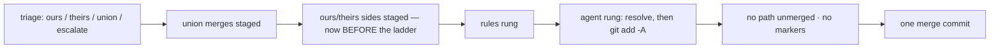

# Milestone sync: take the triage's sides before the ladder climbs (Issue #2006)

## Summary

The milestone sync applied the triage's `ours`/`theirs` decisions **after**
the conflict ladder, but the agent rung stages the whole working tree
(`git add -A`) when the agent is done. That staged every triaged path that
was still unmerged — with git's marker-laden working copy — and cleared its
merge stages, so `applyConflictPlan` could no longer take its side and
refused the whole resolution:

```text
Refusing to resolve the merge of 'Develop' into 'milestone/score-storage-and-ingestion':
the merge stages of conflicted file 'Cargo.lock' could not be read (Issue #1048):
git exited 0 and printed nothing
```

On GRQ-25 that threw away an eleven-minute agent resolution and deferred the
issue as "milestone behind default branch"; five GRQ-AutoTrader milestone
branches failed the same way in one cycle.

`git_pull.ts` now calls `applyConflictPlan` with the triaged decisions
**before** `climbConflictLadder`. The agent sees the triaged paths as decided,
`git add -A` changes nothing about them, and the post-ladder proofs
(`listUnmergedPaths`, `hasConflictMarkers`) still guard the commit. The
"committed by another rung while the triage still had sides to take" refusal
(Issue #1964) is unreachable now and is removed; the adopted-commit safety
gate stays.

Closes #2006.



## Evidence

Backend change; the evidence is the regression test, which reproduces the
production refusal verbatim on the unfixed code:

```text
# before the fix
syncMilestoneBranchWithDefault - a triaged side and an agent-resolved file land together in one merge (Issue #2006) ... FAILED
  AssertionError: the sync lands: Refusing to resolve the merge of 'main' into 'milestone/v2':
  the merge stages of conflicted file 'lib/config.ts' could not be read (Issue #1048): git exited 0 and printed nothing
# after
... ok | 9 passed | 0 failed
```

## Test Plan

- `worker/deno/tests/git_pull_conflict_test.ts` — new: one file the triage
  decides as `theirs` (main's superset) and one rival-design file only the
  agent can decide; the agent stages only its own file and the ladder stages
  the tree. Asserts the sync lands, only the escalation reached the agent,
  main's version and the agent's content both landed, one merge commit with
  two parents, nothing left unmerged.
- `worker/deno/tests/milestone_sync_agent_commit_test.ts` — the Issue #1964
  case "an agent that commits while another file still needs the conflicted
  index is refused" described a state that can no longer arise: the side is
  staged before the agent runs. It now asserts the opposite and stronger
  outcome — the agent's commit is adopted with the triage's side in it, one
  merge commit, the sync's message naming the triaged file.
- Existing `git_pull_conflict_test.ts`, `milestone_conflict_ladder_test.ts`,
  `milestone_merge_state_test.ts` and the `merge_conflict_*` suites unchanged
  and green. Full `./quality.sh`: only the twelve host-only failures this
  macOS host always reports (no `deno` on the scrubbed PATH, no PowerShell).

Documentation: `docs/workflows/milestones.md` (adoption guards) and
`docs/INTERNALS.md` (the ladder).
