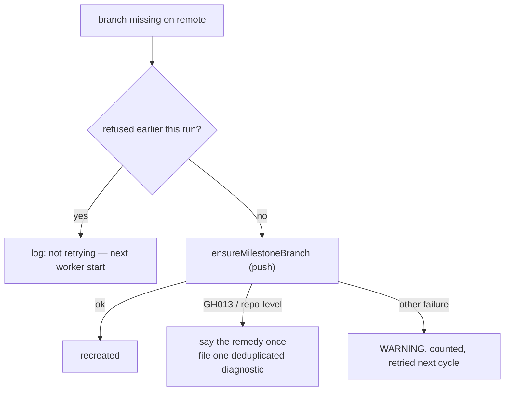

# Milestone self-heal: report a repository that refuses milestone branches once, and stop retrying it (Issue #2007)

## Summary

A milestone ruleset that enforces `required_status_checks` on branch
*creation* refuses every push that would create a milestone branch (`GH013`,
the Issue #3912 failure). Twenty of the twenty-four monitored repositories
with a milestone ruleset still have it that way, and the self-heal retried the
refused push **every cycle, for days, and filed nothing** — 116 times for
`TagsTS` on one host since 2026-09-09, 30 for `NEAT-AI-core`:

```text
WARNING: could not recreate milestone branch 'milestone/scan-20260909' in stSoftwareAU/TagsTS for open milestone 'Scan 20260909' (5 open children): ... remote: error: GH013: Repository rule violations found for refs/heads/milestone/scan-20260909.
```

The fleet account cannot write rulesets, so the fix is a human's; the worker's
job is to say so once and stop. `selfHealMilestoneBranches` now:

- classifies a recreate failure with `isRepoLevelBranchRejection`
  (`milestone_branch_rejection.ts`, Issue #853);
- on a repository-level refusal, logs the remedy once per (repo, branch) per
  run and files **one** deduplicated diagnostic in the repository —
  `fileMilestoneBranchRefusedIssue`, marker
  `VIBE_MILESTONE_BRANCH_REFUSED:<repo>`, matched on marker **and** fleet
  authorship via `selectFleetAuthoredMatches`, attested through
  `recordSelfDiagnosticFiling` (family `milestone-branch-refused`), body naming
  the branch, the milestone, the repository's answer and the one-flag fix
  (`do_not_enforce_on_create: true`; `repo-settings-harden` plans it);
- does not push that branch again for the rest of the run; the next worker
  start tries once more, so a fixed ruleset is picked up on its own;
- leaves every other failure — a dropped connection — exactly as before:
  logged, counted, retried next cycle.

`describeRepoLevelRejection` now names the flag rather than only "drop the
check requirement".

Closes #2007 (worker half). The repository half — setting the flag on the
twenty repositories listed in the issue — needs an admin and is not a code
change.



## Evidence

Backend change; the evidence is the regression suite. New cases in
`worker/deno/tests/milestone_branch_self_heal_test.ts`:

- a `GH013` refusal across two self-heal passes: one push, one `issue create`
  (body carries the marker, quotes `GH013`, names
  `do_not_enforce_on_create: true`), one attestation (`#77`,
  `milestone-branch-refused`), the remedy logged once, the second pass logs why
  it did not push;
- an open diagnostic authored by a fleet account is reused (`exists:#12`),
  nothing filed;
- the same marker planted by an outsider does not dedup — a genuine diagnostic
  is still filed;
- a non-repository-level failure (`network is unreachable`) is retried on the
  next pass and files nothing.

`milestone_branch_self_heal_test` 23/23, `milestone_branch_rejection_test`
green, and the site-policing suites (`marker_dedup_author_cap_test`,
`alert_dedup_author_verification_test`, `self_diagnostic_provenance_test`,
`milestone_ruleset_check_test`) 79/79. Full `./quality.sh` result is recorded
on the PR.

## Test Plan

See Evidence. Documentation: `docs/INTERNALS.md` (Milestone branch self-heal).
