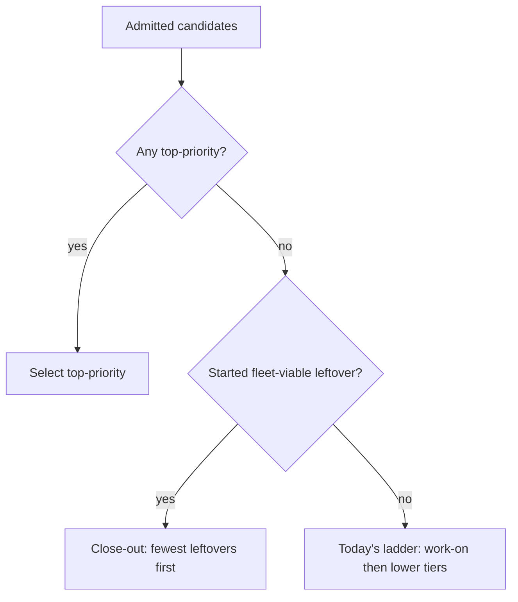

# Finish a started milestone before starting another (Issue #2009)

## Summary

Issue selection was tier-first, then globally oldest. A started milestone
with one `low-priority` leftover therefore lost every time to an older
`work-on` that opened a new branch. The started branch kept drifting, and
the conflict lane — the fleet's weakest path — inherited the merge.

`selectHighestPriority` now lifts leftovers that belong to a **started,
fleet-viable** milestone into a close-out band after `top-priority` and
before `work-on`. Among those leftovers it prefers the milestone with the
fewest remaining viable issues, then in-milestone `priority-high` /
`priority-low`, then oldest. `top-priority` stays first. A leftover that
needs a human, a week-pace drop of tiers 3 and 4, and every existing gate
are unchanged: the band only re-orders candidates those gates have already
admitted.

Closes #2009.

## Evidence

Targeted Deno tests (from `worker/deno`):

- `tests/issue_priority_test.ts` — close-out beats unstarted `work-on`;
  `needs-human` leftover is not fleet-viable; `top-priority` still wins;
  fewer remaining viable issues win; week-pace drops a close-out
  `low-priority`; `#2164` same-repo suppression cannot hide a close-out
- `tests/find_oldest_issue_test.ts` — same four acceptance cases through
  the finder, including the close-out log line
- `tests/issue_query_test.ts` — cached milestone `closed_issues` listing
- `tests/issue_finder_logger_test.ts` — unconditional close-out log

No UI change; visual evidence does not apply.

## Test plan

- [x] Unit tests for `buildCloseOutMilestones` and `selectHighestPriority`
- [x] Integration tests for `findOldestIssue` in both directions
- [x] Week-pace and `#2164` do not leak a close-out the gates refused
- [ ] On a live scan with one started milestone leftover and a fresher
      unstarted `work-on`, confirm the log line
      `close-out: has N viable issues left, selecting #X over tier-2 #Y`
