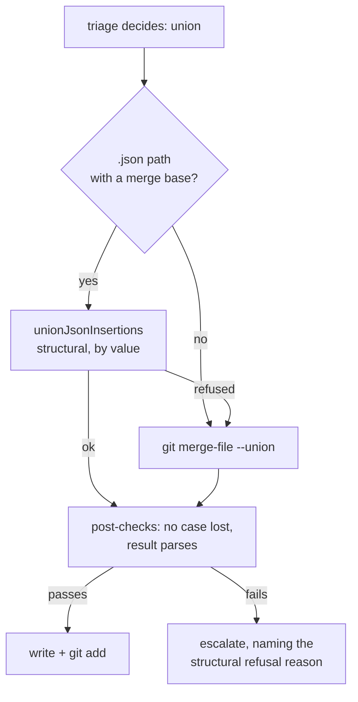

## Summary

The milestone ladder's union rung (`unionMergeConflictedFile`) text-unioned
every conflicted path with `git merge-file -p --union` and then refused a
`.json` result that did not parse. Two branches that each append a slice to
`docs/audits/lib-sweep-coverage.json` conflict _inside_ the appended object, so
no arrangement of the two hunks' text is valid JSON — the rung could only ever
refuse, re-labelling as an escalation a file the triage had already decided was
a plain union.

A `.json` path with a merge base is now unioned **by value** first, through
`json_insertion_union.ts` — the same structural merge #1968 gave the PR-merge
rung. The two sides are passed in whichever way round `UnionOrder` asks for
(`unionJsonInsertions` emits its `theirs` argument's insertions first), and the
result then runs the rung's existing post-checks and staging unchanged. Anything
the structural merge refuses — a deletion, a conflicting edit, formatting it
would not reproduce — falls back to `git merge-file --union` exactly as before,
and its refusal reason is carried into the escalation message so a human is told
why the structural merge declined.

Closes #2013.

## Evidence

Backend/CLI change with no web interface to screenshot. The evidence is the
integration test below, driven against real git repositories.



Test run after the change (`worker/deno`):

```text
deno test --allow-all tests/milestone_sync_conflict_resolution_test.ts
ok | 11 passed | 0 failed (30s)
```

`./quality.sh` run in full after the final edit:
`Result: PASSED (with skipped
checks)` — the one skip is `config integration`,
which is skipped on this host regardless of the change.

## Reproduction

- **symptom** — a milestone sync whose `docs/audits/*.json` ledger was appended
  to on both branches had its union rung refuse with "the union of both sides
  does not parse as JSON, so it was not written", turning a decided union into
  an escalation
- **status** — `partial` — reason: the rung-level symptom was observed directly
  (the regression test failed against the unfixed code, the file's decision
  reading `action: "resolved", rung: "rule"` instead of the union rung's own
  `action: "union"`, and passes after the fix). The end-to-end _human_
  escalation the issue describes was **not** reproduced for a ledger whose
  formatting round-trips: #1968's dependency-rule rung already rescues that file
  one rung later, so today's cost is a spurious escalation plus a second
  structural merge rather than a page to a human. The full escalation is still
  reproducible where both rungs refuse, which is what the existing #1768 test
  pins and which this change deliberately leaves unchanged.
- **regression test** —
  `worker/deno/tests/milestone_sync_conflict_resolution_test.ts::syncMilestoneBranchWithDefault - two appended ledger slices are unioned by value, not escalated (Issue #2013)`
  (and `…::a .json the structural union refuses says why, alongside the parse failure (Issue #2013)`
  for the fallback's error path) — both observed failing against the unfixed
  code and passing after the fix

## Test Plan

- **Added**
  `worker/deno/tests/milestone_sync_conflict_resolution_test.ts::syncMilestoneBranchWithDefault - two appended ledger slices are unioned by value, not escalated (Issue #2013)`
  — builds a real two-branch conflict over `docs/audits/lib-sweep-coverage.json`
  (a bare remote, a `main` and a `milestone/1559` that each append a slice),
  runs the whole sync, and asserts the merged ledger holds both slices with the
  default branch's first, in the file's own formatting, resolved by the union
  rung itself with no escalation and a commit on the branch.
- **Added**
  `worker/deno/tests/milestone_sync_conflict_resolution_test.ts::syncMilestoneBranchWithDefault - a .json the structural union refuses says why, alongside the parse failure (Issue #2013)`
  — covers the new fallback's error path: a ledger whose merge base is
  hand-formatted (`"entries": [\n  ]`) does not round-trip, so the structural
  union declines, the textual union still produces a document that does not
  parse, and the escalation names both the parse failure and why the by-value
  merge was unavailable. Observed failing against the unfixed code (the
  "it was not unioned as JSON first" clause absent) and passing after the fix.
- **Unchanged and still green**
  `…::syncMilestoneBranchWithDefault - a JSON ledger whose union does not parse escalates rather than being written (Issue #1768)`
  — its merge base (`"entries": [\n  ]`) does not round-trip through
  `JSON.stringify`, so the structural union refuses it and the textual path
  still escalates. No existing test was modified or removed.
- Related suites re-run: `both_inserted_conflict_rule_test.ts`,
  `json_insertion_union_test.ts`, `milestone_conflict_ladder_test.ts`,
  `milestone_conflict_triage_test.ts`, `dependency_conflict_apply_test.ts` —
  84 passed, 0 failed. The gate's own `deno tests` stage covers the rest.
- Full gate: `./quality.sh` — PASSED.
