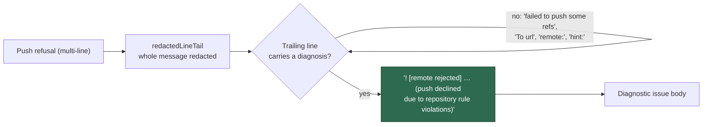

## Summary

`stSoftwareAU/GRQ-FX-validation` was backed off after three fast failures at
`setup`, and the auto-filed diagnostic carried one piece of evidence:
`error: failed to push some refs to '…/GRQ-FX-validation.git'`. That is git's
own summary line — it names the repository and nothing else — and the tracker
kept it because `lastErrorLine` took the **last** non-empty line of the
failure. The line that says *why* the push was refused sits directly above it.

`diagnosticErrorLine` (renamed from `lastErrorLine`) now steps over trailing
lines that carry no diagnosis — git's push summary, its `To <url>` destination
line, blank `remote:` padding, and the `hint:` advice git appends after a
rejection — and keeps the last line that does. When every line in the window is
one of those, the true last line is still recorded: an imperfect line beats an
empty one.

For the reported failure the recorded detail becomes
`! [remote rejected] Develop -> milestone/scan-20260910 (push declined due to
repository rule violations)`, which `isRepoLevelBranchRejection` already
classifies, so the diagnostic issue now names a cause a reader can act on.

Closes #2034.

**Root cause of the GRQ-FX-validation failures themselves is repo-side and
already reported.** Its `Vibe Coder milestone branches` ruleset applies
`required_status_checks` to `refs/heads/milestone/**` with
`do_not_enforce_on_create: false` and no bypass actors, so every push that
would create a milestone branch is refused (GH013). Each milestone-tagged
claim therefore dies in `setup` inside a minute. The worker already filed
`stSoftwareAU/GRQ-FX-validation#151` with the full refusal text and the
one-flag remedy; an admin has to set `do_not_enforce_on_create: true` — the
fleet account cannot write rulesets. Nothing in the worker can fix that
ruleset, so this PR fixes the worker-side defect it exposed: the evidence the
back-off records.

## Evidence

Backend/CLI change — no web interface to screenshot. Evidence is the
regression test below, run red against the unfixed code and green after.

Before (unfixed `lastErrorLine`, real refusal as input):

```text
Expected actual: "error: failed to push some refs to
'https://github.com/stSoftwareAU/GRQ-FX-validation.git'"
  to contain: "push declined due to repository rule".
```

After: `28 passed | 0 failed` in `tests/repo_fast_failure_tracker_test.ts`, and
the full `./quality.sh` gate passes.



## Reproduction

- **symptom** — the fast-failure diagnostic for a repository whose setup phase
  dies on a refused push records only
  `error: failed to push some refs to '<url>'`, so the back-off issue names no
  cause
- **status** — `verified` — the regression test was observed failing against
  the unfixed code (assertion output quoted above) and passing after the fix
- **regression test** —
  `worker/deno/tests/repo_fast_failure_tracker_test.ts::diagnosticErrorLine - a push failure records the refusal, not git's summary line (Issue #2034)`

## Test Plan

Added to `worker/deno/tests/repo_fast_failure_tracker_test.ts`:

- `diagnosticErrorLine - a push failure records the refusal, not git's summary
  line (Issue #2034)` — the real GRQ-FX-validation refusal in, the rejection
  line out, and `isRepoLevelBranchRejection` accepts it.
- `diagnosticErrorLine - git's trailing hints do not displace the rejection
  (Issue #2034)` — a non-fast-forward push whose `hint:` advice follows the
  error line still records `! [rejected] … (fetch first)`.
- `diagnosticErrorLine - an all-summary tail still records its last line
  (Issue #2034)` — nothing informative in the window keeps the last line, and
  an empty message stays empty.
- `recordRepoFastFailure - the stored detail names why the push was refused
  (Issue #2034)` — end to end through the durable sidecar.

Existing `lastErrorLine` tests (last non-empty line, multi-line secret
redaction, length bound) are unchanged apart from the rename; all still pass.
Full gate: `./quality.sh` PASSED.
