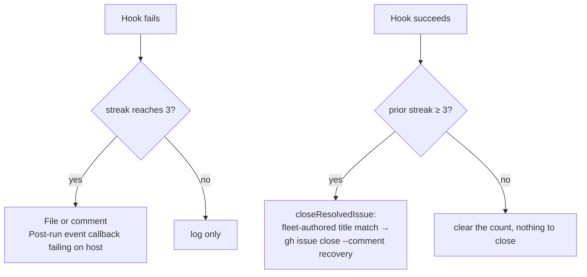

# The post-run callback contract is additive-only, and its failure report retires itself (Issues #2039, #2041)

## Summary

Two escalations on GRQ-23 — `Post-run always callback failing` (#2039) and
`Post-run failure callback failing` (#2041) — had the same cause, and it was
VibeCoder's: PR #1976 (released as 1.5.170) raised the callback schema from 1 to
2 for an **additive** change. `docs/CALLBACKS.md` told hook authors to refuse a
version they did not know, every deployed hook did, and every callback on every
host failed on every issue. The private extension's fix (accept 1 and 2, warn on
newer) was merged the same day, but rollout is a per-host reinstall, and
GRQ-23's hooks predated it. Eight reports were raised across the fleet; every
one stayed open after its host recovered until a human closed it, although each
body promised "a single successful invocation clears it".

This PR fixes the worker's side so the class of failure cannot recur, and so a
recovered host tidies up after itself:

- **The contract is stated as additive-only** (`docs/CALLBACKS.md` →
  _Versioning_, the constant's doc comment, `CODING-STANDARDS.md`,
  `DESIGN-PRINCIPLES.md`). `schemaVersion` moves only for a removal or a change
  of meaning; a hook refuses malformed or older versions, not newer.
- **The schema 1 field set is pinned** by
  `worker/deno/tests/callback_schema_compat_test.ts`: every environment scalar
  and every document field schema 1 promised must still be exported with the
  same type, so a removal fails in review.
- **The report closes itself.** `recordCallbackOutcomes` now hands a success
  that ends a _reported_ streak to a `resolve` seam, whose production
  implementation (`closeResolvedIssue` on the shared host-escalation channel)
  closes the fleet-authored issue under the same title with the recovery as the
  closing comment. A shorter streak's success closes nothing; a title match the
  fleet did not open is left alone; a refused close is logged loud and never
  alters the run.
- **The report body** names the schema version the worker exports and says to
  upgrade the extension when a hook refuses it, and no longer asserts in advance
  that the fault is "not a worker one".
- **Release 1.6.0** is minted from the floor with the release-notes entry the
  contract change should have had.

Closes #2039. Closes #2041.



## Evidence

Backend contract with no web interface, so the evidence is the regression suite,
written red first:

- `callback_failure_streak_test.ts` — a success after a reported streak closes
  the report with the recovering run's repository and issue; a success after two
  failures closes nothing; a ten-issue streak's recovery reports `10`; each
  event closes its own report; a refused close is logged once and the count
  still clears; the body names
  `callback schema version ${CALLBACK_SCHEMA_VERSION}`, promises to close
  itself, and does not say "not a worker one".
- `host_escalation_test.ts` — `closeResolvedIssue` closes only the
  fleet-authored match under the exact title with `--comment`, leaves an
  outsider's title match alone, is a no-op when nothing is open, and throws on a
  refused close.
- `callback_schema_compat_test.ts` — the 21 schema 1 environment scalars and 16
  document fields (plus the 5 telemetry members) are all still exported with the
  documented types.

```text
callback_failure_streak_test / host_escalation_test / callback_schema_compat_test
  → 26 passed, 0 failed
run_callbacks_test / run_core_callbacks_test / callback_conformance_test /
untrusted_marker_action_verification_test / run_callback_context_test /
checkout_update_escalation_spool_test
  → 114 passed, 0 failed
deno check / deno lint (changed modules) → clean
```

Host-side, GRQ-23's extension was reinstalled from the merged upstream fix
(`GRQ_KNOWN_CALLBACK_SCHEMAS="1 2"`) with no `.config.json` change; the two open
reports clear on the next successful invocation.

## Test Plan

- Added `worker/deno/tests/callback_schema_compat_test.ts`.
- Extended `worker/deno/tests/callback_failure_streak_test.ts` (four cases) and
  `worker/deno/tests/host_escalation_test.ts` (four cases).
