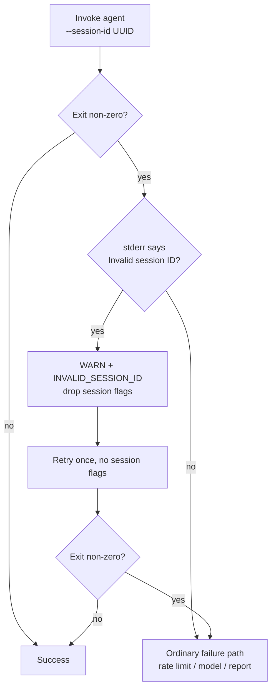

# Session ids are UUIDs, and a rejected one retries without the flags

## Summary

The Claude CLI validates `--session-id` as a UUID. `generateSessionId()`
produced `<repo>-<issue>-<timestamp>`, so the CLI refused it and exited 0.2 s
after spawn with `Error: Invalid session ID. Must be a valid UUID.` — before
reaching a model call. Both planning turns (quorum/draft, then publish) died
instantly on every run, and only the legacy sessionless "retry with explicit
prompt" path did any work; the planning issue was then closed as if the
draft → publish flow had run. Closes #204.

Three changes:

1. **`session_resume.ts`** — `generateSessionId()` returns
   `crypto.randomUUID()`. The repo/issue/timestamp identity already lives in
   the resume-state file name (`.claude-sessions/resume/<owner>-<repo>-<issue>.json`),
   so nothing needed it in the session id. `createSessionResumeState()` takes no
   arguments as a result. New `isValidSessionId()` exports the UUID contract.
2. **`resume_state_store.ts`** — a persisted entry whose `sessionId` is not a
   UUID was written before this fix. `loadResumeState()` drops the id and keeps
   the entry, so the checkpointed branch still resumes but never primes
   `--resume` with an id the CLI will refuse.
3. **`claude_runner.ts` / `claude_executor.ts`** — new `detectInvalidSessionId()`;
   `runClaudeWithRetry()` recognises the refusal, drops the session flags and
   retries once at `WARNING` plus an `INVALID_SESSION_ID` security event.
   Clearing the state is what bounds the retry: a second refusal has no session
   flags left to blame and falls through to the ordinary failure path. The run
   degrades loudly instead of silently losing its structure.

### Business-logic change to existing tests (documented, not removed)

`session_resume_test.ts` asserted the old id format
(`"owner-repo-42-1700000000000"`) — the exact string the CLI rejects. Those
generation assertions now assert the UUID contract; every other test in the
file (flags, phase counting, lifecycle) is unchanged. `resume_state_store_test.ts`'s
round-trip fixture moved from `"sess-1"` to a UUID for the same reason. No test
was commented out or deleted.

## Evidence

Backend/CLI change — no web interface to screenshot. Verified by tests and by
the recorded argument sequence of a stub `claude` on `PATH` that refuses any
invocation carrying `--session-id`, exactly as the real CLI does: the first
invocation logs `--session-id --resume`, the second logs no session flags, and
the run exits 0.

Quality gate: `deno lint`, `deno check`, `deno fmt`, markdownlint, mermaid and
every chokepoint check pass; `14762 passed | 10 failed`. The 10 failures
(`fleet_health_test.ts`, `host_workdir_guard_test.ts`,
`optional_feature_env_test.ts`, `setup_workdir_reminder_test.ts`) are
pre-existing and environmental — verified by stashing this branch's changes and
re-running them against the unmodified tree, where the same 10 fail identically.
None touch session resume, the runner, or planning.

### Security self-check

- No new external input surface; the new regex is tail-scoped and anchored to
  session-id phrasing so it cannot fire on unrelated failures.
- The `WARNING` names the rejected session id (a UUID or an already-logged
  stale id) — no credential, token or path is added to the log.
- No secrets, `.config*.json` or hidden files staged.

## Test Plan

New — `worker/deno/tests/session_id_uuid_204_test.ts`:

- `generateSessionId()` returns a canonical UUID, distinct per call.
- `createSessionResumeState()` yields a UUID and `phaseCount: 0`.
- The first phase passes exactly `["--session-id", "<uuid>"]`.
- `isValidSessionId()` rejects the live failing id
  (`stSoftwareAU-VibeCoder-193-1755744446000`), the empty string, and a
  right-shaped/wrong-character id.
- `loadResumeState()` drops an old-format id but keeps the branch and phase
  count; a UUID id round-trips intact.

New — `worker/deno/tests/claude_runner_invalid_session_id_204_test.ts`:

- `detectInvalidSessionId()` matches the CLI's refusal and ignores unrelated
  failures (invalid model, a git error mentioning "session", a mention outside
  the scanned tail).
- Regression: a rejected session id produces two invocations — flags, then none
  — the run exits 0, and a `WARNING` plus `INVALID_SESSION_ID` is emitted.
  Against the unfixed runner this stops at one invocation and exit 1.
- The retry is not repeated when the sessionless attempt also fails (exactly two
  invocations against a stub that refuses everything).
- A run with no session state is unaffected (one invocation).

Modified:

- `worker/deno/tests/planning_processor_test.ts` — added: every planning turn's
  session id is a UUID and both turns share it.
- `worker/deno/tests/session_resume_test.ts`,
  `worker/deno/tests/resume_state_store_test.ts` — id fixtures updated to the
  UUID contract, as documented above.

Docs: `docs/MODEL-AND-CACHING.md` — the "Deterministic Session ID" section now
documents the UUID requirement, the stale-entry rule, and the recovery flow.
