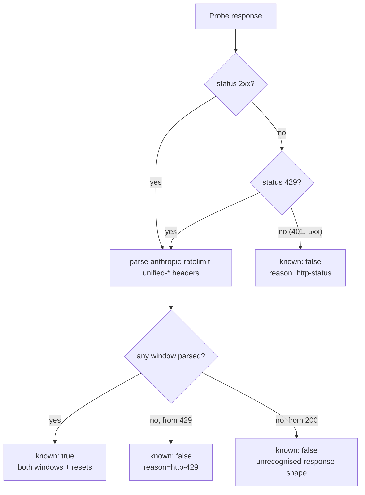

# A 429 carrying the rate-limit headers is the quota answer, not an unknown

## Summary

`probeClaudeTokenBudget` returned `{ known: false, reason: "http-429" }` for
every non-OK response before it looked at the headers. A `429` from
`api.anthropic.com/v1/messages` on a subscription token is not a throttled probe
— it is the quota answer, and Anthropic still sends the full
`anthropic-ratelimit-unified-*` header set with it. Discarding it made a spent
token log `remaining=unknown reason=http-429` with no reset time, so an operator
could not tell an exhausted subscription from a revoked one, and the pool could
not reason about when that token comes back.

The `429` path now parses those headers exactly as the `200` path does. A `429`
carrying no recognisable window headers is a genuinely throttled probe and keeps
its `http-429` unknown; `401` and `5xx` are unchanged, because a revoked token's
headers describe nothing the worker can trust. No other behaviour moved —
`parseWindows`, `mostConstrained` and the `scrub` contract are reused untouched.

Closes #2040.

## Evidence

Backend/CLI change with no web surface to screenshot. The evidence is the test
suite:
`deno test tests/claude_token_budget_test.ts
tests/claude_token_selection_test.ts`
— **28 + 20 passed, 0 failed**. The two new 429-budget cases were observed
**failing** against the unfixed probe
(`AssertionError: a spent token has a budget of zero, not no budget`) and
passing after the change.

What the operator now sees for a spent token, asserted byte-for-byte in
`claude_token_selection_test.ts`:

```text
[SECURITY] claude token candidate provider (#1): five_hour=0.0% resets=2026-09-04T02:00:00.000Z seven_day=0.0% resets=2026-09-08T01:00:00.000Z rate=0.00%/h gate=fail
```

The status decision the probe now makes:



The full gate (`./quality.sh`) reports two pre-existing failures unrelated to
this diff — `agent_provider_test.ts` and `config_test.ts` both fail with
`The running container image did not install the "deepseek" coding-agent
provider. Installed: claude`,
an image-provisioning condition of this host. Neither file, nor
`agent_provider.ts`/`config.ts`, is touched by this change. Every other check
passed.

## Acceptance Criteria

<!-- vibe-spec-review inputs="diff+issue-body" -->

- **met** — a 429 response with the unified headers yields a known budget with
  both windows and their resets — evidence:
  `worker/deno/tests/claude_token_budget_test.ts::a 429 carrying the unified headers is the quota answer, not an unknown (Issue #2040)`
  — reviewer: met
- **met** — a 429 response with no ratelimit headers still yields
  `known: false, reason: "http-429"` — evidence:
  `worker/deno/tests/claude_token_budget_test.ts::a 429 with no rate-limit headers stays a throttled probe (Issue #2040)`
  — reviewer: met
- **met** — a 401 with headers present still yields
  `known: false, reason: "http-401"` — evidence:
  `worker/deno/tests/claude_token_budget_test.ts::a 401 carrying rate-limit headers is still unknown (Issue #2040)`
  — reviewer: met
- **met** — the selection log line for a spent token shows its windows and reset
  times instead of `remaining=unknown` — evidence:
  `worker/deno/tests/claude_token_selection_test.ts::a spent token's candidate line carries its windows, not remaining=unknown (Issue #2040)`
  — reviewer: met
- **met** — no token value can reach a log line (existing `scrub` contract
  holds) — evidence:
  `worker/deno/tests/claude_token_budget_test.ts::the token value reaches no returned value on the 429 paths (Issue #2040)`
  — reviewer: met
- **unrequested** — `docs/SETUP.md` gains a paragraph and a sample line
  documenting the 429 behaviour — reviewer: unrequested — reason: the operator
  manual prints the old `remaining=unknown reason=http-401` candidate line as
  the reference output, so leaving it unamended would document behaviour this
  diff changed ("A Code Change Owes a Docs Change")
- **unrequested** — a test for a 429 whose five-hour window is spent while the
  week still holds budget — reviewer: unrequested — reason: the issue's example
  is a fully spent token, and without this case a fix that hardcoded zero on a
  429 would pass every stated criterion

## Standards Review

<!-- vibe-standards-review inputs="diff+CODING-STANDARDS.md" -->

- **violation** — `docs/archive/pr-summaries/pr-summary-2040.md` was absent —
  evidence: `docs/archive/pr-summaries/` — reason: fixed here; the reviewer ran
  before this file was written
- **clean** — Australian English throughout the new prose and comments; tests
  call the real `probeClaudeTokenBudget` and assert on its result rather than
  inspecting source; no existing test removed or commented out; every status
  branch returns an explicit `known`/`reason` (never a silent swallow);
  `deno fmt`, `deno lint` and `deno check` clean on all three touched TypeScript
  files; tests inject `fetchFn`, touch no network, clock or process state; the
  commit carries the issue reference and the `Vibe-Coder-Run-Id` trailer; the
  module JSDoc and `docs/SETUP.md` were updated in the same commit

## Test Plan

Added to `worker/deno/tests/claude_token_budget_test.ts`:

- `a 429 carrying the unified headers is the quota answer, not an unknown (Issue #2040)`
  — both windows, both resets, the representative claim and the headline all
  survive the 429; one request, no retry.
- `a 429 with partial budget headers reports the budget they carry (Issue #2040)`
  — a spent five-hour window beside a week still at 60%; the figures are read as
  reported, never assumed zero because the status was 429.
- `a 429 with no rate-limit headers stays a throttled probe (Issue #2040)` —
  `known: false, reason: "http-429"`.
- `a 401 carrying rate-limit headers is still unknown (Issue #2040)` — a revoked
  token's headers are not trusted.
- `a 5xx carrying rate-limit headers is still unknown (Issue #2040)` — only 429
  is read.
- `the token value reaches no returned value on the 429 paths (Issue #2040)` —
  the `scrub` contract over both new paths.

Added to `worker/deno/tests/claude_token_selection_test.ts`:

- `a spent token's candidate line carries its windows, not remaining=unknown (Issue #2040)`
  — end to end through the selector: the 429 candidate's log line is asserted
  byte-for-byte, and the token with budget still wins.
