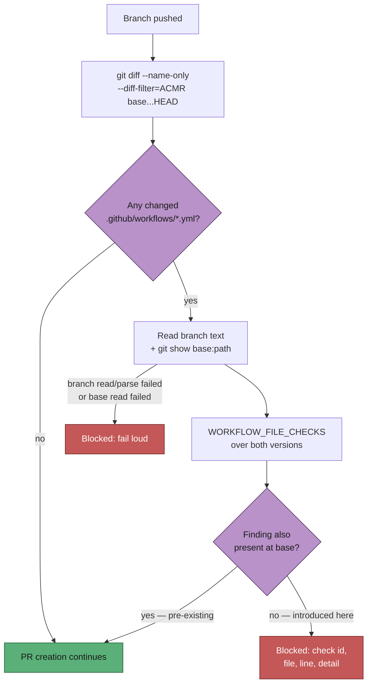

## Summary

The changed-workflow gate (Issue #1859) scoped itself to the `.github/workflows/`
files a run **touched**, then ran `WORKFLOW_FILE_CHECKS` over each one's **full
current text**. One appended step to a file that already carried a hygiene
finding therefore turned that finding into a hard PR block — the reported run
appended two "reclaim runner disk" steps and was refused over a
`push: branches: [Develop]` trigger that had been on the base commit all along.

The gate now baselines. Every check runs twice — once over the branch's text,
once over `git show <base>:<path>` for the same paths — and a finding is the
run's only when it is absent at base. The comparison is per check, keyed by
`(finding id, file)` and **counted**, so a second offender sharing an id with a
pre-existing one is still reported; line numbers are excluded from the key
because appending a step shifts every line below it without changing what is
wrong. A path absent at base is one the branch added, so it is checked whole.

Fail-loud is preserved: a base version that cannot be **read** is an error and
blocks (`readBaseFile` throws), while one that cannot be **parsed** is not — that
is often the very state the run is fixing, and the head file still has to parse.

Closes #2043.

## Evidence

Backend/CLI change with no web interface to screenshot. The evidence is the
test run: the three baseline tests were watched failing against the unfixed
filtering logic and passing after it (see Reproduction below).

**Quality gate.** `./quality.sh` was run in full. Every check passed except
`deno tests`, whose only failure is pre-existing and environmental:
`tests/agent_provider_test.ts::agent provider - the per-run provider override
beats the configured file value (Issue #2062)` fails with `The running container
image did not install the "deepseek" coding-agent provider. Installed: claude.`
That file is not in this diff (`git diff HEAD~1 --name-only` lists six files,
none of them `agent_provider`), and the failure is a missing provider in this
container image rather than a code fault.

## Reproduction

- **symptom** — a run that appended two steps to `.github/workflows/quality.yml`
  was refused with `[BP-TRIGGER-quality] … Test/lint workflow triggers on push
  to \`Develop\``, a trigger already present at the same place on the PR's base
  commit
- **status** — `verified` — the three baseline tests were observed failing
  against the unfixed filtering (the gate pushing every scoped finding) and
  passing after it: `FAILED | 35 passed | 3 failed` → `ok | 38 passed | 0 failed`
- **regression test** — `worker/deno/tests/changed_workflow_gate_test.ts::changed-workflow gate - a finding already at base does not block an unrelated change`
  and `worker/deno/tests/completion_phase_changed_workflow_gate_test.ts::completion - a finding already on the base commit raises the PR`

## Test Plan

Added to `worker/deno/tests/changed_workflow_gate_test.ts`:

- a pre-existing `push:` trigger with an unrelated step appended → `ok`
- the branch **adding** that trigger → blocked
- a new unpinned action beside a pre-existing one → only the new one reported
- a file absent at base → checked whole, still blocks
- a base version that cannot be read → fails loud, `could not read the base version`
- a base version that cannot be parsed → not a fault

Added to `worker/deno/tests/completion_phase_changed_workflow_gate_test.ts`
(the live `workOnIssueCompletion` path, asserting on whether `gh pr create` ran):

- a finding already on the base commit → the PR is raised
- a finding this run adds to an existing workflow → no PR
- an unreadable base version → no PR, the run fails loud

Existing tests are unchanged in intent: `runGate`'s default `readBaseFile`
reports every in-scope path as absent at base, which is the "the run wrote this
file" shape they were written against.
