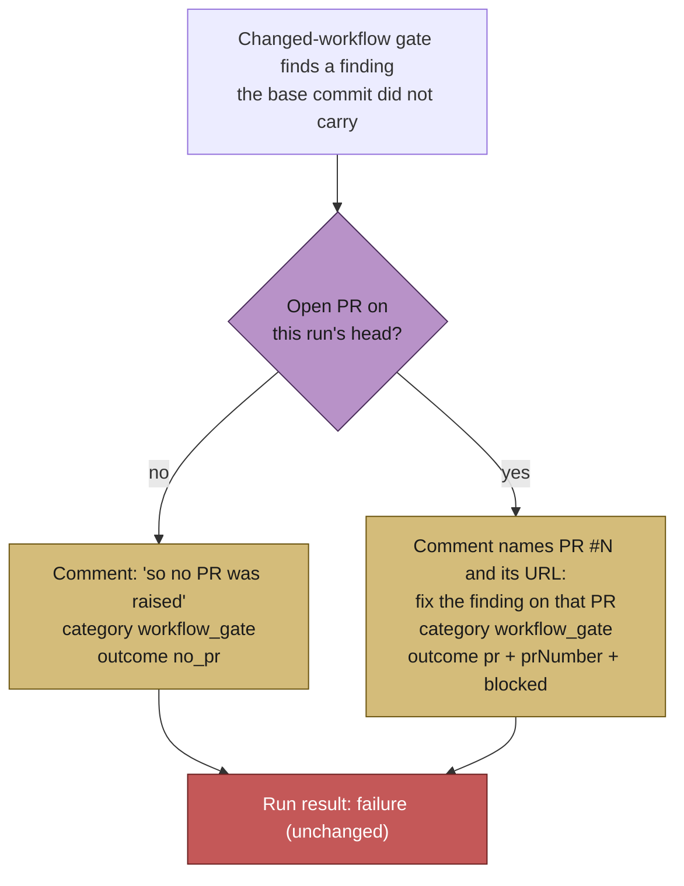

# A gate that blocks after the PR exists now names that PR

## Summary

The changed-workflow gate runs whether or not a PR already exists — by design,
a workflow finding is a defect in the change — but everything it *reported* was
written for the no-PR case. On 2026-09-12 a run's agent raised its own PR with
`gh pr create`; thirty seconds later the gate refused, and the worker commented
"so no PR was raised" over that live PR, recorded the failure as category
`unknown` for a block it had itself authored, and archived the host as having
delivered nothing. The PR merged unchanged three hours later.

Three fixes, all on the reporting — the gate still fails the run, because the
finding still has to be fixed:

1. **The message names the PR.** `buildChangedWorkflowGateMessage` takes the
   open PR on the run's head and says the finding must be fixed on it before it
   can merge, instead of "no PR was raised". With no PR the wording is
   unchanged.
2. **The block is a known category.** New `workflow_gate` `FailureCategory`,
   detected from the one `WORKFLOW_GATE_MARKER` phrase both the message builder
   and `detectFailureCategory` share, with its own display name
   (`workflow-gate`), diagnosis, one-liner and classifier class
   (`not_code_fixable`). A gate the worker applied is never diagnosed `unknown`.
3. **The outcome names the PR.** The completion phase records the recovered PR
   on `PhaseState`, so `deriveRunOutcome` reports `kind: "pr"` with `prNumber`
   plus a `blocked` detail (phase + diagnosed category + reason). The callback
   context carries `prNumber`, `phase`, `category` and `failureClass`, so a
   fleet archive can count "delivered, one finding outstanding" apart from
   "delivered nothing" (Issue #1947). This applies to **any**
   PR-then-later-step failure, not only this gate's.

Behaviour deliberately unchanged: the run still ends `failure`, and the failure
ladder still treats the block as the issue's (`workflow-gate` is not in
`TRANSIENT_FAILURE_CLASSES`, exactly as `unknown` was not). The gate firing on a
pre-existing finding is #2043, not this issue.

Closes #2044.

## Evidence

Backend-only change — no web surface to screenshot. The evidence is the
regression tests below, driven through `workOnIssueCompletion`, the path
`issue_worker.ts` actually runs.



Release comment for the blocked-after-PR case, as rendered by
`renderRunOutcomeClause`:

```text
✅ **Vibe Coder released this claim** — host `vibe-coder-1`, finished 03:04 UTC. Raised #2100 — https://github.com/o/r/pull/2100.
**Outcome:** PR raised, then blocked in phase `completion` — `workflow-gate`. Fix the finding on that PR; the work is not lost.
**Detail:** Workflow files changed by this run did not pass the GitHub Actions file checks…
```

## Reproduction

- **symptom** — a changed-workflow gate block on a run whose own head already
  carried an agent-created PR commented "so no PR was raised", diagnosed as
  category `unknown`, and recorded an outcome with no PR number
- **status** — `verified` — the new tests were observed failing against the
  unfixed code (4 of 5: the message asserted `no PR was raised` over a live PR,
  `detectFailureCategory` returned `unknown`, and the derived outcome was
  `no_pr`) and passing after the fix
- **regression test** —
  `worker/deno/tests/completion_phase_workflow_gate_pr_test.ts::completion - a workflow-gate block after the agent raised the PR names that PR`

## Test Plan

- Added `worker/deno/tests/completion_phase_workflow_gate_pr_test.ts` — drives
  the live completion phase over a workflow file the branch added with a
  tag-pinned action: the message names the PR and never says "no PR was
  raised"; the category is `workflow_gate` with or without a PR; the derived
  outcome is `pr` + `prNumber` + `blocked`, and the callback context carries
  `category` / `failureClass` / `phase`; with no PR (and with an unnumberable
  PR URL) the reporting is exactly as before.
- Added to `worker/deno/tests/changed_workflow_gate_test.ts` — both message
  openings, each still carrying the remediation and each diagnosing as
  `workflow_gate`.
- Added to `worker/deno/tests/failure_diagnosis_test.ts` — detection, display,
  diagnosis, one-liner, normalisation and the non-infrastructure verdict for
  `workflow_gate`; plus a timeout that merely *quotes* the gate wording in the
  agent's output keeps its own category (the #249 lesson).
- Added to `worker/deno/tests/run_outcome_test.ts` — a failed run with a PR
  keeps the PR and names the block; a delivered run is byte-identical to
  before; the release clause states both halves.
- Added to `worker/deno/tests/heartbeat_outcome_render_test.ts` — the blocked
  PR renders under the ✅ delivered line, round-trips through
  `parseReleaseAttemptFromBody`, and stays inside the block length cap.
- Added a row to `worker/deno/tests/run_outcome_classifier_test.ts` —
  `workflow_gate` → `workflow-gate`, `not_code_fixable`.
- Docs: `docs/workflows/issue-processing.md` (the reporting rule, the outcome
  table, the gate diagram) and `docs/CALLBACKS.md` (`OUTCOME_CATEGORY` /
  `OUTCOME_FAILURE_CLASS` now also set for a blocked PR).
