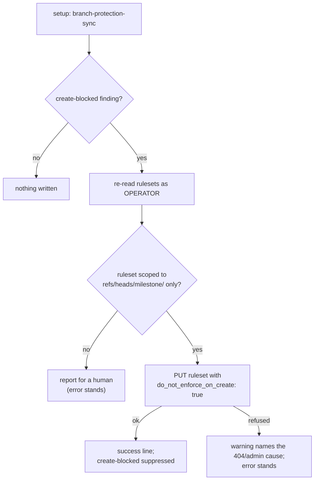

## Summary

`stSoftwareAU/GRQ-FX-validation` died in `setup` inside a minute on every run,
pushing `Develop → milestone/scan-20260910`:

```text
! [remote rejected] Develop -> milestone/scan-20260910
    (push declined due to repository rule violations)
```

The fleet built that trap itself. `buildMilestoneRulesetBody` wrote the
`milestone/**` ruleset's `required_status_checks` rule **without**
`do_not_enforce_on_create`; GitHub defaults it to `false`, so the checks were
enforced on branch **creation** — and a branch that does not exist yet has no
check runs to satisfy, so every push that would create it was declined. The
repository's live ruleset is exactly that document ("Vibe Coder milestone
branches", created 2026-08-31, `do_not_enforce_on_create: false`, no bypass
actors), and it has no `milestone/*` branch at all.

The remedy was already known and documented in three places
(`milestone_branch_rejection.ts`, `milestone_ruleset_check.ts`'s
`create-blocked` finding, `repo_settings_harden.ts`) — but only as advice to a
human, and the one writer that _creates_ the ruleset never applied it.

Two changes close it from both ends:

1. **`buildMilestoneRulesetBody` sets `do_not_enforce_on_create: true`** — the
   checks still gate every merge, and `required_status_checks` stays present so
   the base is protected enough for auto-merge to be armed. No new repository
   gets the trap.
2. **`repairMilestoneRulesetCreateBlock` clears it from repositories already
   trapped**, wired into setup's `branch-protection-sync`. The worker cannot do
   this itself — a ruleset write needs `admin` and the service account holds
   `write` — so it runs under the **operator** identity, like the create path
   (Issue #595). It is idempotent, writes a full-document PUT that preserves
   every other rule, condition and bypass actor, and writes **only** to a
   ruleset whose ref patterns all live under `refs/heads/milestone/`; one
   reaching wider (`~ALL`, the default branch) is reported for a human instead.
   A refused repair warns and leaves the `create-blocked` error standing — a
   still-broken repository is never reported as clean.

Closes #2067.

## Evidence

Backend/CLI change — no web interface to screenshot. The evidence is the live
ruleset read from the failing repository and the tests below.



The live ruleset that caused the failure, read with
`gh api repos/stSoftwareAU/GRQ-FX-validation/rulesets/21913326`:

```json
{
  "name": "Vibe Coder milestone branches",
  "enforcement": "active",
  "conditions": { "ref_name": { "include": ["refs/heads/milestone/**"] } },
  "rules": [{
    "type": "required_status_checks",
    "parameters": {
      "do_not_enforce_on_create": false,
      "...": "6 required contexts"
    }
  }],
  "bypass_actors": []
}
```

`gh api repos/stSoftwareAU/GRQ-FX-validation/branches` lists `Develop` and three
`issue-*` branches — not one `milestone/*` branch has ever been created.

## Reproduction

- **symptom** — every run on `stSoftwareAU/GRQ-FX-validation` died in `setup`
  within 60s, with the milestone branch push declined by a repository rule
  violation (`! [remote rejected] Develop -> milestone/scan-20260910`)
- **status** — `partial` — reason: the remote refusal itself is GitHub-side and
  needs a live ruleset to reproduce. What is reproduced deterministically is the
  cause: the fixture in the regression test is the failing repository's own
  ruleset document verbatim, and the builder test asserts the flag the fleet's
  writer omitted. Both were observed failing against the unfixed code (the
  builder assertion, and the missing `repairMilestoneRulesetCreateBlock` export)
  and passing after the fix.
- **regression test** —
  `worker/deno/tests/repo_rulesets_test.ts::repo_rulesets - the milestone body exempts branch CREATION from its checks`
  and
  `worker/deno/tests/milestone_ruleset_create_block_repair_test.ts::reportMilestoneRuleset - a create-blocking ruleset is repaired under the OPERATOR identity`

## Test Plan

- `worker/deno/tests/repo_rulesets_test.ts` — added: the milestone body exempts
  branch creation while keeping the contexts and the strict policy.
- `worker/deno/tests/milestone_ruleset_create_block_repair_test.ts` — new, 15
  tests:
  - `planMilestoneRulesetRepair` names a blocking ruleset (flag `false` **and**
    flag absent), and leaves alone one already exempt, one requiring no checks,
    one whose enforcement is off, and one reaching beyond milestone branches
    (`~ALL`, `~DEFAULT_BRANCH`, `refs/heads/**`).
  - `buildCreateExemptRulesetBody` sets the flag and preserves the name, target,
    enforcement, conditions, bypass actors and every other rule.
  - `repairMilestoneRulesetCreateBlock` PUTs to the right endpoint, never writes
    twice, fails loudly on an unreadable ruleset list, explains a 404 as the
    admin-permission problem it is, and refuses an invalid repo slug before
    calling `gh`.
  - `reportMilestoneRuleset` repairs under the **operator** identity and
    suppresses the finding it just fixed; never writes to a healthy repository;
    and on a refused repair warns _and_ still reports the error.
- Regression sweep:
  `deno test tests/milestone_ruleset_check_test.ts
  tests/milestone_ruleset_read_test.ts tests/repo_rulesets_test.ts
  tests/repo_settings_harden_test.ts
  tests/milestone_ref_pattern_single_source_test.ts`
  → 90 passed, 0 failed.
- Full gate: `./quality.sh` → every check PASSED except `deno tests`, which
  reports **two pre-existing environment failures** unrelated to this change:
  `agent_provider_test.ts` and `config_test.ts` (Issue #2062's per-run provider
  override) both fail with _"The running container image did not install the
  'deepseek' coding-agent provider. Installed: claude."_ Verified pre-existing:
  the same two tests fail identically on the base commit `e0fc0b1` in a clean
  worktree. 21,556 tests pass.
- Docs: `docs/SETUP.md` (what `branch-protection-sync` now repairs and what it
  deliberately will not touch) and `docs/INTERNALS.md` (the self-heal section
  now says the refusal clears itself on the next setup run).
