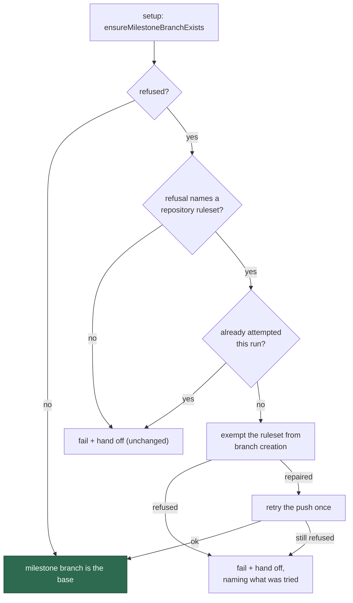

## Summary

`stSoftwareAU/GRQ-FX-validation` recorded three fast failures in 24 h and was
backed off: every claim reached `setup`, tried to open its milestone branch,
and was refused inside a minute.

```text
! [remote rejected] Develop -> milestone/scan-20260910
    (push declined due to repository rule violations)
```

Issue #2067 already diagnosed the cause and shipped both halves of the remedy —
the fleet's ruleset writer now sets `do_not_enforce_on_create`, and setup's
`branch-protection-sync` repairs a repository already carrying the trap. Setup
is **operator-run**, and nobody re-ran it against that repository: the live
ruleset (`gh api repos/stSoftwareAU/GRQ-FX-validation/rulesets/21913326`) still
reads `"do_not_enforce_on_create": false`, `updated_at` unchanged since
2026-08-31, so the trap stood and each new claim died on it.

The worker meets that refusal first-hand, so it now clears it first-hand. When
`ensureMilestoneBranchExists` fails with a message naming a repository ruleset,
the setup phase exempts the ruleset from branch creation and retries the branch
creation **once**. Nothing is swallowed: a refused write, a ruleset the worker
may not safely touch, or a retry that is still refused all leave the run failing
and the handoff now says what the worker tried and why it could not finish.

`docs/SETUP.md` said "the worker cannot do this itself: a ruleset write needs
`admin` and the service account holds `write`". That is a per-repository fact,
not a universal one — the service account holds `admin` on the repository that
was failing — so the sentence is now about what happens when the write *is*
refused rather than an assumption that it always will be.

Closes #2079.

## Evidence

Backend/CLI change — no web interface to screenshot. The evidence is the live
ruleset read from the failing repository (above), and the tests below.



## Reproduction

- **symptom** — every claim on `stSoftwareAU/GRQ-FX-validation` died in `setup`
  inside a minute, the milestone-branch push declined by the repository's own
  ruleset, until three fast failures backed the repository off
- **status** — `verified` — the phase regression test was observed failing
  against the unfixed phase (`Values are not equal: - failure / + continue`,
  and the handoff comment carrying no record of a repair attempt) and passing
  after the fix
- **regression test** —
  `worker/deno/tests/setup_milestone_create_block_test.ts::setupBranch - repairs the create-blocking ruleset and opens the milestone branch (Issue #2079)`

## Test Plan

- **New** `worker/deno/tests/setup_milestone_create_block_test.ts` — 2 tests
  driving the real setup phase with the verbatim GRQ-FX-validation refusal:
  - a create-blocking ruleset is repaired, the push retried exactly once, the
    milestone branch becomes the base, and nothing is handed to a human;
  - a repair refused for want of `admin` still fails the run, still applies
    `needs-human`, and the comment names what the worker tried.
- **New** `worker/deno/tests/milestone_create_block_repair_test.ts` — 8 tests
  on the decision module: the observed refusal is classified as a ruleset
  refusal while branch protection and a denied permission are not; a repair
  plus retry recovers; a refused repair never retries the push; nothing
  repairable is reported rather than called clean; a repair that did not
  unblock the push is reported; and one attempt is made per repository per run.
- Regression sweep: `deno test tests/issue_worker_test.ts
  tests/issue_worker_wiring_test.ts tests/milestone_ruleset_check_test.ts
  tests/milestone_ruleset_create_block_repair_test.ts
  tests/milestone_branch_rejection_test.ts tests/repo_rulesets_test.ts
  tests/milestone_branch_ensure_test.ts
  tests/milestone_branch_worktree_block_test.ts` → all pass.
- Full gate: `./quality.sh` → every check PASSED except `deno tests`, which
  reports the **two pre-existing environment failures** this container image
  produces regardless of the change: `agent_provider_test.ts` and
  `config_test.ts` both fail with _"The running container image did not install
  the 'deepseek' coding-agent provider. Installed: claude."_ Verified
  pre-existing by running both files on the base commit `076f86c8` in a clean
  worktree — identical failures. 21,644 tests pass.
- Docs: `docs/SETUP.md` (setup is no longer the only place the block is
  repaired), `docs/INTERNALS.md` (the worker's mid-run repair), and
  `docs/audits/security-sweep-2079-milestone-create-block.md` with its
  `top-up-2079` slice in `docs/audits/lib-sweep-coverage.json`, as the
  completeness gate requires for a new `worker/deno/lib` module.
