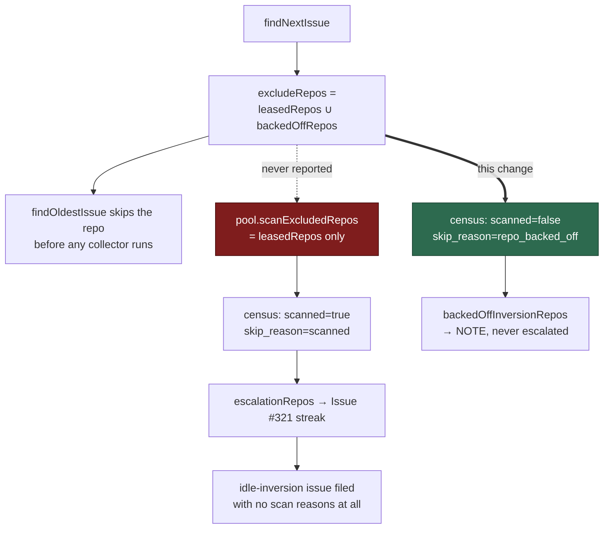

## Summary

The idle-decision census was never told about the second way a repository goes
unscanned, so it escalated a backlog the claim scan had never looked at.

`findNextIssue` unions `backedOffRepos()` — the durable fast-failure tracker's
verdict (Issue #1950) — into `findOldestIssue`'s `excludeRepos`, which drops the
repository before any collector runs. Unlike the maintenance lane's leases, that
union is computed **inside** the scan and never reached `pool.scanExcludedRepos`,
so the census read `scanned=true skip_reason=scanned`, counted the backlog as
claimable, and after three consecutive cycles filed an idle-inversion issue —
with no "what the claim scan did with them" section at all, because the scan had
recorded no reason for a single one of the eight issues.

Both idle instruments now read the same durable sidecar the scan reads (a local
file, no API call — exactly as they already do for the run-local holds):

- the census records such a repo as `scanned=false skip_reason=repo_backed_off`,
  reports it as `backedOffInversionRepos` with its own `NOTE
  inversion_repo_backed_off` line, and keeps it out of `escalationRepos`;
- the idle-detect audit unions the set into `heldRepos`, so `ALERT
  mis_classification` stops firing about a repository the scan was not shown.

Claimable counts are deliberately unchanged on both sides, so the idle-task filer
stays suppressed while the backlog waits (Issue #2813). The work that should be
done on such a repository is its own fast-failure diagnostic, which the tracker
has already filed.

Closes #2085.

## Evidence

Backend/CLI change — no web interface to screenshot. The evidence is the
reproduction below plus the tests listed in the test plan.

**The incident, reproduced from the real numbers.** VibeCoder#2085 named
`stSoftwareAU/GRQ-FX-validation` (issues #149, #147, #145, #144, #143, #142,
#141, #140) on `host=vibe-coder-76707:80`. VibeCoder#2079 — the fast-failure
diagnostic for the *same repository on the same host* — records "3 fast failures
in the last 24 h … **Backed off until:** 2026-09-16T09:10:31.000Z", failing phase
`setup`. The two sides never disagreed: the scan never saw the repository.

`tests/idle_census_backed_off_wiring_2085_test.ts` drives the real
`createProductionRunCoreDeps` with the sidecar seeded exactly as a previous
worker process would have. Against the **unfixed** deps it reproduces the issue's
own census line verbatim:

```text
[idle-census] … repo=org/backed-off-fixture monitored=true scanned=true
skip_reason=scanned … low_priority=8 … inversion_signal=true
[idle-detect] … ALERT mis_classification claimable_total=8 repos=org/backed-off-fixture
```

and after the fix reports `scanned=false skip_reason=repo_backed_off` with the
`NOTE inversion_repo_backed_off` line and no `mis_classification` ALERT. Both
directions are pinned: a repo with no back-off still reads `scanned=true` and
still escalates, so the change narrows nothing else.

**Where the disagreement was manufactured.**



## Test Plan

- Added `worker/deno/tests/idle_census_repo_backed_off_2085_test.ts` — 11 cases
  over the census module: the new `repo_backed_off` skip reason, its own
  inversion bucket, its exclusion from `escalationRepos` /
  `heldInversionRepos` / `deferredInversionRepos`, the `NOTE
  inversion_repo_backed_off` line, `isRepoBackedOffSkipReason`, and
  `resolveRepoScanState`'s precedence (the back-off outranks a lease; an omitted
  set preserves today's behaviour).
- Added `worker/deno/tests/idle_census_backed_off_wiring_2085_test.ts` — 3 cases
  driving the real production factory, seeding the durable fast-failure sidecar
  and asserting on the lines the real `runIdleDetectAudit` and
  `runIdleDecisionCensus` deps log. This is the regression test: it was observed
  failing against the unfixed deps (reproducing the issue's own census line and
  the `mis_classification` ALERT) and passing after the fix. Offline — the audit
  runs first and warms the shared issue/PR caches the census reads.
- Re-ran the neighbouring suites unchanged:
  `idle_decision_census_test.ts`, `idle_census_repo_held_898_test.ts`,
  `stream_scoped_slot_exclusion_1091_test.ts`, `idle_inversion_streak_test.ts`,
  `run_core_idle_census_test.ts`, `idle_audit_wiring_1050_test.ts`,
  `run_core_production_deps_fast_failure_test.ts` — 141 passed, 0 failed.
- `./quality.sh` run in full after the final edit.
