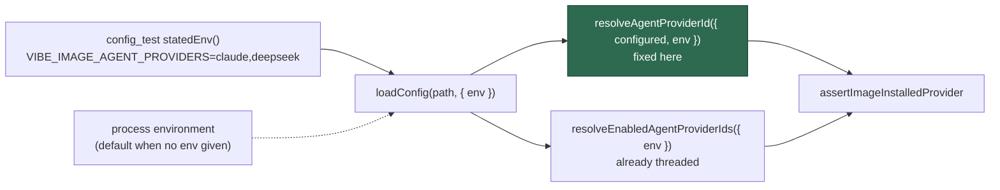

## Summary

`config_test.ts`'s two `Issue #2062` provider cases asserted which coding-agent
CLIs the running container image happens to carry, rather than the override
behaviour they are named for: on a `claude`-only image the override case failed
with `did not install the "deepseek" coding-agent provider`, and on a
`deepseek`-only image the no-override case failed the same way.

The root cause is a production seam gap, not just a test one. `loadConfig`
resolves the active provider with

```ts
resolveAgentProviderId({ configured: file.agent_provider })
```

— no `env`. Every other environment read in the loader goes through its
injected `EnvLookup` (Issue #956), including the sibling
`resolveEnabledAgentProviderIds` call immediately below it, so a loader handed
an explicit lookup still had `VIBE_AGENT_PROVIDER` and the image's
`VIBE_IMAGE_AGENT_PROVIDERS` stamp answered by the process. That is the same
one-call-short defect Issue #969 fixed at `resolveRunMode`.

This change passes the loader's own `env` through, then states the installed
set in the tests via a local `statedEnv` helper — the shape Issue #1977
established for `provider_auto_runtime_test.ts`. No production caller changes:
the parameter still defaults to the process environment.

Closes #2086.

## Evidence

Backend/CLI change — no web interface to screenshot. Evidence is the test run
under several stated image stamps (`worker/deno`):

| `VIBE_IMAGE_AGENT_PROVIDERS` | before | after |
| --- | --- | --- |
| `claude` | `FAILED \| 106 passed \| 1 failed` | `ok \| 108 passed \| 0 failed` |
| `claude,deepseek` (this host) | `ok \| 107 passed \| 0 failed` | `ok \| 108 passed \| 0 failed` |
| `claude,codex` | — | `ok \| 108 passed \| 0 failed` |
| unset (CI — no image stamp) | `ok \| 107 passed \| 0 failed` | `ok \| 108 passed \| 0 failed` |

Where the value flows now:



Known limit, stated rather than hidden: the other ~100 `loadConfig` cases in
`config_test.ts` take the default provider (`claude`) and still read the
ambient stamp, so they would fail on an image that installs no `claude` at all.
That is outside this issue's scope — `claude` is `DEFAULT_AGENT_PROVIDER_ID`
and every fleet image carries it, which is why the reported symptom was a
`claude`-only image rather than a `claude`-less one.

## Reproduction

- **symptom** — `config - the per-run provider override applies to the loaded
  agent (Issue #2062)` fails inside any container whose image installed only
  `claude`, with `The running container image did not install the "deepseek"
  coding-agent provider. Installed: claude.`
- **status** — `verified` — `VIBE_IMAGE_AGENT_PROVIDERS=claude deno test
  --allow-all --no-check tests/config_test.ts` was observed failing against the
  unfixed code with exactly that error, and passing (`108 passed | 0 failed`)
  after the fix. The `deepseek`-only variant reproduced the sibling case's
  failure the same way.
- **regression test** — `worker/deno/tests/config_test.ts::config - loadConfig
  resolves the active provider through the injected lookup (Issue #2086)`

## Test Plan

- Added `config - loadConfig resolves the active provider through the injected
  lookup (Issue #2086)` in `worker/deno/tests/config_test.ts`: the stated set
  decides in both directions — a provider it carries resolves, and one it
  excludes is refused naming `Installed: claude, deepseek` — so the case is
  host-independent and would go red again if the `env` stopped reaching
  `resolveAgentProviderId`. The module-level provider seam is cleared in a
  `finally` so the case leaks nothing into later ones.
- Modified the two `Issue #2062` cases to load through `statedEnv()`; their
  assertions are unchanged.
- Ran `tests/config_test.ts` under the `claude`, `claude,deepseek`,
  `claude,codex` and unset image stamps (table above), plus
  `tests/agent_provider_test.ts`, `tests/multi_provider_credentials_test.ts`,
  `tests/run_mode_test.ts`, `tests/config_merge_test.ts`,
  `tests/config_preflight_test.ts`, `tests/deepseek_executor_test.ts`,
  `tests/config_defaults_test.ts` and `tests/provider_auto_runtime_test.ts` —
  `225 passed | 0 failed`.
