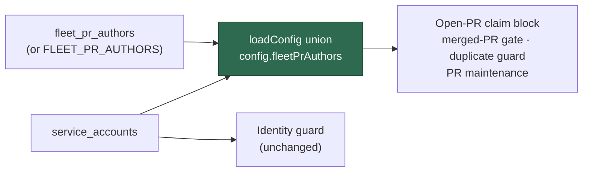

# PR Summary — Issue #209

## Summary

Sibling fleet accounts listed only under `service_accounts` were invisible to
every PR guard. The two keys fed different things: `service_accounts` reached
only the identity guard, while `getBlockingPRForIssue`, the merged-PR gate, the
duplicate-PR guard and PR maintenance all resolved their author set from
`fleet_pr_authors`. With `fleet_pr_authors` unset, a sibling's PR was read as
"some human's PR" and, by the #4133 rule, never deferred a claim — so this host
claimed NEAT-AI-Lamarck#187 three minutes after `stservice` opened PR #188 for
it and duplicated ten minutes of work.

A service account is a fleet account by definition, so the two keys now resolve
to one effective sibling list:

- `loadConfig` sets `config.fleetPrAuthors` to the deduplicated union of
  `fleet_pr_authors` (or `FLEET_PR_AUTHORS`) and `service_accounts`. Unioning
  once at load means no consumer — including the sites that build their own
  author list from `fleetPrAuthors`, such as `merge_if_checks_passed` — can see
  one key without the other.
- `resolveFleetPrAuthorSet` / `resolveFleetMaintenanceAuthorSet` accept
  `serviceAccounts` directly, for callers holding raw configuration values
  (`validateFleetConfig`, `diagnose-repo`).
- The `[fleet-config]` log names the effective author set on **every** run, not
  only a clean one, and the host's own login is no longer reported as a sibling
  missing from `allowed_authors` (`service_accounts` routinely contains it).

Docs (`CONFIGURATION.md`, `SETUP.md`, `HUMAN-PR-POLICY.md`) and both setup
prompts now state that service accounts count as fleet PR authors.

Closes #209.

### Deliberate deviation from the issue's fix list

The issue's item 3 asked `setup.sh` to write the service accounts into
`fleet_pr_authors` as well. With the union applied at load that write is
functionally redundant and would leave the same logins recorded in two places,
free to drift apart — the exact shape of the original bug. The prompts instead
state the effect, and the runtime union guarantees it regardless of how the
file was written (including hand-edited configs, which is how the incident host
was configured).

## Evidence

Backend/CLI change — no web interface to screenshot. Verified by tests, and the
`findOldestIssue` regression test was confirmed to fail against the unfixed
loader (`result.found` was `true`, i.e. the issue was claimable despite the
sibling's open PR).

Acceptance criteria:

| Criterion                                                            | Where verified                                                                 |
| -------------------------------------------------------------------- | ------------------------------------------------------------------------------ |
| A sibling in `service_accounts` only blocks the issue's claim         | `findOldestIssue - sibling in service_accounts only still blocks the duplicate` |
| The startup log names the effective fleet-author set                  | `formatFleetConfigValidation - names the effective author set even when warning` |
| `resolveFleetPrAuthorSet({…, fleetPrAuthors: [], serviceAccounts: ["stservice"]})` contains `stservice` | `resolveFleetPrAuthorSet - a service-account-only sibling is fleet-owned`       |

Gate: `./quality.sh` passes every check except `deno tests`, which reports 10
pre-existing failures unrelated to this change (`fleet_health_test.ts`,
`host_workdir_guard_test.ts`, `optional_feature_env_test.ts`,
`setup_workdir_reminder_test.ts` — container work-dir path assumptions). The
same 10 fail on a clean checkout of the branch point; the remaining 14,774
tests pass.

## Test Plan

New — `worker/deno/tests/fleet_service_accounts_test.ts` (11 tests):

- `resolveFleetPrAuthorSet` / `resolveFleetMaintenanceAuthorSet` include a
  service-account-only sibling, and it is not classified as human-authored.
- `resolveEffectiveFleetPrAuthors` unions, trims and dedupes both keys
  case-insensitively; service accounts dedupe against `fleet_pr_authors`; the
  maintenance set stays a subset of the fleet-owned set.
- `loadConfig` folds `service_accounts` into the effective `fleetPrAuthors`
  (using the incident's configuration verbatim) while `serviceAccounts` keeps
  its own value for the identity guard.
- `validateFleetConfig` covers the sibling and does not report the host's own
  login; the format helper names the effective set while warning.
- End to end: `findOldestIssue` blocks issue #187 behind the sibling's open PR
  #188 when the sibling is configured only under `service_accounts`, plus a
  control asserting the issue is selectable when there is no sibling PR.

Modified — `worker/deno/tests/fleet_config_validation_test.ts`: the two
`formatFleetConfigValidation` tests that asserted exact non-`ok` output now
expect the leading `effective-authors` line (documented behaviour change), and
a new test asserts the set is named at both `ok` and `warning` level. No test
was removed or disabled.
