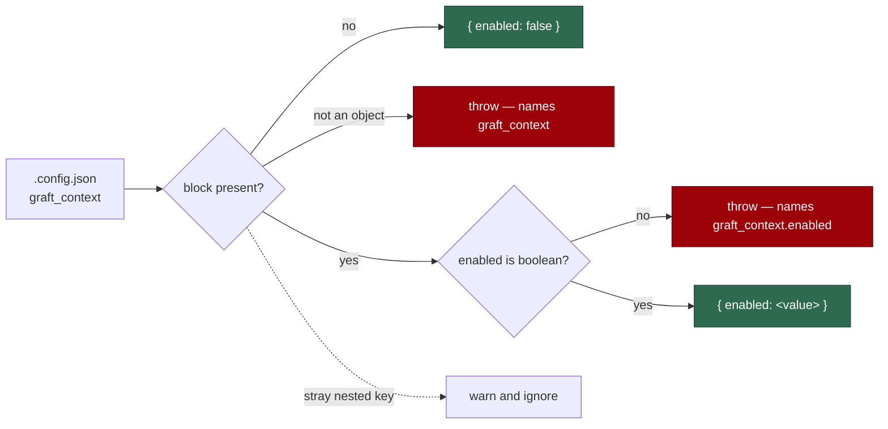

## Summary

Adds the `graft_context` block to the host `.config.json` with a single
`enabled` boolean that defaults to **false**, so a host that never writes the
block behaves exactly as it does today. Closes #2098.

New `worker/deno/lib/graft_context_config.ts` validates the untrusted block
the way `run_callbacks_config.ts` validates `callbacks`: a `Result`-returning
`parseGraftContextConfig` plus a throwing `assertGraftContextConfig` that
`loadConfig` calls, so a non-object block or a non-boolean `enabled` stops the
worker at config load with the key named rather than silently reading as off.
An unrecognised key *inside* the block changes no behaviour, so it warns and is
ignored — the treatment an unknown top-level key already gets, reached through
a new `detectUnknownNestedKeys` helper in `config_unknown_keys.ts`.

This is the configuration surface only; the Graft build and injection it
governs land with the rest of #2060.

## Evidence

Backend/config change with no web interface to screenshot. The evidence is the
test suite and the gate:

- `deno test tests/config_graft_context_test.ts tests/config_unknown_keys_test.ts`
  — 41 passed, 0 failed.
- `deno task check:manifests` — passes with the new module claimed by sweep
  slice `top-up-2098`.
- `./quality.sh` — see the Test Plan below.

## Acceptance Criteria

<!-- vibe-spec-review inputs="diff+issue-body" -->

- **met** — a `.config.json` without `graft_context` loads with
  `graftContext.enabled === false` and no warning — evidence:
  `worker/deno/tests/config_graft_context_test.ts::config graft_context - an absent block loads as disabled with no warning`
  — reviewer: met
- **met** — `{ "graft_context": { "enabled": true } }` loads as enabled —
  evidence:
  `worker/deno/tests/config_graft_context_test.ts::config graft_context - `{ enabled: true }` loads as enabled`
  — reviewer: met
- **met** — a malformed block fails config load with a message naming the key
  — evidence:
  `worker/deno/tests/config_graft_context_test.ts::config graft_context - a non-boolean `enabled` fails the config load`
  (and the non-object, array and null-`enabled` cases beside it) — reviewer: met
- **met** — `docs/CONFIGURATION.md` documents the switch — evidence:
  `docs/CONFIGURATION.md` defaults-table row beside `include_codebase_map` plus
  the `### 🌱 Graft repo-context injection` section — reviewer: met — reason:
  the reviewer flagged three claims in that section it could not trace to the
  diff (a `failed` run-stats field, `graft/` being git-ignored, the upstream
  link); the git-ignore claim was removed and the limits are now explicitly
  labelled as the injection change's behaviour
- **partial** — `deno task test`, `deno task check`, `deno lint` pass —
  evidence: full `./quality.sh` run after the final edit; `deno lint` (2624
  files) and `deno type check` clean — reviewer: partial — reason: the
  reviewer saw one failing test, `tests/config_test.ts::config - the per-run
  provider override applies to the loaded agent (Issue #2062)`, which fails on
  this host because the running container image installed only the `claude`
  provider (`lib/agent_provider.ts:1359`), as does the matching case in
  `tests/agent_provider_test.ts`. Both were confirmed failing on the unmodified
  milestone base in a scratch worktree, so they are pre-existing and
  environmental; nothing in this diff touches `agent_provider.ts`
- **unrequested** — the generic nested-key machinery in
  `worker/deno/lib/config_unknown_keys.ts` (`suggestKeyFrom`,
  `detectUnknownNestedKeys`) — reviewer: unrequested — reason: the issue asks
  that a stray nested key "warns the way the top level does", and reusing the
  existing warning shape beats a second bespoke one; `suggestSimilarKey`'s
  behaviour is unchanged and its tests still pass
- **unrequested** — tests beyond the four the issue listed (`enabled: false`,
  empty block, array block, `enabled: null`, fresh-object default, direct
  `assertGraftContextConfig`) — reviewer: unrequested — reason: the repo's test
  coverage standard requires an error path and edge cases per new public
  function
- **unrequested** — `isGraftContextEnabled(config)` in
  `worker/deno/lib/graft_context_config.ts` — reviewer: unrequested — reason:
  not flagged by the Spec reviewer (added after its run) but required by
  `tests/unused_config_fields_test.ts`, which fails a `WorkerConfig` field no
  library file reads; it is the single read point the injection change
  consumes, rather than callers reaching into the block
- **unrequested** — `docs/audits/lib-sweep-coverage.json` slice `top-up-2098`
  and `docs/audits/security-sweep-2098-graft-context-config.md` — reviewer:
  unrequested — reason: not flagged by the Spec reviewer (added after its run)
  but required by this repo's completeness gate, which goes red for any new
  `worker/deno/lib/` module claimed by no sweep slice

## Standards Review

<!-- vibe-standards-review inputs="diff+CODING-STANDARDS.md" -->

- **violation** — new `lib/` module claimed by no sweep slice, so
  `deno task check:manifests` was red — evidence:
  `worker/deno/lib/graft_context_config.ts:1` — reason: fixed here — slice
  `top-up-2098` added to `docs/audits/lib-sweep-coverage.json` with its written
  record `docs/audits/security-sweep-2098-graft-context-config.md`;
  `check:manifests` now passes (655 tests)
- **violation** — no PR summary document — evidence:
  `docs/archive/pr-summaries/pr-summary-2098.md` absent — reason: fixed here —
  this file
- **violation** — docs state a guarantee nothing implements ("the directory is
  ignored by git so the graph is never staged"; no `graft/` entry exists in
  `REQUIRED_GITIGNORE_PATTERNS`) — evidence: `docs/CONFIGURATION.md:1760` —
  reason: fixed here — the claim is removed and the surrounding limits are
  labelled as the injection change's behaviour
- **violation** — `detectUnknownNestedKeys` had no case in its owning suite —
  evidence: `worker/deno/lib/config_unknown_keys.ts:365` — reason: fixed here —
  five direct cases added to `worker/deno/tests/config_unknown_keys_test.ts`
  (recognised key, dotted field with suggestion, camelCase conversion, no
  suggestion, empty block)
- **violation** — test file named for the config block rather than the module
  (`lib/graft_context_config.ts` → `tests/graft_context_config_test.ts`) —
  evidence: `worker/deno/tests/config_graft_context_test.ts:1` — reason: stands
  — the file covers both the module and its `loadConfig` wiring, and it is
  named for the precedent it mirrors, `tests/config_callbacks_test.ts`, which
  does the same for `lib/run_callbacks_config.ts`
- **clean** — Australian English throughout; fail-loud validation with no
  catch-and-ignore or silent repair; `Result<T, E>` and `@std/assert`
  conventions; the raw block typed `unknown` on `ConfigFile` and typed only
  after validation; defaults registered in `OPERATIONAL_DEFAULTS`; tests call
  real functions with real data (no source-grepping, no sleeps, no wall-clock
  budgets); additive contract with nothing removed or renamed; no hidden paths
  or key material staged; commit carries the issue reference and the
  `Vibe-Coder-Run-Id` trailer

## Test Plan

Added `worker/deno/tests/config_graft_context_test.ts` (14 cases):

- `loadConfig` wiring: absent block → `enabled === false` with no
  `graft_context` warning; `{ enabled: true }` → enabled; `{ enabled: false }`
  → disabled; `{ enabled: "yes" }` → load error naming
  `graft_context.enabled`; a non-object block → load error naming
  `graft_context`; an unknown nested key → one warning naming
  `graft_context.enabledd` and suggesting `graft_context.enabled`, with the
  config still loading as off; `graft_context` recognised by
  `KNOWN_CONFIG_KEYS` / `detectUnknownConfigKeys`.
- Module unit cases: absent and `null` → the off default; empty block → off; an
  array block and a `null` `enabled` rejected naming the key; unknown nested
  keys warn through an injected sink; `graftContextOff()` returns a fresh
  object each call; `assertGraftContextConfig` throws naming the key;
  `isGraftContextEnabled` reads the loaded switch and is false on the default
  config.

Extended `worker/deno/tests/config_unknown_keys_test.ts` (5 cases) for
`detectUnknownNestedKeys`: recognised key → no warning; unknown key → dotted
field with a within-block suggestion; camelCase → snake_case conversion; a
distant key → no suggestion; empty block → no warnings.
