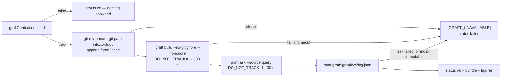

## Summary

Adds `worker/deno/lib/graft_context.ts` — the one module that builds a Graft
code graph of a checkout, queries it for a source bundle, reads the graph
figures, fences the bundle for the user turn, and keeps `graft/` alive across
runs. Both subprocess seams are injectable, so no test spawns anything.

On a host with `graft_context.enabled` false (the default, from #2098) the
module returns `status: "off"` at once and spawns nothing. On an enabled host
it appends `/graft/` to the git-resolved `info/exclude`, runs
`graft build --no-gitignore --no-ignore` (300 s) and `graft ask --source`
(30 s) with `DO_NOT_TRACK=1`, and reads `graft/.graph/wiring.json` for the node
count and the number of `calls` edges. Every fault — a non-zero exit, a
timeout, a missing binary, an absent or unparseable index — logs exactly one
`[GRAFT_UNAVAILABLE] <reason>` line at `warn` and returns `status: "failed"`
with whatever figures were gathered. Nothing throws: the bundle is an
accelerator, so losing it must never fail a run.

`/graft/` also joins `REQUIRED_GITIGNORE_PATTERNS`, so the graph can never be
committed. Closes #2099.

## Evidence

Backend-only change with no web interface, so there is no screenshot to
capture. The evidence is the test suite plus the quality gate.

**Why `info/exclude` as well as the `.gitignore` pattern.** `gitignore_sync.ts`
runs only at `setup.sh` time and its `.gitignore` edit is uncommitted;
`checkout_update.ts` runs `git reset --hard` then `git clean -fd` on every run,
which reverts that edit and would then delete an untracked, unignored
`graft/`. The exclude file is per-clone, survives reset/clean, and can never be
staged — so it is the entry that actually keeps the graph between runs. The
enforcer pattern is the separate guarantee that it is never committed.

**`graft/` and the scoped ignored clean.** `ignored_path_clean.ts` erases
`EXECUTABLE_IGNORED_DIRS` at any depth on every run. The documented layout is
`graft/.graph/wiring.json`; neither `graft` nor `.graph` is in that list, and
`the scoped ignored clean erases no part of the graft/ layout` pins it against
the real `ignoredExecutableCleanArgs()` pathspecs.

**Not confirmed on the image — stated plainly.** Graft is **not installed** in
this container (`which graft` → not found; no `graft*` binary under `/opt`,
`~/.cargo/bin` or the first four levels of `/`), so `graft build --help` could
not be run here and the `graft/` layout could not be observed from a real
build. The image pin is a runtime prerequisite of #2060, not of this module —
every test injects the runner. Two assumptions therefore stand as the issue
recorded them: that `--no-gitignore --no-ignore` are the flags that stop Graft
editing `.gitignore`, and that `graft ask` takes its query as an argument.
`readGraphFigures` accepts a list **or** an id-keyed map for `nodes`/`edges`
for the same reason, and fails loud on anything else — see
`docs/audits/security-sweep-2099-graft-context.md`.

**Quality gate.** `./quality.sh` run in full after the final edit: every check
PASSED except `deno tests`, which reports two failures that **pre-date this
branch** and are unrelated to it —
`config - the per-run provider override applies to the loaded agent (Issue
#2062)` and `agent provider - the per-run provider override beats the
configured file value (Issue #2062)`. Both fail with
`The running container image did not install the "deepseek" coding-agent
provider. Installed: claude.` Verified by checking out the branch base
(`a6fa91de`) into a scratch worktree and running the same two tests there:
`FAILED | 0 passed | 2 failed`. Neither test file is touched by this diff.

## Standards Review

<!-- vibe-standards-review inputs="diff+CODING-STANDARDS.md" -->

- **violation** — a doc comment said "seconds" beside a millisecond value — evidence: `worker/deno/lib/graft_context.ts:78` — reason: fixed here; both constants now read "Milliseconds … (300 s)" / "(30 s)"
- **violation** — two tests asserted on a constant array rather than exercising code — evidence: `worker/deno/tests/graft_context_test.ts:569` — reason: fixed here; replaced by one test that calls `ignoredExecutableCleanArgs()` and checks the real pathspecs, which also removes the duplication between the two
- **violation** — `truncateUtf8` is exported with no direct test (empty, exact limit, zero) — evidence: `worker/deno/lib/graft_context.ts:590` — reason: fixed here; two boundary tests added, including a split four-byte character
- **violation** — error paths and the link-free security claim were unpinned (`wiring.json` not an object, no readable `nodes`/`edges`, the id-keyed shape, and the symlink refusals the audit record asserts) — evidence: `worker/deno/lib/graft_context.ts:493`, `:400`, `:433` — reason: fixed here; five cases added, two of them planting a symlink and asserting the link target is left untouched
- **violation** — the second fault was dropped when the ask failed and the index was also unreadable — evidence: `worker/deno/lib/graft_context.ts:259` — reason: fixed here; the reason now names both
- **violation** — `CONFIGURATION.md` documented the limits but not the `[GRAFT_UNAVAILABLE]` marker or the 64 KiB query cap — evidence: `docs/CONFIGURATION.md:1751` — reason: fixed here; both are now operator-facing
- **violation** — `formatGraftContextSection` duplicates the five-line body of `formatCodebaseMapSection` — evidence: `worker/deno/lib/graft_context.ts:556` vs `worker/deno/lib/codebase_map.ts:729` — reason: **stands**. The issue asked for a section "mirroring `formatCodebaseMapSection`"; extracting a shared fencing helper means editing `codebase_map.ts`, which this issue does not ask for and Change Scope forbids. Recorded rather than silently accepted
- **violation** — no PR summary file — evidence: `docs/archive/pr-summaries/pr-summary-2099.md` — reason: fixed here; this file
- **clean** — Australian English throughout; fail-loud with no catch-and-ignore (the only swallowed exception is `AlreadyExists` on `mkdir`, and a missing index is an error rather than a zero); secret redaction already wired on both sinks the module reaches; every `graft` argv a literal array plus one truncated element, no shell, no network, paths never built from untrusted text; both spawns through their chokepoints (`gh`/`git` spawn-chokepoint checks PASSED); commit safety — no hidden path staged, both commits carry the run-id trailer; the lib-sweep ledger entry, its `top-up-2099` chunk and its written record all present (`check:manifests` PASSED); no wall-clock sleep or absolute-millisecond assertion in any test

## Test Plan

Added `worker/deno/tests/graft_context_test.ts` (26 tests, none spawning):

- off → `status: "off"`, no `run` and no `git` call, nothing logged
- happy path → `ok` with `buildSeconds`, `bundleChars`, `nodeCount: 3`,
  `callEdgeCount: 2` (only `calls` edges counted) and the bundle text
- the documented argv, `cwd`, `DO_NOT_TRACK=1` and 300 s / 30 s limits, and no
  `--lsp` on either invocation
- build non-zero → `failed`, and `graft ask` is never spawned
- build timeout → `failed` with `buildSeconds` still reported
- ask timeout → `failed` with the node and edge figures present
- spawn error (binary missing) → `failed`, no throw
- `wiring.json` absent / unparseable / not an object / without readable
  `nodes` and `edges` → `failed`
- an id-keyed `wiring.json` counts correctly
- a symlinked exclude file and a symlinked `wiring.json` are refused, and the
  link target is left untouched
- a failed `git rev-parse` fails loud and spawns no `graft`
- the exclude file gains `/graft/` exactly once across two calls, is created
  when absent, and an absolute `--git-path` answer (lane worktree) resolves
- an over-long query is truncated on a code-point boundary; a short one is
  passed through untouched
- `truncateUtf8` boundaries: empty, exact limit, zero, split four-byte
  character
- `formatGraftContextSection`: empty → `""`; the section is tagged
  `<document source="graft ask --source">`; a bundle carrying delimiter-shaped
  text cannot close the fence
- the scoped ignored clean's real pathspecs erase no part of the `graft/`
  layout

Extended `worker/deno/tests/gitignore_enforcer_test.ts`: `/graft/` in the
canonical pattern list, `graft/.graph/wiring.json` ignored while
`src/graft/parser.ts` is not (the pattern is root-anchored), and `/graft/`
written exactly once across two enforcement passes.
