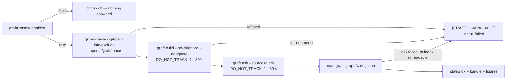

## Summary

Adds `worker/deno/lib/graft_context.ts` — the one module that builds a Graft
code graph of a checkout, queries it for a source bundle, reads the graph
figures, fences the bundle for the user turn, and keeps `graft/` alive across
runs. Both subprocess seams are injectable, so no test spawns anything.

On a host with `graft_context.enabled` false (the default, from #2098) the
module returns `status: "off"` at once and spawns nothing. On an enabled host
it appends `/graft/` to the git-resolved `info/exclude`, runs
`graft build --no-gitignore --no-ignore` (300 s) and `graft ask --source`
(30 s) with `DO_NOT_TRACK=1`, and reads `graft/.graph/wiring.json` for the node
count and the number of `calls` edges. Every fault — a non-zero exit, a
timeout, a missing binary, an absent or unparseable index — logs exactly one
`[GRAFT_UNAVAILABLE] <reason>` line at `warn` and returns `status: "failed"`
with whatever figures were gathered. Nothing throws: the bundle is an
accelerator, so losing it must never fail a run.

`/graft/` also joins `REQUIRED_GITIGNORE_PATTERNS`, so a checkout carrying the
canonical pattern set cannot stage the graph. The two entries differ in reach
and the docs now say which does the work: during a run it is the `info/exclude`
line that is in force, because the enforcer's `.gitignore` edit is uncommitted
and the per-run `git reset --hard` reverts it. Closes #2099.

## Evidence

Backend-only change with no web interface, so there is no screenshot to
capture. The evidence is the test suite plus the quality gate.

**Why `info/exclude` as well as the `.gitignore` pattern.** `gitignore_sync.ts`
runs only at `setup.sh` time and its `.gitignore` edit is uncommitted;
`checkout_update.ts` runs `git reset --hard` then `git clean -fd` on every run,
which reverts that edit and would then delete an untracked, unignored
`graft/`. The exclude file is per-clone, survives reset/clean, and can never be
staged — so it is the entry that actually keeps the graph between runs. The
enforcer pattern is the separate guarantee that it is never committed.

**`graft/` and the scoped ignored clean.** `ignored_path_clean.ts` erases
`EXECUTABLE_IGNORED_DIRS` at any depth on every run. The documented layout is
`graft/.graph/wiring.json`; neither `graft` nor `.graph` is in that list, and
`the scoped ignored clean erases no part of the graft/ layout` pins it against
the real `ignoredExecutableCleanArgs()` pathspecs.

**Not confirmed on the image — stated plainly.** Graft is **not installed** in
this container (`which graft` → not found; no `graft*` binary under `/opt`,
`~/.cargo/bin` or the first four levels of `/`), so `graft build --help` could
not be run here and the `graft/` layout could not be observed from a real
build. The image pin is a runtime prerequisite of #2060, not of this module —
every test injects the runner. Two assumptions therefore stand as the issue
recorded them: that `--no-gitignore --no-ignore` are the flags that stop Graft
editing `.gitignore`, and that `graft ask` takes its query as an argument.
`readGraphFigures` accepts a list **or** an id-keyed map for `nodes`/`edges`
for the same reason, and fails loud on anything else — see
`docs/audits/security-sweep-2099-graft-context.md`.

**Quality gate.** `./quality.sh` run in full after the final edit:
`Result: PASSED (with skipped checks)`. Every check passes, `deno tests`
included — the two provider-override failures an earlier attempt on this
branch recorded as pre-existing (`config - the per-run provider override
applies to the loaded agent (Issue #2062)` and its `agent provider` twin) were
fixed on the default branch by #2140 and #2146 and no longer fail here. The
only skip is `config integration`, which the gate skips on a host with no
integration config and which this diff does not touch.

## Standards Review

<!-- vibe-standards-review inputs="diff+CODING-STANDARDS.md" -->

- **violation** — a code change owes a docs change: the operator text asserted present-tense runtime behaviour ("logs one `[GRAFT_UNAVAILABLE]` line", "records a `failed` Graft status") for a runner that has no caller yet, so an operator told to grep the log would find silence and read it as success — evidence: `docs/CONFIGURATION.md:1751` — reason: fixed here; both new paragraphs now carry the same "this is what #2099 implements, and #2060 wires in" hedge the neighbouring limits paragraph already had
- **violation** — the same section contradicted itself: twelve lines above, "enabling the switch today changes nothing" — evidence: `docs/CONFIGURATION.md:1739` vs `:1751` — reason: fixed here by the same hedge
- **violation** — a guarantee asserted on the weaker of the two mechanisms: "`/graft/` is in the canonical `.gitignore` pattern set … so the graph can never be committed", contradicted by this diff's own module header, which explains the `.gitignore` edit is uncommitted and reverted by the per-run `git reset --hard` — evidence: `docs/CONFIGURATION.md:1779` — reason: fixed here; the paragraph now says which of the two entries is actually in force during a run (`info/exclude`) and which is the belt to its braces
- **violation** — test coverage expectations: no test pinned the redaction the sweep record claims for `formatGraftContextSection` — a credential planted in the bundle was never asserted redacted — evidence: `worker/deno/tests/graft_context_test.ts:795` — reason: fixed here; `a credential in the bundle is redacted before it is fenced (Issue #2099)` plants a token-shaped string and asserts it does not survive into the section
- **violation** — test coverage expectations: the `needsNewline` branch was never exercised, so an `info/exclude` whose last pattern has no trailing newline — where a missing `\n` would fuse `/graft/` onto the operator's own entry and silently break both — went untested — evidence: `worker/deno/lib/graft_context.ts:464` — reason: fixed here; `an exclude file with no trailing newline is not fused onto (Issue #2099)` asserts both lines survive intact
- **violation** — the sweep slice was anchored to `9bea06e552…`, which is not an object in this repository, so `driftSince` would throw for that slice — evidence: `docs/audits/lib-sweep-coverage.json:1612` — reason: fixed here; `sweptAt` now names `b7b29797…`, the empty-bundle commit the record's fail-direction claim actually depends on. (31 of the 51 pre-existing slices carry equally unresolvable anchors from squash-merged history; that is not this change's to fix)
- **violation** — DRY: a second `truncateUtf8(text, maxBytes)` with the same contract already exists at `worker/deno/lib/security.ts:248` — evidence: `worker/deno/lib/graft_context.ts:630` — reason: **stands**. The existing one is module-private and strips a trailing replacement character rather than walking back over continuation bytes, so it is lossy on input that legitimately ends in U+FFFD; lifting it means editing `security.ts`, which this issue does not ask for and Change Scope forbids. Recorded rather than silently accepted
- **violation** (minor) — production reads time through `lib/clock.ts` — evidence: `worker/deno/lib/graft_context.ts:242`, `:641` — reason: **stands**. `performance.now()` here measures a *duration* for a reported figure, not a deadline; the clock seam exists so tests can drive watchdogs without sleeping, and no watchdog is armed here — the two timeouts are enforced by `runWithTimeout`, which already has its own seam and whose limits the tests assert on what the injected runner was handed
- **violation** (minor) — `formatGraftContextSection` duplicates the five-line body of `formatCodebaseMapSection` — evidence: `worker/deno/lib/graft_context.ts:556` vs `worker/deno/lib/codebase_map.ts:729` — reason: **stands**, for the same Change Scope reason as the `truncateUtf8` entry above; the issue asked for a section copying that shape
- **violation** (minor) — the test harness's `fakeRunner` throws "unexpected spawn" as an over-spawn guard, but production catches every seam throw and converts it to `failed`, so the guard only bites in cases that separately assert `calls.length` — evidence: `worker/deno/tests/graft_context_test.ts:87` — reason: **stands**. It is a belt-and-braces guard, not an assertion any case relies on; the cases that care about spawn counts assert them directly, which is the stronger check
- **clean** — the three surfaces that enumerate `.gitignore` patterns (`CODING-STANDARDS.md:535`, `prompts/coding_guidelines/`, `SECURITY.md:675`) were checked against `/graft/` joining `REQUIRED_GITIGNORE_PATTERNS` and need no update: they enumerate the **hidden-path allowlist** and the forbidden secret/key patterns, not the whole set, and `/graft/` is a build artefact — neither hidden nor secret-bearing. The related observation that the enforcer runs for every monitored repo regardless of `graft_context.enabled`, so a repo that never runs Graft gains a root-anchored ignore of a directory it never creates, is accurate, harmless, and exactly what the issue asked for
- **clean** — Australian English throughout, no US spellings in any added line; fail-loud with no catch-and-ignore (the only swallowed exception is `AlreadyExists` on `mkdir`; a missing or wrong-shaped index errors rather than degrading to a zero count; a zero-exit ask that printed nothing is a failure, not `ok`); subprocess chokepoints — no `Deno.Command` in the module, `graft` only via `runWithTimeout` and `git` only via `runGitCommand`, both bounded and both injectable; injection surface — the query is one argv element and never a shell, the bundle reaches the prompt only through `sanitiseDelimiterPatterns` inside a `codeFenceFor` fence; path handling — both filesystem paths read and appended link-free with planted-symlink tests that also assert the link target is untouched, and an empty `--git-path` answer refused before anything spawns; test quality — 34 cases in 40 ms, no sleeps, no absolute-millisecond assertions, no real spawns, no source-grepping; commit safety — no hidden path staged outside the allowlist, no `git add -f`, every commit carries the run-id trailer

## Test Plan

Added `worker/deno/tests/graft_context_test.ts` (34 tests, none spawning):

- off → `status: "off"`, no `run` and no `git` call, nothing logged
- happy path → `ok` with `buildSeconds`, `bundleChars`, `nodeCount: 3`,
  `callEdgeCount: 2` (only `calls` edges counted) and the bundle text
- the documented argv, `cwd`, `DO_NOT_TRACK=1` and 300 s / 30 s limits, and no
  `--lsp` on either invocation
- build non-zero → `failed`, and `graft ask` is never spawned
- build timeout → `failed` with `buildSeconds` still reported
- ask timeout → `failed` with the node and edge figures present
- spawn error (binary missing) → `failed`, no throw
- `wiring.json` absent / unparseable / not an object / without readable
  `nodes` and `edges` → `failed`
- an id-keyed `wiring.json` counts correctly
- a symlinked exclude file and a symlinked `wiring.json` are refused, and the
  link target is left untouched
- a failed `git rev-parse` fails loud and spawns no `graft`
- the exclude file gains `/graft/` exactly once across two calls, is created
  when absent, and an absolute `--git-path` answer (lane worktree) resolves
- an exclude file whose last pattern has no trailing newline is not fused onto
  — both the operator's entry and `/graft/` survive as separate lines
- an over-long query is truncated on a code-point boundary; a short one is
  passed through untouched
- `truncateUtf8` boundaries: empty, exact limit, zero, split four-byte
  character
- `formatGraftContextSection`: empty → `""`; the section is tagged
  `<document source="graft ask --source">`; a bundle carrying delimiter-shaped
  text cannot close the fence; a credential planted in the bundle is redacted
  before it is fenced
- the scoped ignored clean's real pathspecs erase no part of the `graft/`
  layout

Extended `worker/deno/tests/gitignore_enforcer_test.ts`: `/graft/` in the
canonical pattern list, `graft/.graph/wiring.json` ignored while
`src/graft/parser.ts` is not (the pattern is root-anchored), and `/graft/`
written exactly once across two enforcement passes.
