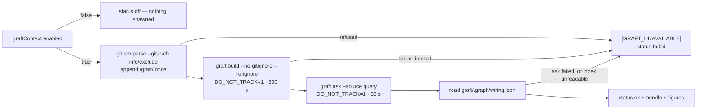

## Summary

Adds `worker/deno/lib/graft_context.ts` — the one module that builds a Graft
code graph of a checkout, queries it for a source bundle, reads the graph
figures, fences the bundle for the user turn, and keeps `graft/` alive across
runs. Both subprocess seams are injectable, so no test spawns anything.

On a host with `graft_context.enabled` false (the default, from #2098) the
module returns `status: "off"` at once and spawns nothing. On an enabled host
it appends `/graft/` to the git-resolved `info/exclude`, runs
`graft build --no-gitignore --no-ignore` (300 s) and `graft ask --source`
(30 s) with `DO_NOT_TRACK=1`, and reads `graft/.graph/wiring.json` for the node
count and the number of `calls` edges. Every fault — a non-zero exit, a
timeout, a missing binary, an absent or unparseable index — logs exactly one
`[GRAFT_UNAVAILABLE] <reason>` line at `warn` and returns `status: "failed"`
with whatever figures were gathered. Nothing throws: the bundle is an
accelerator, so losing it must never fail a run.

`/graft/` also joins `REQUIRED_GITIGNORE_PATTERNS`, so a checkout carrying the
canonical pattern set cannot stage the graph. The two entries differ in reach
and the docs now say which does the work: during a run it is the `info/exclude`
line that is in force, because the enforcer's `.gitignore` edit is uncommitted
and the per-run `git reset --hard` reverts it. Closes #2099.

## Evidence

Backend-only change with no web interface, so there is no screenshot to
capture. The evidence is the test suite plus the quality gate.

**Why `info/exclude` as well as the `.gitignore` pattern.** `gitignore_sync.ts`
runs only at `setup.sh` time and its `.gitignore` edit is uncommitted;
`checkout_update.ts` runs `git reset --hard` then `git clean -fd` on every run,
which reverts that edit and would then delete an untracked, unignored
`graft/`. The exclude file is per-clone, survives reset/clean, and can never be
staged — so it is the entry that actually keeps the graph between runs. The
enforcer pattern is the separate guarantee that it is never committed — and
this repository's own committed root `.gitignore` now carries the line too,
because `graft/` is not hidden and the file's `.*` rule never reached it.

**`graft/` and the scoped ignored clean.** `ignored_path_clean.ts` erases
`EXECUTABLE_IGNORED_DIRS` at any depth on every run. The documented layout is
`graft/.graph/wiring.json`; neither `graft` nor `.graph` is in that list, and
`the scoped ignored clean erases no part of the graft/ layout` pins it two
ways — `EXECUTABLE_IGNORED_DIRS` membership, and the real pathspecs
`ignoredExecutableCleanArgs()` emits — so neither a change to the list nor a
change to the pathspec syntax can erase the graph unnoticed.

**Not confirmed on the image — stated plainly.** Graft is **not installed** in
this container (`which graft` → not found; no `graft*` binary under `/opt`,
`~/.cargo/bin` or the first four levels of `/`), so `graft build --help` could
not be run here and the `graft/` layout could not be observed from a real
build. The image pin is a runtime prerequisite of #2060, not of this module —
every test injects the runner. Two assumptions therefore stand as the issue
recorded them: that `--no-gitignore --no-ignore` are the flags that stop Graft
editing `.gitignore`, and that `graft ask` takes its query as an argument.
`readGraphFigures` accepts a list **or** an id-keyed map for `nodes`/`edges`
for the same reason, and fails loud on anything else — see
`docs/audits/security-sweep-2099-graft-context.md`.

**Quality gate.** `./quality.sh` run in full after the final edit:
`Result: PASSED (with skipped checks)`. Every check passes, `deno tests`
included — the two provider-override failures an earlier attempt on this
branch recorded as pre-existing (`config - the per-run provider override
applies to the loaded agent (Issue #2062)` and its `agent provider` twin) were
fixed on the default branch by #2140 and #2146 and no longer fail here. The
only skip is `config integration`, which the gate skips on a host with no
integration config and which this diff does not touch.

## Acceptance Criteria

<!-- vibe-spec-review inputs="diff+issue-body" -->

- **met** — `enabled: false` → status `off`, no subprocess spawned — evidence: `worker/deno/tests/graft_context_test.ts::collectGraftContext - disabled returns off and spawns nothing` (asserts `runner.calls.length === 0`, `git.calls.length === 0`, nothing logged) — reviewer: met
- **met** — happy path with a fake runner and a fixture `wiring.json` → status `ok` with `buildSeconds`, `bundleChars`, `nodeCount`, `callEdgeCount` and the bundle text — evidence: `worker/deno/tests/graft_context_test.ts::collectGraftContext - builds, asks, and reports the figures` (all five fields asserted; `nodeCount: 3`, `callEdgeCount: 2` from a four-edge fixture, so only `calls` edges are counted) — reviewer: met
- **met** — every failure mode (build fail, build timeout, ask timeout, spawn error, missing `wiring.json`) → status `failed`, one `[GRAFT_UNAVAILABLE]` warn line, no throw — evidence: `worker/deno/tests/graft_context_test.ts::collectGraftContext - build non-zero exit fails without asking`, `- build timeout fails and still reports buildSeconds`, `- ask timeout fails with the graph figures present`, `- a spawn error (binary missing) fails without throwing`, `- missing wiring.json fails`, each asserting `warns.length === 1` — reviewer: met
- **met** — `graft` is invoked with `DO_NOT_TRACK=1`, `build --no-gitignore --no-ignore`, `ask --source`, the 300 s / 30 s limits and no `--lsp` — evidence: `worker/deno/tests/graft_context_test.ts::collectGraftContext - invokes graft with the documented argv, env and limits` (exact argv arrays, `cwd`, `env.DO_NOT_TRACK === "1"`, `timeoutMs` 300_000 / 30_000 as literals, and both calls checked for `--lsp`) — reviewer: met
- **met** — `/graft/` is appended to the git-resolved `info/exclude` exactly once across repeated calls, and is present in `REQUIRED_GITIGNORE_PATTERNS` — evidence: `worker/deno/tests/graft_context_test.ts::collectGraftContext - writes /graft/ to info/exclude exactly once across two calls`, `- resolves an absolute git-path answer (lane worktree)`, and `worker/deno/tests/gitignore_enforcer_test.ts::ensureGitignorePatterns - /graft/ is written exactly once across two passes (Issue #2099)` — reviewer: met
- **met** — `deno task check`, `deno lint`, `deno task test` and the spawn-chokepoint scan pass, and the PR summary carries the `## Acceptance Criteria` and `## Standards Review` blocks — evidence: `./quality.sh` → `Result: PASSED (with skipped checks)` with `gh`/`git` spawn chokepoints, `deno tests`, `deno lint` and `deno type check` all `PASSED`; this block and the one below it — reviewer: partial — reason: the reviewer read `pr-summary-2099.md` before this block existed and could not run the gate itself; the block is present now and the full gate was re-run green after the final edit
- **unrequested** — a zero-exit `graft ask` that returns an empty bundle is treated as `failed` rather than `ok` — evidence: `worker/deno/lib/graft_context.ts` and `worker/deno/tests/graft_context_test.ts::collectGraftContext - a zero-exit ask returning an empty bundle fails rather than reporting ok` — reviewer: unrequested — reason: the issue's failure rule does not list it, but returning `ok` with no bundle is exactly the "absence of a failure marker is not success" trap the coding standards forbid
- **unrequested** — a truncated query announces itself on a `[GRAFT_QUERY_TRUNCATED]` warn line, and `truncateUtf8` / `utf8Length` are exported — evidence: `worker/deno/lib/graft_context.ts`, `worker/deno/tests/graft_context_test.ts::collectGraftContext - a cut query is reported, an untouched one is not` — reviewer: unrequested — reason: the issue asks only that the query be cut; a silent cut makes a thin bundle indistinguishable from a full one, so the degradation is said out loud on its own marker, leaving `[GRAFT_UNAVAILABLE]` one-per-failure
- **unrequested** — a failure resolving, reading or appending to `info/exclude` (including a planted symlink and an empty `--git-path` answer) fails the collection before anything is spawned — evidence: `worker/deno/tests/graft_context_test.ts::collectGraftContext - refuses a symlinked exclude file rather than writing through it`, `- a git-path answer of nothing fails rather than writing to the repo root`, `- a failed git-path lookup fails loud and spawns no graft` — reviewer: unrequested — reason: the issue's step 2 only says "append a line"; a graph the next `git clean` deletes is 300 s spent for nothing, and writing to an unresolved path is the worse alternative
- **unrequested** — `wiring.json` is accepted as a list **or** an id-keyed map, with two extra failure classes ("not a JSON object", "no readable nodes and edges") — evidence: `worker/deno/tests/graft_context_test.ts::collectGraftContext - counts an id-keyed wiring.json as well as a list`, `- a wiring.json that is not an object fails`, `- a wiring.json without readable nodes and edges fails` — reviewer: unrequested — reason: Graft is not installed on this image, so the index shape could not be observed; the tolerance covers the two plausible shapes and every other shape fails loud rather than degrading to a zero count
- **unrequested** — the graph figures are read even when the ask failed, and both faults are reported on one reason line — evidence: `worker/deno/tests/graft_context_test.ts::collectGraftContext - ask timeout fails with the graph figures present` — reviewer: unrequested — reason: the issue says the figures "may be absent" after an ask failure; reporting the graph size is what makes a `failed` status diagnosable, and dropping the second fault would hide half the diagnosis
- **unrequested** — the module exports six constants (`GRAFT_BUILD_TIMEOUT_MS`, `GRAFT_ASK_TIMEOUT_MS`, `MAX_GRAFT_QUERY_BYTES`, `GRAFT_EXCLUDE_PATTERN`, `GRAFT_WIRING_PATH`, `GRAFT_LAYOUT_DIRS`), two helpers and four types beyond the three things the issue names — evidence: `worker/deno/lib/graft_context.ts` — reviewer: unrequested — reason: the tests assert the documented limits and the layout invariant against the values production uses rather than against restated literals, which needs them exported
- **unrequested** — `/graft/` is added to this repository's own committed root `.gitignore`, with a test pinning it — evidence: `.gitignore`, `worker/deno/tests/gitignore_enforcer_test.ts::root .gitignore - ignores Graft's code graph (Issue #2099)` — reviewer: unrequested — reason: raised by the Standards reviewer below; `graft/` is not hidden, so the root file's `.*` rule never reached it, and #3660 set the precedent that a non-hidden enforcer pattern lands on both surfaces
- **unrequested** — operator documentation in `docs/CONFIGURATION.md`, a security-sweep record and a `lib-sweep-coverage.json` slice — evidence: `docs/CONFIGURATION.md`, `docs/audits/security-sweep-2099-graft-context.md`, `docs/audits/lib-sweep-coverage.json` — reviewer: unrequested — reason: the repo's own gates require them — a code change owes a docs change, and the lib sweep ledger is checked by `./quality.sh`
- **unrequested** — the diff handed to the reviewers carried callback-contract hunks (`mode`, `telemetry.turns`, `telemetry.model`) and a `top-up-2100` sweep slice — evidence: that diff, cut against `a6fa91de` — reviewer: unrequested — reason: not authored here; they are #2100 (commit `4bd7caa4`), already merged. The milestone branch has since been merged into this one, so the PR diff no longer contains them and the change is Graft-only

## Standards Review

<!-- vibe-standards-review inputs="diff+CODING-STANDARDS.md" -->

- **violation** — the canonical pattern set gained `/graft/` but this repository's own committed root `.gitignore` did not, and `graft/` is not hidden so the file's `.*` rule never reached it — the #3660 precedent lands a non-hidden pattern on both surfaces and pins the root file by test — evidence: `.gitignore:48` — reason: fixed here; `/graft/` is now in the root file and `root .gitignore - ignores Graft's code graph (Issue #2099)` pins it, including that a nested `graft/` directory in our own source stays tracked
- **violation** — the security-sweep record misstated its own subject: "three fixed regexes, all linear: `/\s+/g` over a bounded diagnostic". The module has one regex literal of its own, and its input is *unbounded* subprocess stderr — `detail()` collapses first and truncates afterwards — evidence: `docs/audits/security-sweep-2099-graft-context.md:37` — reason: fixed here; the row now states the real count, that the bound is applied after the scan, and why `\s+` is linear regardless
- **violation** — the operator cause list for `[GRAFT_UNAVAILABLE]` omitted the `info/exclude` resolve/read/append failure — the one cause that fires before anything is spawned, so an operator hitting it would see a line matching no documented cause — evidence: `docs/CONFIGURATION.md:1752` — reason: fixed here; it is now the first cause listed
- **violation** — the `graft/`-survives-the-clean invariant was pinned only on the *pathspec string format* `ignoredExecutableCleanArgs()` emits, so changing that syntax would leave the test green while `graft/` was erased — evidence: `worker/deno/tests/graft_context_test.ts:879` — reason: fixed here; the case now asserts `EXECUTABLE_IGNORED_DIRS` membership **and** the generated pathspecs, so neither a list change nor a syntax change can pass unseen
- **violation** — "fake the external service, do not assert the request" (the Issue #470 scar): the argv/env/limits case asserts the literal request text of a CLI that is not installed on this image, so no execution has ever confirmed those subcommands and flags — evidence: `worker/deno/tests/graft_context_test.ts:209` — reason: **stands**, and named as the deliberate trade it is. Acceptance criterion 4 asks for exactly this assertion, and with no binary to run there is no stronger check available here; the PR summary and the module header both record the flags as an unverified assumption from #2060 rather than an observed fact
- **violation** — `entriesOf` accepts an array *or* any object for `nodes`/`edges`, so a hypothetical summary-shaped index (`{"nodes":{"total":7}}`) would yield a confident wrong figure and a `status: "ok"` — evidence: `worker/deno/lib/graft_context.ts:563` — reason: **stands**. The real shape could not be observed (no binary on the image) and the two accepted shapes are the two the index is plausibly written in; every other shape fails loud. Narrowing it to the observed shape is #2060's job, once a real `wiring.json` exists to observe
- **violation** (minor) — DRY: a module-private `truncateUtf8` with the same contract already exists at `worker/deno/lib/security.ts:248` — evidence: `worker/deno/lib/graft_context.ts:630` — reason: **stands**. That one strips a trailing replacement character rather than walking back over continuation bytes, so it is lossy on input legitimately ending in U+FFFD; lifting it means editing `security.ts`, which this issue does not ask for and Change Scope forbids
- **violation** (minor) — production reads time through `lib/clock.ts` — evidence: `worker/deno/lib/graft_context.ts:242` — reason: **stands**. `performance.now()` here measures a *duration* for a reported figure, not a deadline; the clock seam exists so tests can drive watchdogs without sleeping, and the two real deadlines are enforced by `runWithTimeout`, which has its own seam
- **clean** — Australian English throughout, with no Americanism anywhere in the patch including the new audit record
- **clean** — fail-loud: every fault path returns `status: "failed"` with exactly one `warn` line (asserted per case); a zero-exit ask with an empty bundle is a failure, not `ok`; a missing or wrong-shaped index errors rather than degrading to a zero count; the only swallowed exception is `AlreadyExists` from `mkdir -p`; a throwing seam is caught and reported, never propagated
- **clean** — subprocess chokepoints: no `Deno.Command` in the module, `graft` only via `runWithTimeout` and `git` only via `runGitCommand`, both bounded and both injectable; argv is literal arrays plus one query element, no shell and no concatenation; `DO_NOT_TRACK=1` is merged onto the inherited environment rather than clearing it, so the child keeps `PATH`
- **clean** — secure coding: both filesystem paths are read and appended link-free with planted-link tests, an empty `--git-path` answer is refused before anything spawns, the query is cut on a code-point boundary to keep `execve` off `E2BIG`, and the bundle reaches the prompt only through `sanitiseDelimiterPatterns` (which redacts secrets) inside a fence it cannot close — pinned by a planted-token test
- **clean** — test quality: 59 tests across the two suites (34 in `graft_context_test.ts`), unit-scoped, parallel-safe, temp dirs only, no real spawn, no sleep, no absolute wall-clock threshold, no source-grepping; every export has happy-path, error-path and edge coverage
- **clean** — commit safety: no hidden path staged outside the allowlist, no `git add -f`, every commit carries the run-id trailer and references the issue
- **clean** — docs owed by the code change: the three surfaces that enumerate `.gitignore` patterns (`CODING-STANDARDS.md`, `prompts/coding_guidelines/`, `SECURITY.md`) enumerate the hidden-path allowlist and the forbidden secret patterns, not the whole set, so a non-hidden build artefact needs no entry there

## Test Plan

Added `worker/deno/tests/graft_context_test.ts` (34 tests, none spawning):

- off → `status: "off"`, no `run` and no `git` call, nothing logged
- happy path → `ok` with `buildSeconds`, `bundleChars`, `nodeCount: 3`,
  `callEdgeCount: 2` (only `calls` edges counted) and the bundle text
- the documented argv, `cwd`, `DO_NOT_TRACK=1` and 300 s / 30 s limits, and no
  `--lsp` on either invocation
- build non-zero → `failed`, and `graft ask` is never spawned
- build timeout → `failed` with `buildSeconds` still reported
- ask timeout → `failed` with the node and edge figures present
- spawn error (binary missing) → `failed`, no throw
- `wiring.json` absent / unparseable / not an object / without readable
  `nodes` and `edges` → `failed`
- an id-keyed `wiring.json` counts correctly
- a symlinked exclude file and a symlinked `wiring.json` are refused, and the
  link target is left untouched
- a failed `git rev-parse` fails loud and spawns no `graft`
- the exclude file gains `/graft/` exactly once across two calls, is created
  when absent, and an absolute `--git-path` answer (lane worktree) resolves
- an exclude file whose last pattern has no trailing newline is not fused onto
  — both the operator's entry and `/graft/` survive as separate lines
- an over-long query is truncated on a code-point boundary; a short one is
  passed through untouched
- `truncateUtf8` boundaries: empty, exact limit, zero, split four-byte
  character
- `formatGraftContextSection`: empty → `""`; the section is tagged
  `<document source="graft ask --source">`; a bundle carrying delimiter-shaped
  text cannot close the fence; a credential planted in the bundle is redacted
  before it is fenced
- the scoped ignored clean erases no part of the `graft/` layout — asserted on
  `EXECUTABLE_IGNORED_DIRS` membership and on the real pathspecs

Extended `worker/deno/tests/gitignore_enforcer_test.ts`: `/graft/` in the
canonical pattern list, `graft/.graph/wiring.json` ignored while
`src/graft/parser.ts` is not (the pattern is root-anchored), and `/graft/`
written exactly once across two enforcement passes. Added
`root .gitignore - ignores Graft's code graph (Issue #2099)`, which runs the
committed root `.gitignore` through `git check-ignore` and asserts
`graft/.graph/wiring.json` is ignored while source under a nested `graft/`
directory is not.
