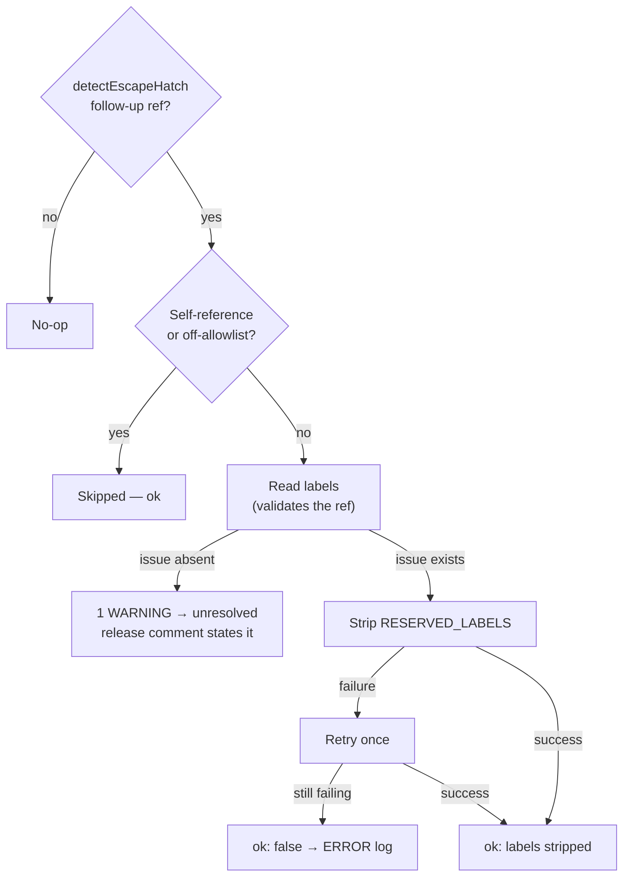

# Escape-hatch follow-up references are validated before they are acted on

## Summary

An escape-hatch hand-off names its follow-up issue in model-authored free
text, so the **number** can simply be wrong. A run on NEAT-AI-Lamarck#187
handed off naming `#3952` — a number from another repo's series — and the
worker took it at face value: two `gh` round-trips, a retry, and an ERROR
about an issue that cannot exist, while the real outcome (no follow-up was
ever filed in that repo) was never surfaced.

The root cause was two-fold:

1. `gh` reports a missing issue number through GraphQL as `Could not resolve
   to an issue or pull request with the number of 3952`, which carries
   neither "not found" nor "404" — so `isDefinitiveNotFound()` read it as a
   transient failure. That also meant `verifyFollowUpIssueExists()` (Issue
   #3661) accepted a hallucinated number as an inconclusive lookup.
2. The reserved-label strip treated the failed label read as a retryable
   failure, ending in `ok: false` and a caller ERROR.

The fix validates the reference with the read the strip already performs
before any mutation:

- `worker/deno/lib/github_not_found.ts` (new) owns the single
  definitive-not-found test, extended with the GraphQL wording.
  `escape_hatch_verify.ts` re-exports it, so both follow-up paths share one
  definition.
- `stripReservedLabelsFromIssueRefs()` records a definitively-absent ref in
  `summary.unresolved` after **one WARNING** — not a failure, so it is never
  retried and no caller raises an ERROR.
- The issue-work path turns that ref into a claim-release note via
  `describeUnresolvedFollowUp()`, carried on the run outcome
  (`withRunOutcomeNotes()`), so the release comment states
  `**Note:** follow-up reference #3952 not found in this repo` whatever else
  the run achieved.

An inconclusive read (timeout, 5xx, rate limit) is unchanged: still retried
once and still reported loud, so a real follow-up carrying a reserved label
is never quietly abandoned.

Closes #210.

## Evidence

Backend/CLI change — no web interface to screenshot. The behaviour is
verified by the tests below; the flow through the strip is:



Acceptance criteria, and the test that pins each:

| Criterion | Test |
| --- | --- |
| A reference that does not resolve produces a single WARNING and no ERROR/retry | `escape_hatch_label_strip_test.ts` — "a reference that does not exist is one WARNING, no retry, no failure"; `follow_up_label_strip_paths_test.ts` — the end-to-end `workOnIssue` run |
| The claim-release comment says "follow-up reference #N not found in this repo" | `follow_up_label_strip_paths_test.ts` (outcome notes) + `heartbeat_outcome_render_test.ts` (rendered body) |

Local run of the affected suites:

```text
deno test tests/escape_hatch_label_strip_test.ts tests/github_not_found_test.ts \
  tests/reserved_label_strip_test.ts tests/escape_hatch_verify_test.ts
ok | 64 passed | 0 failed
deno test tests/follow_up_label_strip_paths_test.ts tests/heartbeat_outcome_render_test.ts
ok | 19 passed | 0 failed
```

`./quality.sh` passes except for eight pre-existing, environment-dependent
failures in `setup_workdir_reminder_test.ts` and `host_workdir_guard_test.ts`
(plus one in `fleet_health_test.ts` caused by this host's `FLEET_HEALTH_REPO`
env var). All eight fail identically on a clean checkout of the base branch —
verified by stashing this change and re-running those files — and none touch
the modules changed here.

### Note for reviewers

Extending `isDefinitiveNotFound()` also tightens `verifyFollowUpIssueExists()`:
a PR-feedback hand-off naming a number GitHub reports as absent through
GraphQL is now **rejected** (Issue #3661's intended behaviour) instead of
being waved through as an inconclusive lookup.

## Test Plan

Added:

- `worker/deno/tests/github_not_found_test.ts` — the GraphQL missing-number
  wording is definitive; REST 404 wordings still are; transient failures
  (502, rate limit, i/o timeout) are not.
- `worker/deno/tests/reserved_label_strip_test.ts` — a ref for an issue that
  does not exist is `unresolved`, not a failure; a real ref in the same batch
  is still scrubbed; exactly one WARNING.
- `worker/deno/tests/escape_hatch_label_strip_test.ts` — the bogus-reference
  regression (one read, one WARNING, no removal, `unresolved` returned); an
  inconclusive read still fails loud and is still retried;
  `describeUnresolvedFollowUp()` wording for same-repo and cross-repo refs;
  a hallucinated number in Claude's own text is skipped.
- `worker/deno/tests/follow_up_label_strip_paths_test.ts` — end-to-end
  `workOnIssue` run whose hand-off names `#3952`: nothing mutated, no
  "Reserved-label strip" ERROR, no retry WARNING, and the run outcome carries
  `follow-up reference #3952 not found in this repo`.
- `worker/deno/tests/heartbeat_outcome_render_test.ts` — outcome notes render
  on a PR outcome and on a failure block, are flattened and bounded, and a
  blank note changes the body byte for byte.

Modified: the strip's transient-read test in
`escape_hatch_label_strip_test.ts` was rewritten to assert the retry-and-fail
behaviour explicitly (it previously relied on the read-failure warning alone),
so the deliberate split between "absent" and "inconclusive" is pinned from
both sides. No test was removed or disabled.
