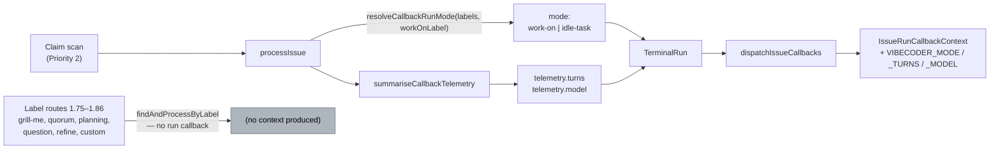

## Summary

Three **additive** fields on the post-run callback contract, so a fleet
archive can tell an implementation run apart from an idle-task sweep without
reading a transcript:

- **`mode`** — the workflow the run served, resolved at the dispatch site from
  the configured implementation label by the new
  `worker/deno/lib/callback_run_mode.ts`.
- **`telemetry.turns`** — turns summed across the run's invocations, omitted
  when no invocation reported one.
- **`telemetry.model`** — the served model of the invocation with the biggest
  token total (tokens rather than estimated cost, so a model with no pricing
  row can still be named).

`CALLBACK_SCHEMA_VERSION` **stays at 2**: the contract is additive, and a bump
for an additive change is what took every callback on every host down on
2026-09-11 (Issues #2039, #2041). `callback_schema_compat_test.ts` now pins
the schema 1 *and* schema 2 field sets alongside the omit-when-unset rule for
the three new ones.

Closes #2100.

## Evidence

Backend/CLI only — no web interface to screenshot. The evidence is the test
suite and the full quality gate, both run here.



Full gate, after the final edit:

```text
  deno tests                     PASSED
  deno lint                      PASSED
  deno type check                PASSED
  deno fmt                       PASSED
  semgrep                        PASSED
  markdownlint                   PASSED
Result: PASSED (with skipped checks)
```

(`config integration` is skipped on a host without a live `.config.json`; it
is the gate's own pre-existing skip, not one this change introduced.)

### Scope note the reviewers surfaced

Post-run callbacks fire for exactly one family of runs: those the claim scan
hands to `processIssue`. The label routes at priorities 1.75–1.86 — grill-me,
quorum, planning, question, refine-issue and the custom-label prompts — go
through `findAndProcessByLabel`, which returns a bare `{ processed }` and
fires **no run callback at all**. So `mode` today takes the configured
implementation label (`work-on`) or `idle-task`, and the resolver deliberately
does not test for the label-route names: `grill-me` and `quorum` are *not*
among the labels the claim scan filters out, so a `work-on` issue also
carrying `grill-me` — declined by the grill-me route — is claimed and
implemented by the scan, and naming it `grill-me` would drop a real
implementation run from the very archive query this field exists to enable.
`TerminalIssueRun.mode` stays an open string, so a route that later gains run
callbacks reports its own label without touching the resolver.

## Acceptance Criteria

<!-- vibe-spec-review inputs="diff+issue-body" -->

- **met** — `buildCallbackContextDocument` emits `mode`, `telemetry.turns`, `telemetry.model` when supplied and omits them otherwise; existing fields and `schemaVersion` unchanged — evidence: `worker/deno/tests/callback_schema_compat_test.ts::#2100 - mode, telemetry.turns and telemetry.model are emitted when the run supplied them`, `::#2100 - the additive fields are omitted, not emitted empty, when unset`, `::#2100 - adding the three fields left schemaVersion and every earlier field alone` — reviewer: met
- **met** — `summariseCallbackTelemetry` sums turns and attributes the model per the rule, with tests for no turns reported and for mixed-model invocations — evidence: `worker/deno/tests/run_callback_telemetry_test.ts::turns are summed across invocations`, `::no invocation reporting turns omits the field`, `::the model is the served model of the invocation with the most tokens`, `::an equal-token tie is broken deterministically by invocation order` — reviewer: met — reason: the reviewer flagged that turns were dropped for an invocation reporting `num_turns` but no parseable usage; fixed in `run_callback_telemetry.ts` and covered by `::an invocation that reported turns but no usage still contributes them`
- **partial** — an implementation run reports `mode: "work-on"` (or the configured equivalent); a grill-me run reports `mode: "grill-me"`; a question run `mode: "question"` — evidence: `worker/deno/tests/run_core_callbacks_test.ts::the terminal run carries the mode the dispatch matched`, `worker/deno/tests/callback_run_mode_test.ts::an implementation run reports the work-on label` — reviewer: partial — reason: the `work-on` half is met end to end and `idle-task` with it, but grill-me and question runs fire **no** run callback in this codebase (`findAndProcessByLabel` never reaches `dispatchIssueCallbacks`), so no context exists for them to carry a mode; emitting those names from the claim scan's own labels would mislabel real implementation runs, so the resolver does not — see the scope note above
- **met** — `docs/CALLBACKS.md` documents the fields — evidence: `docs/CALLBACKS.md` env/JSON table rows, the example document and the additive-versioning note — reviewer: met — reason: the reviewer flagged two inaccurate sentences (an overstated value set for `mode`, and a wrong absence rule for `model`); both rewritten in this diff
- **met** — `deno task test`, `deno task check`, `deno lint` pass — evidence: full `./quality.sh` run after the final edit, output quoted above — reviewer: partial — reason: the reviewer's own 30-minute cap stopped the full suite (it saw no failures in the 294 related tests it did run); the gate was run to completion here and passed
- **unrequested** — `worker/deno/lib/callback_run_mode.ts` and its test — reviewer: unrequested — reason: the issue asked for the label "taken from the configured `*Label` values at the dispatch site", and that dispatch site is a 5,500-line file with no unit-test seam; a pure 76-line resolver is the smallest testable home for it, and it was cut back to the two workflows the site can actually serve after the review
- **unrequested** — `docs/audits/security-sweep-2100-callback-run-mode.md` and the `top-up-2100` slice in `docs/audits/lib-sweep-coverage.json` — reviewer: unrequested — reason: the repo's own `lib_sweep_coverage` gate fails any new `lib/` module that no sweep slice claims; this follows the `top-up-2098` precedent
- **unrequested** — `docs/CONFIGURATION.md` env list and example document — reviewer: unrequested — reason: it is the second surface carrying the callback field inventory, and "a code change owes a docs change" means both move together
- **unrequested** — `mode` on the idle-task / add-repo / seed-idle-tasks route returns in `run_core_production_deps.ts` — reviewer: unrequested — reason: those returns *are* the `processIssue` result for a wrapper run, and a wrapper run does fire callbacks; omitting them would leave `idle-task` unreportable

## Standards Review

<!-- vibe-standards-review inputs="diff+CODING-STANDARDS.md" -->

- **violation** — no `docs/archive/pr-summaries/pr-summary-2100.md` — evidence: the file was absent at review time — reason: fixed here; this is that file
- **violation** — `docs/CALLBACKS.md` advertised `mode` values the contract cannot emit, and the resolver's six-route precedence ladder was unreachable ordering (KISS) — evidence: `docs/CALLBACKS.md:252`, `worker/deno/lib/callback_run_mode.ts:62-69` at review time — reason: fixed — the resolver now reads only the wrapper label and the configured implementation label, and the doc states what is actually emitted plus why the label routes produce no context
- **violation** — "the model that dominated the run's cost" is decided by token count, not cost — evidence: `worker/deno/lib/run_callback_telemetry.ts:80-87` — reason: fixed by correcting the claim rather than the ranking; the issue specifies the largest token total deliberately, because `estimateRunCost` yields no cost for a model with no pricing row, and the comment and docs now say tokens and give that rationale
- **violation** — the turn summation duplicates `aggregateRunStats` (DRY) — evidence: `worker/deno/lib/run_callback_telemetry.ts:72` vs `lib/run_stats.ts:334-336` — reason: stands. `TelemetrySource` is a deliberately structural subset so the callback layer does not depend on the stats module; the two rules are now identical and the callback copy says so in a comment, which is the cheapest way to keep them from drifting without coupling the modules
- **violation** — no test drives real `issueData.labels` + `config.workOnLabel` through `processIssue` to a callback context — evidence: `worker/deno/lib/run_core_production_deps.ts:3621` — reason: stands, and is recorded rather than papered over. `processIssue` needs a live `fetchIssueData`, so covering it means an integration test with network; the resolver itself has ten unit tests and the call site is now a two-line pass-through of one config value
- **clean** — Australian English on every added line; no hidden or credential path staged; commit messages name Issue #2100 and carry `Vibe-Coder-Run-Id`; the contract stays additive with `CALLBACK_SCHEMA_VERSION` at 2 and the field sets pinned; absent-not-zero holds for all three fields with a test asserting each key is absent; both documented surfaces updated in the same change; the new module is 76 focused lines with a paired test file; every new test calls real functions and asserts on results (no source greps, no sleeps, no spawned scripts)

## Test Plan

Added:

- `worker/deno/tests/callback_run_mode_test.ts` — 10 tests over
  `resolveCallbackRunMode`: the implementation label, priority-only claims,
  the idle-task wrapper, the wrapper winning over the implementation label, a
  renamed implementation label, a label route's name never displacing the
  implementation mode, case-insensitivity, the empty-label fallback, a blank
  configured label yielding `undefined`, and an issue label never becoming the
  mode verbatim.

Extended:

- `worker/deno/tests/run_callback_telemetry_test.ts` — turns summed across
  invocations; the field omitted when none reported one; summed over only the
  invocations that did; turns counted even when that invocation reported no
  usage; the model taken from the biggest-token-total invocation; the
  served→requested fallback for that invocation; cache tokens counting towards
  which invocation dominates; a deterministic tie-break.
- `worker/deno/tests/callback_schema_compat_test.ts` — a schema 2 scalar set
  pinned alongside schema 1 (driven by a no-PR outcome so `category` and
  `failureClass` are exercised); the three new fields emitted when supplied;
  omitted from both document and environment when unset; `schemaVersion` and
  every earlier field unchanged by the addition.
- `worker/deno/tests/run_callback_context_test.ts` — `mode` carried through;
  a blank or absent `mode` omitted; `turns` and `model` riding the telemetry.
- `worker/deno/tests/run_core_callbacks_test.ts` — the terminal run carries
  the mode the dispatch matched; a run whose dispatch named none reports none.

Run: `./quality.sh` — PASSED (deno tests, lint, type check, fmt, semgrep,
markdownlint, mermaid and the chokepoint audits).
