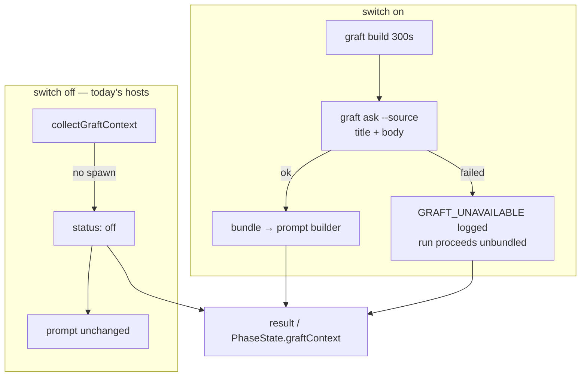

## Summary

On a host with `graft_context.enabled`, the issue, planning and question runs
now collect a Graft repo-context bundle before their prompt is built — the
query is the issue title and body — and inject it when the collection
succeeded. With the switch off the collector short-circuits to `off` before
spawning anything, so a host that never opted in is byte-for-byte unchanged.
Closes #2102.

Both issue-run entry points are wired, because they build their prompts
separately: `lib/execute_claude_phase.ts` (the `execute-claude-phase` command)
and `lib/phases/execute_phase.ts` (the main loop, which holds the `PhaseState`
the issue asked the result to be stored on).

- `lib/graft_context.ts` — `graftQueryFor()` (one query shape for all three
  runs), `describeGraftContext()` (the one log line, status plus figures), the
  `GraftContextCollector` seam and the `GraftContextSlot` carrier.
- `lib/execute_claude_phase.ts` — `graftContextEnabled` option beside
  `includeCodebaseMap`, collection after the codebase-map block using the same
  `repoDir`, bundle into `deps.buildCachedIssuePrompt`, outcome on the phase
  result. The body returns from sixteen places, so the outcome escapes through
  a slot and is attached to whichever exit is taken.
- `commands/execute_claude_phase.ts` — threads the switch from
  `isGraftContextEnabled(config)` at the site that already supplies
  `includeCodebaseMap`.
- `lib/phases/execute_phase.ts` — same collection on the main-loop issue run,
  with the outcome on `PhaseState.graftContext` beside `claudeRunStats`;
  `InfrastructureDeps.collectGraftContext` is the injected seam.
- `lib/planning_processor.ts`, `lib/question_processor.ts` — collection right
  after `readRepoContext(repoDir)`, bundle into `buildPlanningPrompt` /
  `buildQuestionPrompt`, outcome on the processor result.

The recorded outcome carries the status and figures but **not** the bundle
(`graftContextFacts()`): the `execute-claude-phase` command JSON-serialises its
result onto stdout, so an outcome that kept the bundle would write the whole
uncapped selection into the worker log on every enabled run.

Nothing reads the recorded `GraftContextResult` yet: the run-stats comment and
callback that report it are a later sub-issue of #2060, and this change is the
carrier they read from.

## Evidence

Backend/CLI only — no web interface to screenshot. The evidence is the test
suite and the full quality gate.

```
deno test tests/graft_context_test.ts tests/…wiring_2102…   54 passed | 0 failed
deno test …planning_processor… …question_processor…        197 passed | 0 failed
deno task check:manifests                                  658 passed | 0 failed
./quality.sh                                               Result: PASSED
```

Where the collection sits in each run:



## Acceptance Criteria

<!-- vibe-spec-review inputs="diff+issue-body" -->

- **met** — with the switch off, no `graft` subprocess is attempted in any of the three phases and prompts are unchanged — evidence: `worker/deno/tests/graft_context_wiring_2102_test.ts::runExecuteClaudePhase - the switch off collects nothing and injects nothing` (and the planning, question and main-loop twins), which run the **real** collector so a spawn would surface as `failed` rather than `off` — reviewer: met
- **partial** — with the switch on, each phase calls the collector once with the issue title and body and injects the bundle when status is `ok` — evidence: `worker/deno/tests/graft_context_wiring_2102_test.ts::… an enabled host injects the bundle and asks for the issue` (×4), query built by `graftQueryFor` — reviewer: partial — reason: once per attempt, but the #1550 in-process infra retry re-enters `executeClaudeBody` and collects again; the persistent `graft/` makes the second build a cache replay, and the code says so at `lib/phases/execute_phase.ts:441`
- **met** — a `failed` collection never fails or delays the run beyond the collector's own limits — evidence: `…a failed collection is reported and the run proceeds` (×4); `collectGraftContext` never throws and is bounded by `GRAFT_BUILD_TIMEOUT_MS` / `GRAFT_ASK_TIMEOUT_MS` — reviewer: met
- **partial** — the `GraftContextResult` is present on the phase state / processor result in all three paths — evidence: `ExecuteClaudePhaseResult.graftContext`, `PhaseState.graftContext`, `PlanningResult.graftContext`, `QuestionResult.graftContext`, each asserted in the suite — reviewer: partial — reason: the planning and question processors return `Result<T>`, whose error variant carries an `Error` and no value to attach the outcome to, so a failed round reports it in the log alone
- **met** — `deno task test`, `deno task check`, `deno lint` pass — evidence: `./quality.sh` run to completion after the final edit: `Result: PASSED` — reviewer: missing — reason: the reviewer was read-only and could not run the gate; it judged "likely pass" from the code, and the gate was then run here and passed
- **unrequested** — Graft wired into `lib/phases/execute_phase.ts` as well, with the new `InfrastructureDeps.collectGraftContext` seam — reviewer: unrequested — reason: the issue named `lib/execute_claude_phase.ts`, but that is only reached by the `execute-claude-phase` CLI command; the main loop builds its own prompt, so without this the feature would be dead on every real issue run — and it is the only place that can hold the `PhaseState` the issue asked the outcome to be stored on
- **unrequested** — `QuestionProcessorDeps.promptsDir` — reviewer: unrequested — reason: the question tests otherwise read whichever templates the host has installed; this is the seam `PlanningProcessorDeps` already carries, and production leaves it unset
- **unrequested** — `graftQueryFor`, `describeGraftContext`, `graftContextFacts`, `GraftContextCollector` and `GraftContextSlot` exported from `graft_context.ts` — reviewer: unrequested — reason: the same query, log line, record shape and seam are needed at four call sites; inlining them four times is the drift this repo's DRY rule exists to stop
- **unrequested** — the log line is skipped when the status is `off` — reviewer: unrequested — reason: the issue asked for one line unconditionally, but an extra line on every run of every host that never opted in is exactly the "no behaviour change for today's hosts" the same issue requires
- **unrequested** — `docs/CONFIGURATION.md` updated and this PR summary added — reviewer: unrequested — reason: repo convention; the config doc said the switch "changes nothing", which this PR makes false

## Standards Review

<!-- vibe-standards-review inputs="diff+CODING-STANDARDS.md" -->

- **violation** — the host switch was read as `config.graftContext.enabled` at three of four new sites, bypassing the documented single read point — evidence: `worker/deno/lib/phases/execute_phase.ts:444` — reason: fixed here; all four now call `isGraftContextEnabled(config)`
- **violation** — the new question tests passed no `promptsDir`, so they read the host's installed templates rather than this checkout's — evidence: `worker/deno/tests/graft_context_wiring_2102_test.ts:439` — reason: fixed here by adding the `promptsDir` seam `PlanningProcessorDeps` already has and pinning it in the tests
- **violation** — two new exported helpers had no direct test in their module's own suite — evidence: `worker/deno/lib/graft_context.ts:609` — reason: fixed here; `graft_context_test.ts` now covers `graftQueryFor`, `describeGraftContext` and `graftContextFacts`, including the no-figures and partial-figures lines
- **violation** — a doc comment claimed `PhaseState.graftContext` is "read by the completion phase", which nothing does yet — evidence: `worker/deno/lib/issue_worker_types.ts:241` — reason: fixed here; it now says the reader is a later sub-issue of #2060
- **violation** — the result-field comment said "always present" beside an optional field — evidence: `worker/deno/lib/execute_claude_phase.ts:186` — reason: fixed here; it now says "on every run that reached the collection"
- **violation** — the recorded outcome carried the bundle text, and the `execute-claude-phase` command JSON-serialises its result onto stdout, so an enabled host would write the whole uncapped `graft ask --source` selection into the worker log every run — evidence: `worker/deno/commands/execute_claude_phase.ts:186` — reason: fixed here; `graftContextFacts()` drops the bundle from every recorded outcome, with `…bundle, undefined` asserted on all four paths
- **violation** — an unwrapped 109-character line left in an edited paragraph — evidence: `docs/CONFIGURATION.md:1782` — reason: fixed here; the paragraph is rewrapped
- **clean** — Australian English throughout; fail-loud preserved (`failed` logged as loudly as `ok`, no swallowed errors, `off` kept distinct from "never ran"); tests drive real functions end to end and assert on the prompt the agent received, never on source text; no sleeps, clock assertions or spawned processes; no hidden paths staged; the new log line emits only a status enum and integers; no new monolith.

## Test Plan

New — `worker/deno/tests/graft_context_wiring_2102_test.ts` (12 tests, four
paths × three states, each with an injected fake collector except the disabled
cases, which use the **real** collector so `off` is proven by the pre-spawn
short-circuit rather than by a fake):

- `runExecuteClaudePhase - the switch off collects nothing and injects nothing`
- `runExecuteClaudePhase - an enabled host injects the bundle and asks for the issue`
- `runExecuteClaudePhase - a failed collection is reported and the run proceeds`
- `execute_phase - the switch off collects nothing and injects nothing`
- `execute_phase - an enabled host injects the bundle and asks for the issue`
- `execute_phase - a failed collection is recorded and the run proceeds`
- `processIssuePlanning - …` (same three)
- `processIssueQuestion - …` (same three)

New in `worker/deno/tests/graft_context_test.ts` — direct cover for the three
helpers, including their edges: `graftQueryFor` with an empty body,
`describeGraftContext` with no figures, with a partial figure set and for
`off`, and `graftContextFacts` dropping the bundle while keeping every figure.

Each of the four `ok` paths additionally asserts the recorded outcome carries
no `bundle` — the regression guard for the stdout leak above.

Existing suites re-run unchanged: `planning_processor_test.ts`,
`question_processor_test.ts`, `execute_claude_phase_codebase_map_test.ts`,
`completion_phase_run_stats_test.ts`, `issue_run_stats_comment_test.ts`. No
existing test was modified or removed.
