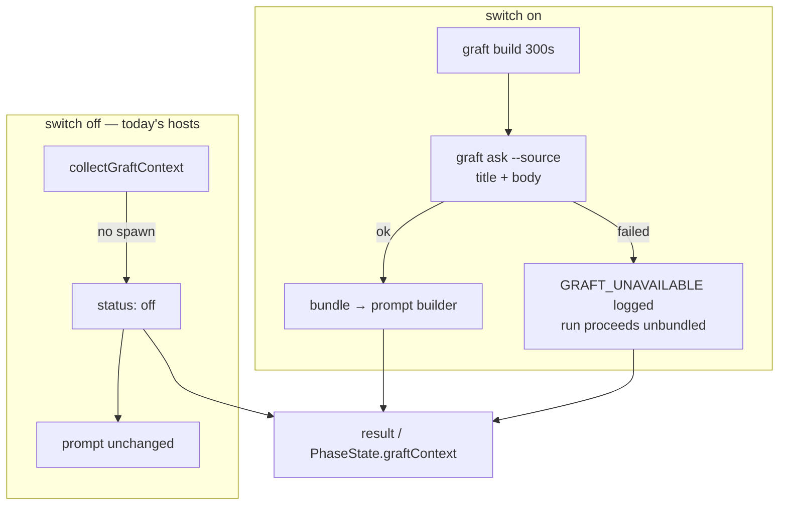

## Summary

On a host with `graft_context.enabled`, the issue, planning and question runs
now collect a Graft repo-context bundle before their prompt is built — the
query is the issue title and body — and inject it when the collection
succeeded. With the switch off the collector short-circuits to `off` before
spawning anything, so a host that never opted in is byte-for-byte unchanged.
Closes #2102.

Both issue-run entry points are wired, because they build their prompts
separately: `lib/execute_claude_phase.ts` (the `execute-claude-phase` command)
and `lib/phases/execute_phase.ts` (the main loop, which holds the `PhaseState`
the issue asked the result to be stored on).

- `lib/graft_context.ts` — `graftQueryFor()` (one query shape for all three
  runs), `describeGraftContext()` (the one log line, status plus figures), the
  `GraftContextCollector` seam and the `GraftContextSlot` carrier.
- `lib/execute_claude_phase.ts` — `graftContextEnabled` option beside
  `includeCodebaseMap`, collection after the codebase-map block using the same
  `repoDir`, bundle into `deps.buildCachedIssuePrompt`, outcome on the phase
  result. The body returns from sixteen places, so the outcome escapes through
  a slot and is attached to whichever exit is taken.
- `commands/execute_claude_phase.ts` — threads the switch from
  `isGraftContextEnabled(config)` at the site that already supplies
  `includeCodebaseMap`.
- `lib/phases/execute_phase.ts` — same collection on the main-loop issue run,
  with the outcome on `PhaseState.graftContext` beside `claudeRunStats`;
  `InfrastructureDeps.collectGraftContext` is the injected seam.
- `lib/planning_processor.ts`, `lib/question_processor.ts` — collection right
  after `readRepoContext(repoDir)`, bundle into `buildPlanningPrompt` /
  `buildQuestionPrompt`, outcome on the processor result.

Nothing reads the recorded `GraftContextResult` yet: the run-stats comment and
callback that report it are a later sub-issue of #2060, and this change is the
carrier they read from.

## Evidence

Backend/CLI only — no web interface to screenshot. The evidence is the test
suite and the full quality gate.

```
deno test tests/graft_context_wiring_2102_test.ts        12 passed | 0 failed
deno test tests/graft_context_test.ts …planning…question 197 passed | 0 failed
deno task check:manifests                                658 passed | 0 failed
./quality.sh                                             Result: PASSED
```

Where the collection sits in each run:



## Test Plan

New — `worker/deno/tests/graft_context_wiring_2102_test.ts` (12 tests, four
paths × three states, each with an injected fake collector except the disabled
cases, which use the **real** collector so `off` is proven by the pre-spawn
short-circuit rather than by a fake):

- `runExecuteClaudePhase - the switch off collects nothing and injects nothing`
- `runExecuteClaudePhase - an enabled host injects the bundle and asks for the issue`
- `runExecuteClaudePhase - a failed collection is reported and the run proceeds`
- `execute_phase - the switch off collects nothing and injects nothing`
- `execute_phase - an enabled host injects the bundle and asks for the issue`
- `execute_phase - a failed collection is recorded and the run proceeds`
- `processIssuePlanning - …` (same three)
- `processIssueQuestion - …` (same three)

New in `worker/deno/tests/graft_context_test.ts` — direct cover for the two
helpers, including their edges: `graftQueryFor` with an empty body, and
`describeGraftContext` with no figures, with a partial figure set, and for
`off`.

Existing suites re-run unchanged: `planning_processor_test.ts`,
`question_processor_test.ts`, `execute_claude_phase_codebase_map_test.ts`,
`completion_phase_run_stats_test.ts`, `issue_run_stats_comment_test.ts`. No
existing test was modified or removed.
