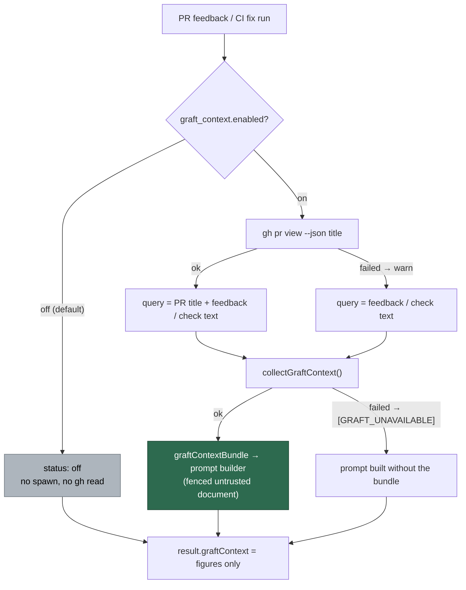

# Wire Graft context into the PR-feedback and CI-fix processors (Issue #2103)

## Summary

On an enabled host both PR runs now collect a Graft bundle before their prompt
is built and inject it when the collection succeeded, completing the five
phases #2101 gave a `graftContextBundle` parameter to. The query is the PR
title plus the feedback comment text (PR feedback) or the failing check's
name, annotations and CI log excerpt (CI fix). With `graft_context.enabled`
off — the default — the collector short-circuits to `off` before spawning
anything and no extra GitHub read is made, so today's hosts are byte-identical
to before. Closes #2103.

The PR title is not handed to either processor by the scan that dispatched it,
so it is read once with `gh pr view --json title`, **only** on an enabled
host. A read that fails is warned about and dropped from the query rather than
interpolated as blank lines — the bundle is an accelerator, and a title-less
query beats no bundle.

Two placement decisions are worth a reviewer's eye:

- **The CI fix collects immediately before the prompt build**, not beside
  `loadRepoContextContent` as the issue's wording says. Every stand-down
  between those two points — the auto-fix cap, the credentials escalation, an
  already-diagnosed head — returns without building a prompt, and a
  300-second graph build spent on a run that never prompts is pure waste. The
  consequence is that those early returns carry no `graftContext` at all, which
  is honest: the collection was never reached.
- **The title is a second `gh pr view`**, alongside the live-state read
  `pr_live_state.ts` already makes. Widening that shared read to
  `--json state,title` would save the call, but it is used by four passes and
  its argv is pinned by a shared test predicate (`isPrLiveStateRead`), so
  coupling it to the Graft query was the larger change. One read-only call on
  an opted-in host was the cheaper trade.

## Evidence

Backend/CLI change with no web interface to screenshot — the evidence is the
test suite, which drives the real `processPrFeedback` and `processCiFailure`
end to end with an injected collector and asserts on the prompt the (faked)
agent actually received.

Full gate on the final tree: `./quality.sh` → **PASSED** (21 checks; `config
integration` SKIPPED as it always is off-container). Targeted runs:
`tests/graft_context_wiring_2103_test.ts` 8/8, `tests/pr_title_read_test.ts`
6/6, `tests/graft_context_test.ts` 56/56, and the `pr_feedback_*` (56) and
`pr_ci_*` (82) suites unchanged and green.

Wiring, for the reviewer:

| Surface | Where |
| ------- | ----- |
| Feedback collection → prompt | `worker/deno/lib/pr_feedback_processor.ts:551` → `:601` |
| CI-fix collection → prompt | `worker/deno/lib/pr_ci_processor.ts:1235` → `:1256` |
| Outcome on both results | `pr_feedback_processor.ts:110`, `pr_ci_processor.ts:208` |
| The query shape | `worker/deno/lib/graft_context.ts:647` (`graftQueryForPr`) |
| The one title read | `worker/deno/lib/pr_title_read.ts:32`, `:86` |
| Switch threaded from config | both `commands/pr_*_processor.ts` and both `run_core_production_deps.ts` passes |

## Acceptance Criteria

<!-- vibe-spec-review inputs="diff+issue-body" -->

- **met** — With the switch off, neither processor attempts `graft` and prompts are unchanged — evidence: `worker/deno/tests/graft_context_wiring_2103_test.ts::processPrFeedback - the switch off collects nothing and injects nothing` and `::processCiFailure - the switch off collects nothing and injects nothing` (both drive the **real** collector, so `off` can only come from its pre-spawn short-circuit, and both assert no PR-title read was made) — reviewer: met
- **met** — With the switch on, each processor injects the bundle when status is `ok` and the query is PR title + feedback/failing-check text — evidence: `worker/deno/tests/graft_context_wiring_2103_test.ts::processPrFeedback - an enabled host injects the bundle and asks for the PR` and `::processCiFailure - an enabled host injects the bundle and asks for the failing check` — reviewer: met — reason: the reviewer noted the CI collection sits before the prompt build rather than beside `loadRepoContextContent`; that departure is deliberate and explained above, and the criterion it is judged against is unaffected
- **met** — The `GraftContextResult` is present on both processors' return values — evidence: `pr_feedback_processor.ts:110`, `pr_ci_processor.ts:208`, asserted on the `ok`, `failed` and `off` paths of all six wiring tests — reviewer: met — reason: the reviewer's caveat stands and is by design — it is absent on exits that returned before the collection, and the run-stats/callback readers land with the rest of #2060
- **met** — `deno task test`, `deno task check`, `deno lint` pass — evidence: full `./quality.sh` run on the final tree, PASSED — reviewer: met — reason: the reviewer verified check, lint and every affected suite but could not finish the whole `deno task test` inside its tool ceiling; the full gate was run here and passed
- **unrequested** — New module `worker/deno/lib/pr_title_read.ts` and the `gh pr view --json title` call it makes — reviewer: unrequested — reason: the issue requires the PR title in the query and neither processor is handed one, so a read is implied; it is made only on an enabled host and only when the collection is actually reached
- **unrequested** — `pr_ci_processor.ts:461` reports `failed` (not `off`) when an enabled host has no checkout to graph — reviewer: unrequested — reason: reporting a fault as `off` would hide it among the hosts that never opted in; now pinned by `::processCiFailure - an enabled host with no checkout reports failed, never off`
- **unrequested** — `graft_context.ts:671` `withGraftContext()`, and switching `planning_processor.ts` / `question_processor.ts` onto it — reviewer: unrequested — reason: the helper is needed here (both PR results have a dozen exits); leaving the two #2102 copies inlined would have made three copies of one rule, which the standards review flagged as a DRY breach
- **unrequested** — `docs/CONFIGURATION.md` Graft section rewritten — reviewer: unrequested — reason: the previous text said the two PR builders accept a bundle but nothing collects one, which this change makes false; a code change owes a docs change
- **unrequested** — `docs/audits/lib-sweep-coverage.json` slice plus `docs/audits/security-sweep-2103-pr-title-read.md` — reviewer: unrequested — reason: a new `lib/` module must be claimed by a swept slice or `deno task check:manifests` is red; the record is the security reading of the new module
- **unrequested** — the tests live in a new `graft_context_wiring_2103_test.ts` rather than inside the `pr_feedback_processor` / `pr_ci_processor` suites — reviewer: unrequested — reason: mirrors `graft_context_wiring_2102_test.ts`, so the whole #2060 wiring story is readable in one place

## Standards Review

<!-- vibe-standards-review inputs="diff+CODING-STANDARDS.md" -->

- **violation** — a new `lib/` module must be claimed by a sweep slice or `deno task check:manifests` fails — evidence: `worker/deno/lib/pr_title_read.ts:1` — reason: fixed here — slice `top-up-2103` added to `docs/audits/lib-sweep-coverage.json` with its written record at `docs/audits/security-sweep-2103-pr-title-read.md`
- **violation** — every PR needs `docs/archive/pr-summaries/pr-summary-<issue>.md` — evidence: the directory held #2101 and #2102 but no #2103 — reason: fixed here — this file
- **violation** — DRY: `withGraftContext` duplicated the shape already inlined by #2102 — evidence: `worker/deno/lib/planning_processor.ts:1284`, `worker/deno/lib/question_processor.ts:304` — reason: fixed here — both now call the shared helper and `graftContextFacts` is no longer imported at either site
- **violation** — DRY: the two collector wrappers repeated the title read and a byte-identical warn line — evidence: `worker/deno/lib/pr_ci_processor.ts:481`, `worker/deno/lib/pr_feedback_processor.ts:321` (pre-fix) — reason: fixed here — `prTitleForGraftQuery()` (`pr_title_read.ts:86`) holds the warn-and-drop step for both
- **violation** — every new function needs an error-path test; the degraded-title and missing-checkout branches had none — evidence: `pr_ci_processor.ts:461`, `pr_feedback_processor.ts:311` — reason: fixed here — `::processPrFeedback - a title that cannot be read is dropped, and the bundle still lands`, `::processCiFailure - an enabled host with no checkout reports failed, never off`, plus `prTitleForGraftQuery` covered directly
- **violation** — "fake the external service, do not assert the request": the title test pinned the `gh` argv text — evidence: `worker/deno/tests/pr_title_read_test.ts:24` (pre-fix) — reason: fixed here — the test now uses a `gh` fake modelling `pr view`'s own rules (unknown repo/number and a field that was not asked for all answer truthfully wrong), so a read built the wrong way round goes red
- **clean** — Australian English throughout; fail-loud error handling (a throwing `gh` and a clean exit that printed nothing are both failed `Result`s, never an empty title; a fault on an enabled host is `failed`, never `off`); tests call real functions and assert on decisions, with no source-grepping, no sleeps and no wall-clock thresholds; every new module has its paired test file and doc comments; additive-only interface changes (`graftContext?`, `graftContextEnabled?`, `collectGraftContext?` all optional); no hidden paths staged; the bundle still reaches the prompt only through `formatGraftContextSection`, which redacts and fences it

## Test Plan

Added `worker/deno/tests/graft_context_wiring_2103_test.ts` (8 tests) — for each
processor: the switch off collects nothing, spawns nothing and reads no title;
an enabled host injects the bundle and asks a query carrying the PR title and
the feedback/check text; a `failed` collection leaves the run to proceed
unbundled with the outcome still recorded. Plus the two degraded paths — an
unreadable title dropped from the query, and an enabled host with no checkout
reporting `failed`.

Added `worker/deno/tests/pr_title_read_test.ts` (6 tests) — `readPrTitle`
against a `gh` fake: the titled PR, an unresolvable PR, an untitled PR, and a
throwing `gh`; `prTitleForGraftQuery` warning-and-dropping a failed read.

Extended `worker/deno/tests/graft_context_test.ts` (5 tests) — `graftQueryForPr`
joining the title and text and dropping an absent or blank title, and
`withGraftContext` recording the outcome without its bundle, recording nothing
for an unreached collection, and leaving a failed result untouched.

No existing test was modified or removed.
