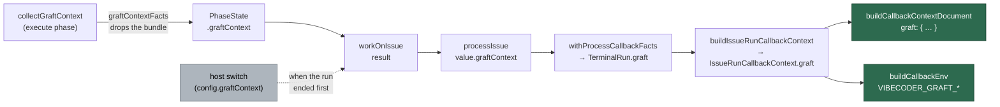

## Summary

Every run's post-run callback context now carries an additive `graft` block —
`enabled`, `status`, and the four figures (`buildSeconds`, `bundleChars`,
`nodeCount`, `callEdgeCount`) — so a GRQ-23 run with Graft repo-context
injection switched on can be compared against every other host in the logs
repo. Closes #2104.

`GraftContextResult` travels the same path `telemetry` already travels:
`PhaseState` → `workOnIssue` → `processIssue` → `withProcessCallbackFacts` /
`TerminalRun` → `TerminalIssueRun` → `IssueRunCallbackContext` →
`buildCallbackContextDocument` / `buildCallbackEnv`.

Two properties make the block worth archiving:

- **It is never absent.** `graft.enabled` and `graft.status` are emitted on
  every run and always exported as `VIBECODER_GRAFT_ENABLED` and
  `VIBECODER_GRAFT_STATUS`, so a host without the switch reports
  `{ enabled: false, status: "off" }` rather than silence — silence is
  indistinguishable from a worker too old to report.
- **`enabled` is a fact, not a default.** A run that ends before the
  collection (setup failure, refused claim) reads the host's real switch, so
  it reports `{ enabled: true, status: "off" }` on a Graft host instead of
  being archived as a host that never opted in.

The Graft **bundle text** never crosses the boundary: it is repository source
already spent on the run's prompt. `callbackGraftFacts` rebuilds the block
field by field at each publish boundary rather than spreading the result.

`CALLBACK_SCHEMA_VERSION` stays at **2** — this is additive, and the scar of
Issues #2039/#2041 is that a bump for an additive change is the outage.

## Evidence

Backend/worker change with no web interface, so there is nothing to
screenshot. The evidence is the test suite and the full quality gate.

`./quality.sh` — **PASSED** (21 checks; `config integration` skipped as it is
on this host), run after the final edit.

The path the block travels:

## Acceptance Criteria

<!-- vibe-spec-review inputs="diff+issue-body" -->

- **met** — Every callback document carries `graft.enabled` and `graft.status`, plus the four figures when Graft ran (`ok`, or `failed` with partial figures) — evidence: `worker/deno/lib/run_callbacks.ts` sets `document.graft` unconditionally; `worker/deno/tests/graft_context_callback_2104_test.ts::#2104 - a \`failed\` collection reports the figures it reached, not a clean \`off\`` — reviewer: met
- **met** — A run on a host without the switch emits `graft: { enabled: false, status: "off" }` — evidence: `worker/deno/tests/graft_context_callback_2104_test.ts::#2104 - a host with the switch off reports \`enabled: false\` on the same path` — reviewer: met
- **met** — Existing callback fields and `schemaVersion` are unchanged; the compat test passes — evidence: `worker/deno/tests/callback_schema_compat_test.ts::#2104 - the Graft block left schemaVersion and every earlier field alone` — reviewer: met
- **met** — `docs/CALLBACKS.md` documents the block — evidence: `docs/CALLBACKS.md` (example document, six env-table rows, and the additive-contract subsection) — reviewer: met
- **met** — `deno task test`, `deno task check`, `deno lint` pass — evidence: `./quality.sh` PASSED after the final edit (deno tests / lint / type check / fmt all PASSED) — reviewer: missing — reason: the reviewer was given only the diff and could not execute the gate; it was run here and passed, so its `missing` reflects its inputs, not the state of the branch
- **unrequested** — `docs/CONFIGURATION.md` carries the `graft` block and the six `VIBECODER_GRAFT_*` names — reviewer: unrequested — reason: the issue names only `docs/CALLBACKS.md`, but CONFIGURATION.md holds a second copy of the same hook surface, so leaving it behind would have shipped a stale doc against the "a code change owes a docs change" standard
- **unrequested** — `workOnIssue` synthesises `{ enabled: <host switch>, status: "off" }` for a run that ended before the collection, instead of omitting the block — reviewer: unrequested — reason: the issue asked only to thread the existing result through, but a bare threading archives every early exit on a Graft host as `enabled: false`, which is indistinguishable from a host that never opted in and defeats the cross-host comparison the issue's Summary states as the whole purpose
- **unrequested** — new test file `worker/deno/tests/graft_context_callback_2104_test.ts` (the issue named only `callback_schema_compat_test.ts`) — reviewer: unrequested — reason: the compat test guards the published contract against regression, and mixing the feature's own behaviour tests into it would blur that role; the new file covers the wiring and the bundle-containment property the compat test does not
- **unrequested** — 2 tests added to `worker/deno/tests/run_core_callbacks_test.ts` — reviewer: unrequested — reason: `withProcessCallbackFacts` onto `TerminalRun` is on the thread the issue lists, and it needs the real `runCycle` harness that lives in that file

### Reviewer findings not raised as criteria

- **Fixed** — the reviewer found `docs/CALLBACKS.md` claiming the `enabled: false` fallback applied only to "a run that threw outright", when any result-less path takes it. Corrected in this diff to name every no-result path.
- **Stands** — `run_core_production_deps.ts` gates the lift on `!isExpectedSkip`, so an expected skip would take the fallback. It stands: skips dispatch no run callbacks at all, and the gate matches the `telemetry`/`outcome`/`phase` lines the issue pointed at as the pattern to follow.
- **Stands** — `TerminalRun.graft` is typed `CallbackGraftContext` while the runtime value is a `GraftContextResult` that may still carry `bundle`. It stands because the bundle is stripped upstream by `graftContextFacts` **and** rebuilt field by field at every publish boundary; see the Standards Review entry below for why that third rebuild is kept.

## Standards Review

<!-- vibe-standards-review inputs="diff+CODING-STANDARDS.md" -->

- **violation** — stale JSDoc: `PhaseState.graftContext` still read "It has no reader yet", while this diff adds the reader — evidence: `worker/deno/lib/issue_worker_types.ts:241` — reason: fixed here; the comment now names both readers (#2105 and #2104)
- **violation** — silent fallback: `{ enabled: false, status: "off" }` was fabricated for a run that ended before the collection, so a Graft-enabled host's setup failure was archived as a host that never opted in — evidence: `worker/deno/lib/run_callbacks.ts:149` — reason: fixed here; `workOnIssue` now reads the host's real switch, and `worker/deno/tests/graft_context_callback_2104_test.ts::#2104 - a run that ended before the collection states the host's real switch` pins it
- **violation** — doc overclaim: "A `failed` collection still reports whichever figures it reached" was not true on the throw path — evidence: `docs/CALLBACKS.md:487` — reason: fixed here; the claim is now qualified to a failure the run recorded, and the fallback paths are named
- **violation** — missing `docs/archive/pr-summaries/pr-summary-2104.md` — evidence: absent file — reason: fixed here; this file
- **violation** — DRY: `callbackGraftFacts` is applied three times on one path (context builder, document builder, env builder) — evidence: `worker/deno/lib/run_callback_context.ts:218` — reason: stands. `IssueRunCallbackContext` is an exported type with a consumer outside the two builders (`worker/deno/lib/callback_conformance.ts`), so the context-builder rebuild is what makes the context object itself bundle-free rather than a third copy of the same guard. The bundle is repository source, so defence in depth is the deliberate trade against one extra call.
- **clean** — Australian English throughout code, comments and docs; no American spellings in any added line
- **clean** — additive contract honoured: `CALLBACK_SCHEMA_VERSION` stays at 2, only new fields and scalars are added, and the compat test re-pins both the schema 1 and schema 2 field sets
- **clean** — secret containment: the Graft bundle is stripped upstream and rebuilt field by field at each boundary; a test asserts no document field and no env value carries the bundle text
- **clean** — test quality and speed: every new test calls real functions (`buildCallbackContextDocument`, `buildCallbackEnv`, `buildIssueRunCallbackContext`, `callbackGraftFacts`, `workOnIssue`, the real `runCycle` harness) and asserts on returned values; no source-grepping, no sleeps, no polling, no wall-clock thresholds
- **clean** — Deno-native tooling only; no Node files, tasks or dependencies introduced
- **clean** — commit safety: no hidden paths, keys or credential-shaped files staged; every commit references Issue #2104 and carries the `Vibe-Coder-Run-Id` trailer
- **clean** — docs kept in step: `VIBECODER_GRAFT_*` is documented in both places the callback env surface is enumerated, and the `CALLBACKS.md#what-a-hook-receives` cross-link resolves

## Test Plan

Added `worker/deno/tests/graft_context_callback_2104_test.ts` (12 tests) —
drives the real builders and the real `workOnIssue` pipeline:

- `an \`ok\` collection publishes the status and all four figures`
- `the bundle text never reaches a hook` — asserts no document field and no
  env value carries the bundle source
- `a \`failed\` collection reports the figures it reached, not a clean \`off\``
- `a host with the switch off reports an explicit \`off\` block`
- `a run that reported no collection at all still carries the block`
- `the environment exports the status pair and the four figures`
- `the four figures are omitted, not exported empty, when unreached`
- `adding the block left the schema version alone`
- `callbackGraftFacts copies the figures it is given and invents none` —
  nought is a figure, not an absence
- `workOnIssue lifts the run's collection onto its result`
- `a run that ended before the collection states the host's real switch` —
  refuses a claim so the collection is never reached, and asserts
  `{ enabled: true, status: "off" }` on a Graft host
- `a host with the switch off reports \`enabled: false\` on the same path`

Extended `worker/deno/tests/callback_schema_compat_test.ts` (3 tests) — the
compat gate that stops a removal reaching the fleet:

- `#2104 - every run carries the Graft block, whatever the collection did` —
  `ok`, `failed`, `off` and an absent collection, in document and environment
- `#2104 - the four Graft figures travel when reached and are omitted when not`
- `#2104 - the Graft block left schemaVersion and every earlier field alone` —
  re-asserts the schema 1 document fields and every schema 1 env scalar

Extended `worker/deno/tests/run_core_callbacks_test.ts` (2 tests) — the scan
loop's half of the thread, against the real `runCycle` harness:

- `the terminal run carries what the run's Graft collection did (Issue #2104)`
- `a run that reported no Graft collection carries none (Issue #2104)`

Full targeted run: 161 tests passed across the new file, the compat test, the
run-core callback tests, `setup_claim_refusal_1193_test.ts` and
`issue_worker_test.ts`. `deno task test`, `deno task check`, `deno lint` and
`deno fmt --check` all pass via `./quality.sh`.
