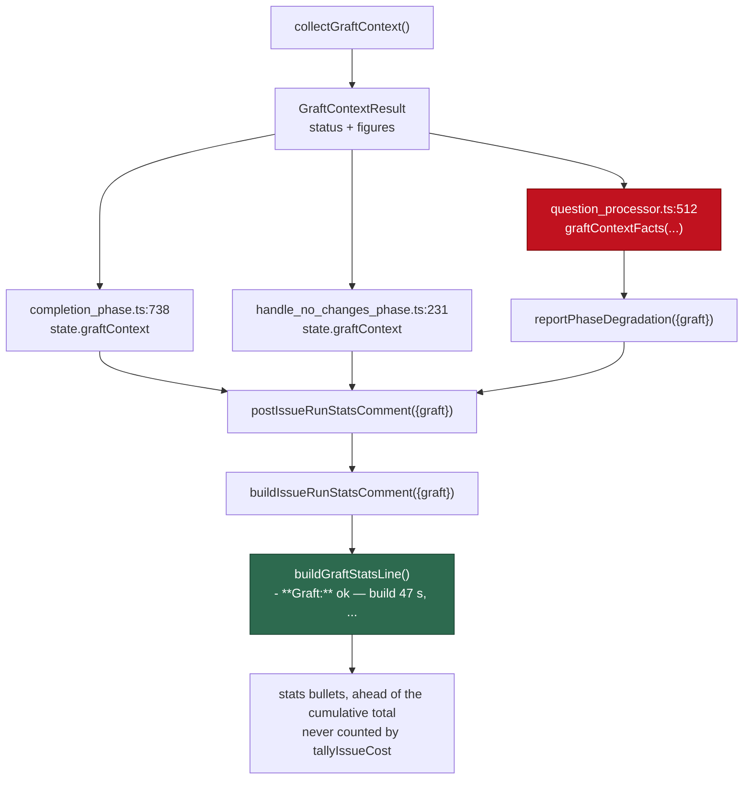

# Show the Graft figures in the per-issue run-stats comment (Issue #2105)

## Summary

The host's worker log is private, so a run's Graft outcome was invisible to
whoever is judging the #2060 trial on the issue itself. `buildGraftStatsLine`
(`worker/deno/lib/issue_run_stats_comment.ts:218`) renders one bullet for the
stats block — the status always, plus whichever of build seconds, bundle
characters, node count and call-edge count the collection actually reached —
and `buildIssueRunStatsComment` / `postIssueRunStatsComment` /
`reportPhaseDegradation` take an optional `graft` argument to carry it. A
caller that passes nothing renders exactly the comment it rendered before.

**This branch does not currently pass its own quality gate.** Both reviewers
below independently found that `graftContextFacts` is called at
`worker/deno/lib/question_processor.ts:512` but never imported, which fails
`deno task check` and turns the question round's own new test red. That defect
was introduced by this issue's first commit (`3a477772`) and is recorded
honestly rather than written around — see AC4 and Standards violation 1. The
fix is a one-line import, deliberately not applied in this commit, which
changes documentation only.

The red node is the defect: the expression is evaluated while building the
argument object, so it throws a `ReferenceError` **before**
`reportPhaseDegradation` is reached, and the surrounding `try/catch` swallows
it as "degraded-model detection failed (non-fatal)". A question round
therefore posts no run-stats comment at all — a regression on the pre-change
behaviour, not merely a missing Graft bullet.

## Evidence

Backend change with no web interface to screenshot — the evidence is the test
suite, which drives the real phases and asserts on the comment body actually
posted.

Gate state on this tree, run here and reported as found:

| Check | Result |
| ----- | ------ |
| `deno lint` | **passes** — 2652 files, and clean on all six changed `lib/` files |
| `deno fmt --check`, `markdownlint-cli2` | **pass** — 0 issues (standards reviewer) |
| `deno check` | **FAILS** — `TS2552 Cannot find name 'graftContextFacts'` at `question_processor.ts:512` |
| `deno test` (`--no-check`) | **FAILS** — 109 passed, 1 failed: `graft_context_wiring_2102_test.ts:508` |
| `issue_run_stats_comment` + `phase_run_stats` + `completion_phase_run_stats` + `handle_no_changes_phase` | **97 passed, 0 failed** |

Wiring, for the reviewer:

| Surface | Where |
| ------- | ----- |
| The line itself | `worker/deno/lib/issue_run_stats_comment.ts:218` (`buildGraftStatsLine`) |
| Appended to the stats block | `issue_run_stats_comment.ts:283` — ahead of the cumulative total |
| Kept out of the tally | `ESTIMATED_COST_PATTERN`, `issue_run_stats_comment.ts:107` |
| Issue wrap-up call site | `worker/deno/lib/phases/completion_phase.ts:738` |
| No-changes call site | `worker/deno/lib/phases/handle_no_changes_phase.ts:231` |
| Planning-shaped rounds | `worker/deno/lib/phase_run_stats.ts:178`, `:228`, `:256` |
| Question round (currently broken) | `worker/deno/lib/question_processor.ts:512` |
| Shared count formatting | `worker/deno/lib/planning_run_stats.ts:493` (`formatCount`, now exported) |

## Acceptance Criteria

<!-- vibe-spec-review inputs="diff+issue-body" -->

- **partial** — The run-stats comment carries the Graft line with the figures for `ok`, the reason for `failed`, and `off` when the switch is off — evidence: `worker/deno/tests/issue_run_stats_comment_test.ts::buildGraftStatsLine - reports every figure an ok collection gathered` and `::buildGraftStatsLine - the host switch being off is stated, not omitted` — reviewer: partial — reason: three gaps, all the reviewer's, none disputed — (a) the **reason** for `failed` is never rendered: `GraftContextResult` (`graft_context.ts:159`) carries no reason field, it exists only in the `[GRAFT_UNAVAILABLE]` log line, and the docs were rewritten to drop the issue's `(timed out)` example rather than the field being plumbed; (b) the question round posts no line — and no comment — at runtime, per AC4; (c) the planning round gets no bullet at all, because planning posts through its own `buildRunStats` and never `reportPhaseDegradation`, and that gap was documented in `docs/CONFIGURATION.md` instead of implemented
- **met** — `tallyIssueCost` and the total-cost line are unchanged by the new line — evidence: `worker/deno/tests/issue_run_stats_comment_test.ts::buildIssueRunStatsComment - the Graft line leaves the cost tally alone`; `ESTIMATED_COST_PATTERN` (`issue_run_stats_comment.ts:107`) cannot match a `- **Graft:**` bullet — reviewer: met
- **met** — A comment built without the argument is byte-identical to today's — evidence: `worker/deno/tests/issue_run_stats_comment_test.ts::buildIssueRunStatsComment - a comment built without the argument is byte-identical`; `issue_run_stats_comment.ts:283` appends nothing, not even a newline, when the line is `""` — reviewer: met — reason: the reviewer marked it met but flagged the test as tautological, and it is right — the test compares `build(args)` against `build({...args, graft: undefined})`, which is the same code path, not a pinned pre-change string; the property holds by construction, but the test does not independently establish it
- **missing** — `deno task test`, `deno task check`, `deno lint` pass — evidence: `deno check lib/question_processor.ts` → `TS2552 [ERROR]: Cannot find name 'graftContextFacts'`; `deno test --no-check` → `FAILED | 109 passed | 1 failed` on `graft_context_wiring_2102_test.ts:548` — reviewer: missing — reason: `graftContextFacts` is used at `question_processor.ts:512` and absent from the import block at `:44`; `deno lint` passes, the other two do not. Not fixed in this commit, which is scoped to documentation
- **unrequested** — `worker/deno/lib/planning_run_stats.ts:493`: `formatCount` widened from module-private to exported — reviewer: unrequested — reason: the Graft counts must render exactly as the stats block above them; the alternative was a second copy of the separator logic, which the standards axis would have called a DRY breach
- **unrequested** — `worker/deno/lib/phase_run_stats.ts:256`: the bullet is attached to the **degraded-round** comment as well as the healthy one — reviewer: unrequested — reason: deliberate — the figures should be readable whichever way the round went, and a degraded round is exactly when a reader wants to know whether Graft ran; the issue named only the healthy comment
- **unrequested** — `issue_run_stats_comment.ts:169`, `:220`: a status allow-list with an `"unknown"` fallback for values outside the `"ok" | "failed" | "off"` union, plus a markdown-injection test — reviewer: unrequested — reason: defends a state the type forbids but a deserialised outcome does not; the status reaches a comment body, so an allow-list is the cheap guard
- **unrequested** — `issue_run_stats_comment.ts:181`, `:199`: non-finite figure suppression and seconds rounded to one decimal — reviewer: unrequested — reason: the reviewer calls this invented formatting policy and it is; the issue gives integer-second examples only, and this decides what a half-gathered or fractional figure renders as
- **unrequested** — `docs/CONFIGURATION.md:1799` and `docs/MODEL-AND-CACHING.md:1111` — reviewer: unrequested — reason: a code change owes a docs change; but the reviewer's sharper point stands — the CONFIGURATION.md text also documents the planning-round gap as though it were a design decision
- **unrequested** — `worker/deno/tests/graft_context_wiring_2102_test.ts:274`: `makeGhClient` widened to capture posted bodies — reviewer: unrequested — reason: test-harness plumbing needed to assert on the comment; note `:554` asserts via `toLocaleString("en-AU")` while the production formatter is deliberately locale-independent, so the expectation is coupled to a locale the implementation avoids

## Standards Review

<!-- vibe-standards-review inputs="diff+CODING-STANDARDS.md" -->

- **violation** — Quality Gates ("all quality checks MUST pass before creating a PR") and Strict TypeScript — evidence: `worker/deno/lib/question_processor.ts:512` — reason: **stands, not fixed here** — `graftContextFacts` is called but absent from the import block at `:44`; `deno check` and `deno task check:manifests` both fail on it. This commit is scoped to the PR summary and does not touch code
- **violation** — TDD, "every new or modified public function MUST have tests" — evidence: `worker/deno/tests/graft_context_wiring_2102_test.ts:508` — reason: **stands** — the question-round test cannot execute (it aborts at type-check, and is red under `--no-check`), so the one caller reached through `graftContextFacts` has no coverage that actually runs
- **violation** — A Code Change Owes a Docs Change: the prose must match what shipped — evidence: `docs/CONFIGURATION.md:1799` — reason: **stands** — the added text says the bullet "rides the comment the issue and question rounds post", but the question round cannot post it given the violation above
- **violation** — PR Summary and Evidence: every PR needs `docs/archive/pr-summaries/pr-summary-<issue>.md` — evidence: the directory held #2103 but no #2105 — reason: **fixed here** — this file
- **clean** — Australian English throughout (`deserialised`, `unrecognised`); `deno fmt --check` and `deno lint` clean across all 11 changed files; markdownlint 0 issues on both touched docs; DRY (`formatCount` exported rather than copied); new logic in `worker/deno/lib/` with no shell; each touched module has its paired test file; `buildGraftStatsLine` covered for happy path, both `failed` shapes and the `NaN`/absent/injection edges; tests call real functions and drive real phases, with no source-grepping, sleeps or wall-clock thresholds; no new catch-and-ignore (an unrecognised status renders `unknown` rather than vanishing, and `failed` is stated as loudly as `ok`); secret redaction intact — only an allow-listed status token and numeric figures reach the comment, the bundle text is kept out by `graftContextFacts`; additive-only contract change (`graft?` optional, `tallyIssueCost` untouched, byte-identity pinned); no hidden paths staged; both commits reference Issue #2105 and carry a `Vibe-Coder-Run-Id` trailer

## Test Plan

Added `worker/deno/tests/issue_run_stats_comment_test.ts` (10 tests) —
`buildGraftStatsLine` for an `ok` collection with every figure, a `failed` one
with partial figures and with none, `off`, no outcome at all, fractional and
non-finite figures, and a status that would otherwise inject markdown; plus
`buildIssueRunStatsComment` carrying the line inside the stats block, leaving
the cost tally alone, and rendering byte-identically without the argument, and
`postIssueRunStatsComment` posting the figures with the run's costs.

Added `worker/deno/tests/phase_run_stats_test.ts` (3 tests) —
`reportPhaseDegradation` carrying the figures on a healthy round, on a
degraded round, and leaving the comment unchanged with no outcome.

Added `worker/deno/tests/completion_phase_run_stats_test.ts` (2 tests) — the
completion phase reporting the run's figures beside the costs, and a run that
never reached the collection carrying no line.

Added `worker/deno/tests/handle_no_changes_phase_test.ts` (1 test) — the
no-changes wrap-up stating a `failed` collection.

Extended `worker/deno/tests/graft_context_wiring_2102_test.ts` (1 test) — the
question round's comment carrying the figures. **This test is red on HEAD** and
is what catches the missing import; it is listed here as added, not as passing.

No existing test was modified or removed.
