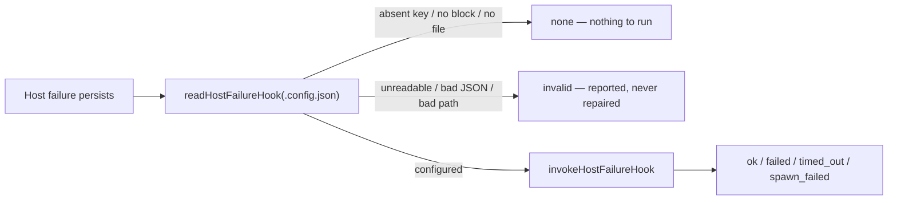

## Summary

Adds the `callbacks.host_failure` hook: the config key, the payload, and the
host-side module that reads and invokes it. A host-level failure — the
launcher crash-looping, the checkout update failing run after run — happens
before any issue is claimed and before a container exists, so none of the
post-run hooks can report it. This is that report, under the existing
post-run callback contract. Nothing calls the invoker yet; the launcher wiring
is a separate child of #2088. Closes #2107.

- `worker/deno/lib/run_callbacks_config.ts` — `host_failure` joins
  `CALLBACK_EVENTS` (and so `KNOWN_KEYS`, `parseHookPath`,
  `CallbacksConfig.host_failure` and the container-side `assertCallbacksConfig`
  load), kept out of `RUN_CALLBACK_EVENTS`. New `parseHostFailureCallback`
  validates `host_failure` and `timeout_seconds` **only**, so a host-side read
  is not failed by a container-only key it never uses. The header's path-rules
  note now records that this one key is a **host** path.
- `worker/deno/lib/run_callbacks.ts` — the private `invokeOne` is exported as
  `invokeCallback`, so the host reuses the same spawn rather than growing a
  second one. `CALLBACK_SCHEMA_VERSION` stays `2`: a new event is an additive
  change, and the #2039/#2041 scar says a bump is not.
- `worker/deno/lib/host_failure_hook.ts` (new) — `readHostFailureHook` (never
  throws; absent is `none`, malformed is `invalid` **with the message**),
  `buildHostFailureDocument`, `buildHostFailureEnv` and
  `invokeHostFailureHook`.

## Evidence

Backend/CLI only — no web interface to screenshot. The evidence is the test
suite and the full quality gate, both run in this worktree.

- `deno test -A tests/host_failure_hook_test.ts tests/run_callbacks_config_test.ts tests/callback_conformance_test.ts tests/callback_schema_compat_test.ts` — 60 passed, 0 failed.
- `./quality.sh` — **PASSED** on the final tree (21 checks; `config integration`
  skipped by the gate itself, as it is on every run here). That covers
  `deno test`, `deno lint`, `deno fmt --check`, `deno check`, semgrep,
  markdownlint, mermaid and the completeness/manifest checks.

## Acceptance Criteria

<!-- vibe-spec-review inputs="diff+issue-body" -->

- **met** — `parseCallbacksConfig({ host_failure: "/opt/hooks/h.sh" })` succeeds and a relative path fails with the existing absolute-path error — evidence: `worker/deno/tests/run_callbacks_config_test.ts::run_callbacks_config - accepts a host_failure hook path (Issue #2107)` and `::a host_failure path obeys the existing path rules` — reviewer: met
- **met** — `readHostFailureHook` returns `none` for a missing file or absent key, `invalid` with a message for malformed input, and never throws — evidence: `worker/deno/lib/host_failure_hook.ts:139-177`; `worker/deno/tests/host_failure_hook_test.ts` (missing file, no block, absent key, invalid JSON, non-object root, array `callbacks`, relative path, out-of-range timeout, unreadable path) — reviewer: met
- **met** — `invokeHostFailureHook` spawns directly with a cleared environment, bounds it by `timeoutSeconds`, redacts and truncates output, and records exactly one status — evidence: `worker/deno/lib/host_failure_hook.ts:266-278` delegating to `invokeCallback`; `worker/deno/tests/host_failure_hook_test.ts::a successful hook is recorded ok` plus the `failed` / `timed_out` / `spawn_failed` cases and `::the child environment carries nothing beyond the contract` — reviewer: met
- **met** — `CALLBACK_SCHEMA_VERSION` remains `2` and `callback_schema_compat_test.ts` passes — evidence: `worker/deno/lib/run_callbacks.ts:64` unchanged; the compat test is untouched and green — reviewer: met
- **met** — `deno test && deno lint && deno fmt --check && deno check` pass — evidence: `./quality.sh` PASSED on the final tree; the reviewer independently ran lint (2624 files), `fmt --check` (2636 files), `check` and the four affected test files (60 passed) — reviewer: met
- **unrequested** — `worker/deno/commands/callback_conformance.ts` and its test: the fixture now refuses `--host_failure` and takes its event list from a new `CONTAINER_CALLBACK_EVENTS` export — reviewer: unrequested — reason: adding `host_failure` to `CALLBACK_EVENTS` broke the command's type and would otherwise have let the fixture accept the flag and silently report a green contract for a hook it never ran
- **unrequested** — `docs/audits/security-sweep-2107-host-failure-hook.md` and the `docs/audits/lib-sweep-coverage.json` slice — reviewer: unrequested — reason: a repo gate (`lib_sweep_coverage_test.ts`) fails any new `lib/` module that no sweep slice claims, so the ledger entry and its written reading are required to land the module
- **unrequested** — `docs/CALLBACKS.md`, `docs/CONFIGURATION.md` and `README.md` updates — reviewer: unrequested — reason: the issue adds an operator-visible config key, and the standards require every doc surface naming the key set to be updated in the same change

## Standards Review

<!-- vibe-standards-review inputs="diff+CODING-STANDARDS.md" -->

- **violation** — no PR summary file — evidence: `docs/archive/pr-summaries/pr-summary-2107.md` absent — reason: fixed here; this file is it
- **violation** — `--host_failure` was accepted and silently dropped, reporting a green contract for a hook that never ran — evidence: `worker/deno/commands/callback_conformance.ts:58` — reason: fixed in this diff; the command now refuses the flag naming why, covered by `tests/callback_conformance_test.ts::--host_failure is refused, never silently dropped (Issue #2107)`
- **violation** — doc surfaces still described the container-only key set — evidence: `docs/CALLBACKS.md:286` (`VIBECODER_CALLBACK_EVENT` values), `docs/CALLBACKS.md:148` (filesystem visibility), `docs/CONFIGURATION.md:2861` (path rules), `README.md:170` and `README.md:451` — reason: fixed in this diff; all five now name the host path
- **violation** — a second hand-maintained copy of the event list — evidence: `worker/deno/commands/callback_conformance.ts:44` — reason: fixed in this diff; the list is now the exported `CONTAINER_CALLBACK_EVENTS` in `run_callbacks_config.ts`, which `CALLBACK_EVENTS` itself spreads
- **violation** — `readEnvSafe` and `put` duplicated from the runner — evidence: `worker/deno/lib/host_failure_hook.ts:116` and `:183` — reason: stands. Both are five-line private helpers; the standards prefer a small duplication to a premature shared abstraction, and exporting them would widen the runner's public surface beyond what the issue asked for
- **clean** — Australian English throughout the added lines; the additive contract held (`CALLBACK_SCHEMA_VERSION` stays `2`, compat test untouched); tests call the production functions through injected seams with no source-grepping, no wall-clock sleep and no real subprocess; temp dirs removed in `finally`; fail-loud behaviour (absent vs faulty are distinguished, nothing throws, no status inferred from the absence of a failure); no hidden or credential-shaped path staged; commit messages name the issue and carry the run-id trailer

## Test Plan

Added:

- `worker/deno/tests/host_failure_hook_test.ts` (21 tests) — the targeted read
  (missing file, no `callbacks` block, absent key, valid path with trimming,
  a container-only key ignored, invalid JSON, non-object root, array
  `callbacks`, relative path, out-of-range `timeout_seconds`, unreadable
  path); the document and environment shape including omission of absent
  optionals and exclusion of multi-line facts; and `ok` / `failed` /
  `timed_out` / `spawn_failed` through an injected runner, plus an assertion
  that the child environment holds nothing outside `INHERITED_ENV_VARS` and
  `VIBECODER_*`.
- `worker/deno/tests/run_callbacks_config_test.ts` (+5 tests) — `host_failure`
  accepted; relative, blank and NUL paths rejected with the existing errors;
  `parseHostFailureCallback` ignoring an invalid `success` value, reporting
  only its own two keys, and defaulting an absent hook.
- `worker/deno/tests/callback_conformance_test.ts` (+1 test) — the fixture
  refuses `--host_failure` rather than dropping it.

Unchanged and still green: `worker/deno/tests/callback_schema_compat_test.ts`.
