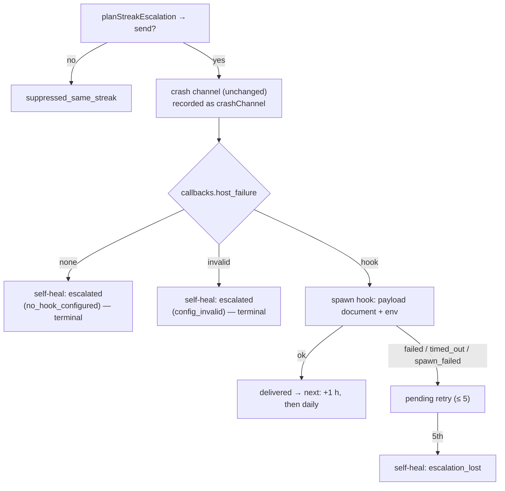

# Launcher self-heal recorder escalates through `callbacks.host_failure`

## Summary

The launcher's self-heal recorder used to fall back to **filing (or commenting
on) an issue in the worker's own repository** whenever the crash channel had
nobody to tell (Issue #556) — a host's outage published to a public repository.
That fallback is gone. The escalation channel is now the host's own
`callbacks.host_failure` hook (Issue #2107), keeping the crossing → +1 h →
daily cadence and the five-attempt retry exactly as they were. Closes #2108.

- `worker/deno/lib/container_restart_backoff.ts` — `HostFailureReport`,
  `escalateHostFailure` and the `escalateHost` / `repoDir` options are removed,
  along with the `fileOrCommentIssue` / `resolveOriginRepo` imports
  (`escalationHostId` stays, for the payload's `host`). New options
  `hostFailureHook` (defaulting to `none`, so no unit test can spawn anything)
  and an injectable `invokeHook` seam. On `plan.send` the recorder builds a
  `HostFailurePayload` — `condition: "launcher"`, the phase, the streak facts,
  `delivery` `first`/`repeat` with its count, the attempt number, and the
  launcher's 40-line tail passed through `redactSecrets`.
- **Delivery bookkeeping.** The crash channel (in-flight-issue comment +
  `CRASH_WEBHOOK_URL`) is still called exactly as before and its result is
  recorded as `details.crashChannel`, but with a hook configured the hook's
  status alone decides whether anybody was told. `ok` advances `delivered`;
  anything else queues a retry up to `ESCALATION_MAX_ATTEMPTS`. With no hook —
  or a malformed `callbacks` block — today's crash bookkeeping stands, except
  that `no_channel` is **terminal**: nothing is retried, and the streak keeps
  its own local record on the re-notify schedule.
- Every attempt emits `escalated` with `details.hookStatus` ∈ `ok | failed |
  timed_out | spawn_failed | no_hook_configured | config_invalid` (plus the
  read's own error for `config_invalid`), and `repo` / `issueNumber` are gone
  from the details. `escalation_undeliverable` is renamed `escalation_lost` at
  both emit sites.
- `worker/deno/commands/container_restart_backoff.ts` reads the hook from the
  same `.config.json` the `log_dir` read resolves, and `--repo-dir` is dropped.

## Evidence

Backend/CLI only — there is no web surface to screenshot. The evidence is the
test suite below plus the flow it pins:

## Reproduction

- **symptom** — a launcher that failed before claiming work escalated by filing
  (or commenting on) an issue in the worker's own origin repository, publishing
  a host's outage to a public repository
- **status** — `partial` — reason: the symptom is a *design* property of the
  unfixed recorder rather than a runtime fault, and the only command that goes
  red against the old code is the issue's own acceptance grep
  (`grep -n "fileOrCommentIssue\|resolveOriginRepo\|escalateHostFailure"` over
  the two files — non-empty before, empty after). No test could be written that
  failed against the old code without also reaching GitHub, which is exactly
  what this change forbids. The replacement behaviour is covered by the tests
  below, all observed passing after the change.
- **regression test** — `worker/deno/tests/container_escalation_streak_test.ts::recordContainerRestartOutcome - no hook configured spawns nothing and records locally`

## Test Plan

`worker/deno/tests/container_restart_backoff_test.ts` — the three Issue #556
fallback tests are **removed**: `a crossing with no in-flight issue reports to
the worker's own repo`, `a fallback that cannot deliver is recorded as
undelivered` and `the fallback stays inert without a checkout to file into` all
pinned the GitHub fallback this issue deletes, so there is no longer any
behaviour for them to assert. They are replaced, in
`worker/deno/tests/container_escalation_streak_test.ts` — a unit suite, whereas
`container_restart_backoff_test.ts` is in `INTEGRATION_TEST_FILES` and would
have kept the new cases out of the merge gate — by:

- `a delivered hook holds the crossing, hourly then daily cadence` — crossing,
  +3600 s, then 86400 s, with `delivery` `first/1`, `repeat/2`, `repeat/3` and
  the full payload asserted.
- `a hook that fails is retried to the cap, then recorded lost` — `failed`,
  `timed_out` and `spawn_failed` each queue a retry; the fifth attempt emits one
  `escalation_lost` (`result: failed`) and nothing more is spawned.
- `no hook configured spawns nothing and records locally` — `Deno.Command` is
  stubbed to throw; `hookStatus: no_hook_configured`, `crashChannel:
  no_channel`, no retry, no `escalation_lost`.
- `a malformed callbacks block is reported, and the backoff still stands` —
  `config_invalid` with the read's error, nothing spawned, backoff unchanged.
- `the payload's log tail is redacted before it reaches the hook`.

- `a hook seam that throws is recorded, never swallowed` — a seam that rejects
  surfaces as `hook_spawn_failed: <message>`, queues a retry, and leaves the
  backoff untouched.
- `the hook decides delivery while the crash channel is only recorded` — the
  crash channel delivers on every cycle while the hook refuses, and the
  escalation stays pending until the hook says `ok`.

The same file carries the `escalation_undeliverable` → `escalation_lost` rename
throughout its existing assertions.
