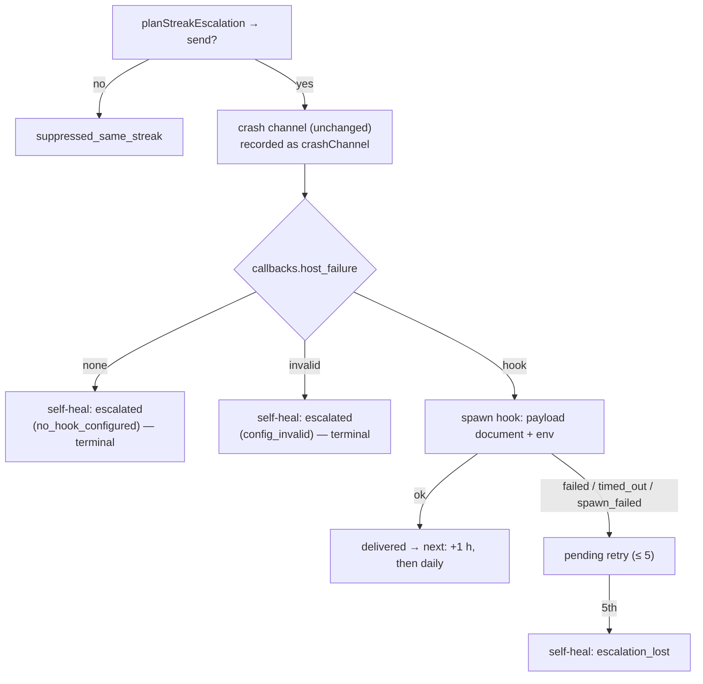

# Launcher self-heal recorder escalates through `callbacks.host_failure`

## Summary

The launcher's self-heal recorder used to fall back to **filing (or commenting
on) an issue in the worker's own repository** whenever the crash channel had
nobody to tell (Issue #556) — a host's outage published to a public repository.
That fallback is gone. The escalation channel is now the host's own
`callbacks.host_failure` hook (Issue #2107), keeping the crossing → +1 h →
daily cadence and the five-attempt retry exactly as they were. Closes #2108.

- `worker/deno/lib/container_restart_backoff.ts` — `HostFailureReport`,
  `escalateHostFailure` and the `escalateHost` / `repoDir` options are removed,
  along with the `fileOrCommentIssue` / `resolveOriginRepo` imports
  (`escalationHostId` stays, for the payload's `host`). New options
  `hostFailureHook` (defaulting to `none`, so no unit test can spawn anything)
  and an injectable `invokeHook` seam. On `plan.send` the recorder builds a
  `HostFailurePayload` — `condition: "launcher"`, the phase, the streak facts,
  `delivery` `first`/`repeat` with its count, the attempt number, and the
  launcher's 40-line tail passed through `redactSecrets`.
- **Delivery bookkeeping.** The crash channel (in-flight-issue comment +
  `CRASH_WEBHOOK_URL`) is still called exactly as before and its result is
  recorded as `details.crashChannel`, but with a hook configured the hook's
  status alone decides whether anybody was told. `ok` advances `delivered`;
  anything else queues a retry up to `ESCALATION_MAX_ATTEMPTS`. With no hook —
  or a malformed `callbacks` block — today's crash bookkeeping stands, except
  that `no_channel` is **terminal**: nothing is retried, and the streak keeps
  its own local record on the re-notify schedule.
- Every attempt emits `escalated` with `details.hookStatus` ∈ `ok | failed |
  timed_out | spawn_failed | no_hook_configured | config_invalid` (plus the
  read's own error for `config_invalid`), and `repo` / `issueNumber` are gone
  from the details. `escalation_undeliverable` is renamed `escalation_lost` at
  both emit sites.
- `worker/deno/commands/container_restart_backoff.ts` reads the hook from the
  same `.config.json` the `log_dir` read resolves, and `--repo-dir` is dropped.

## Evidence

Backend/CLI only — there is no web surface to screenshot. The evidence is the
test suite below plus the flow it pins:

## Reproduction

- **symptom** — a launcher that failed before claiming work escalated by filing
  (or commenting on) an issue in the worker's own origin repository, publishing
  a host's outage to a public repository
- **status** — `partial` — reason: the symptom is a *design* property of the
  unfixed recorder rather than a runtime fault, and the only command that goes
  red against the old code is the issue's own acceptance grep
  (`grep -n "fileOrCommentIssue\|resolveOriginRepo\|escalateHostFailure"` over
  the two files — non-empty before, empty after). No test could be written that
  failed against the old code without also reaching GitHub, which is exactly
  what this change forbids. The replacement behaviour is covered by the tests
  below, all observed passing after the change.
- **regression test** — `worker/deno/tests/container_escalation_streak_test.ts::recordContainerRestartOutcome - no hook configured spawns nothing and records locally`

## Quality gate

`./quality.sh` passes every check except `deno tests`, which reports two
failures that are **environmental and outside this diff**:
`agent_provider_test.ts::agent provider - the per-run provider override beats
the configured file value (Issue #2062)` and `config_test.ts::config - the
per-run provider override applies to the loaded agent (Issue #2062)`. Both
throw `The running container image did not install the "deepseek" coding-agent
provider. Installed: claude.` — this container was built with `claude` alone.
Neither file is touched by this change, and both fail identically when run on
their own.

## Acceptance Criteria

<!-- vibe-spec-review inputs="diff+issue-body" -->

- **met** — hook `ok` fires at the crossing, +3600 s then every 86400 s, with `delivery` `first/1`, `repeat/2`, `repeat/3` — evidence: `worker/deno/tests/container_escalation_streak_test.ts::recordContainerRestartOutcome - a delivered hook holds the crossing, hourly then daily cadence` — reviewer: met
- **partial** — non-`ok` is retried to 5 attempts, the 5th emits `escalation_lost` (`result: failed`) once **and no further hook invocations occur for that streak** — evidence: `worker/deno/lib/container_restart_backoff.ts:1846` and `worker/deno/tests/container_escalation_streak_test.ts::recordContainerRestartOutcome - a hook that fails is retried to the cap, then recorded lost` — reviewer: partial — reason: the cap and the once-only `escalation_lost` hold, but past the cap `planStreakEscalation` still returns `kind: "retry"` while `pending !== null`, so the hook fires again at +3600 s. That is the *unchanged* pre-existing schedule this issue's "What Needs to Be Done" asked to keep ("retry as today up to `ESCALATION_MAX_ATTEMPTS`", then "fall back to the re-notify schedule"); the stricter reading in the acceptance criterion would change `planStreakEscalation`, which the issue did not ask for. Left as is and surfaced here rather than silently reinterpreted.
- **met** — no hook: nothing spawned, nothing written to GitHub, `hookStatus: "no_hook_configured"` — evidence: `worker/deno/tests/container_escalation_streak_test.ts::recordContainerRestartOutcome - no hook configured spawns nothing and records locally` — reviewer: met
- **met** — a malformed `callbacks` block records `config_invalid` and the backoff is still returned — evidence: `worker/deno/tests/container_escalation_streak_test.ts::recordContainerRestartOutcome - a malformed callbacks block is reported, and the backoff still stands` — reviewer: met
- **met** — the `fileOrCommentIssue` / `resolveOriginRepo` / `escalateHostFailure` grep over the two files is empty — evidence: grep run, exit 1, no output — reviewer: met
- **met** — the two docs no longer say the launcher files an issue in the worker's own repository; markdownlint, mermaid and shellcheck pass — evidence: `docs/TROUBLESHOOTING.md:124-150`, `docs/workflows/resilience-and-concurrency.md:88-93,111-114,150`; `./quality.sh` reports mermaid, markdownlint PASSED — reviewer: met
- **partial** — `deno test && deno lint && deno fmt --check && deno check` pass — evidence: `./quality.sh` — lint, fmt, type check and both touched suites pass — reviewer: met — reason: recorded as `partial` here, not `met`, because the full `deno test` pass reports two failures outside this diff (`agent_provider_test.ts` / `config_test.ts`, Issue #2062), which throw because this container image installed only the `claude` provider. See **Quality gate** above.
- **unrequested** — `run.ps1` / `loop.ps1` comment rewrites (the issue named only `run.sh` / `loop.sh`) — evidence: `run.ps1:203`, `loop.ps1:15` — reviewer: unrequested — reason: the PowerShell launchers carried the same "escalates through GitHub" claim word for word; leaving half the launchers asserting a removed channel is worse than the extra comment diff.
- **unrequested** — `worker/deno/lib/outcome_record_gate.ts` header rewrite — evidence: `worker/deno/lib/outcome_record_gate.ts:4` — reviewer: unrequested — reason: it explained `--allow-sys=hostname` in terms of the removed issue title being the dedup key, which this change makes false.
- **unrequested** — `details.hookError` on `config_invalid`, and `reason` carrying `hook_spawn_failed: <message>` for a throwing seam — evidence: `worker/deno/lib/container_restart_backoff.ts:1835`, `:1762` — reviewer: unrequested — reason: fail-loud. A malformed config and a misbehaving seam must carry their own message; the listed details set is a floor, not a ceiling.
- **unrequested** — `hostConfigPath()` extracted in the command — evidence: `worker/deno/commands/container_restart_backoff.ts:112` — reviewer: unrequested — reason: the new hook read and the existing `log_dir` read must resolve the same file; one helper makes that structural.
- **unrequested** — `docs/archive/pr-summaries/pr-summary-2108.md` — evidence: this file — reviewer: unrequested — reason: required by the repository's own PR conventions.

## Standards Review

<!-- vibe-standards-review inputs="diff+CODING-STANDARDS.md" -->

- **violation** — the hook-seam `catch` wrote its message into a dead store, so a misbehaving seam's fault reached no event and no return value — evidence: `worker/deno/lib/container_restart_backoff.ts:1745` — reason: fixed in this diff; the fault now rides `reason` as `hook_spawn_failed: <message>` and is covered by `recordContainerRestartOutcome - a hook seam that throws is recorded, never swallowed`.
- **violation** — that error path had no test — evidence: `worker/deno/tests/container_escalation_streak_test.ts` — reason: fixed; the throwing-seam test above was added.
- **violation** — a unit test assigned a throwing class over the global `Deno.Command`, mutating process-wide state — evidence: `worker/deno/tests/container_restart_backoff_test.ts` (removed) — reason: fixed; the no-hook case now proves nothing spawns through the injected `invokeHook` seam, and the two `no-explicit-any` escapes went with it.
- **violation** — the five new cases were added to a file listed in `INTEGRATION_TEST_FILES`, so they would have run outside the merge gate — evidence: `worker/deno/lib/integration_test_manifest.ts:60` — reason: fixed; they moved to `container_escalation_streak_test.ts`, a unit suite.
- **violation** — `resolveHostConfigPath({ baseDir: Deno.cwd(), env: processEnvLookup })` was written out twice while a comment asserted both reads name the same file — evidence: `worker/deno/commands/container_restart_backoff.ts:112` — reason: fixed; one `hostConfigPath()` helper.
- **violation** — three JSDoc lines in the rewritten module still named GitHub as the channel — evidence: `worker/deno/lib/container_restart_backoff.ts:187`, `:1372`, `:1388` — reason: fixed in this diff.
- **violation** — `container_restart_backoff.ts` grew from 1818 to ~1890 lines, against "favour many smaller, focused source files" — evidence: `worker/deno/lib/container_restart_backoff.ts` — reason: stands. Splitting the escalation-delivery concern out of an already-monolithic module is a refactor this issue did not ask for; recorded rather than folded in.
- **clean** — Australian English throughout; `redactSecrets` applied before the log tail leaves the process, with a dedicated test; fail-loud preserved (a malformed config records `config_invalid` rather than degrading to "no hook", and the supervisor's backoff is returned whatever the escalation does); no `CALLBACK_SCHEMA_VERSION` change; tests call real code with injected seams, no source-grepping, no sleeps, no wall-clock thresholds; no hidden or credential paths staged; every commit carries its `Vibe-Coder-Run-Id` trailer; the docs owed by the rename and the `--repo-dir` removal are in this diff.

## Test Plan

`worker/deno/tests/container_restart_backoff_test.ts` — the three Issue #556
fallback tests are **removed**: `a crossing with no in-flight issue reports to
the worker's own repo`, `a fallback that cannot deliver is recorded as
undelivered` and `the fallback stays inert without a checkout to file into` all
pinned the GitHub fallback this issue deletes, so there is no longer any
behaviour for them to assert. They are replaced, in
`worker/deno/tests/container_escalation_streak_test.ts` — a unit suite, whereas
`container_restart_backoff_test.ts` is in `INTEGRATION_TEST_FILES` and would
have kept the new cases out of the merge gate — by:

- `a delivered hook holds the crossing, hourly then daily cadence` — crossing,
  +3600 s, then 86400 s, with `delivery` `first/1`, `repeat/2`, `repeat/3` and
  the full payload asserted.
- `a hook that fails is retried to the cap, then recorded lost` — `failed`,
  `timed_out` and `spawn_failed` each queue a retry; the fifth attempt emits one
  `escalation_lost` (`result: failed`) and nothing more is spawned.
- `no hook configured spawns nothing and records locally` — an injected
  `invokeHook` that must never be called; `hookStatus: no_hook_configured`,
  `crashChannel: no_channel`, no retry, no `escalation_lost`.
- `a malformed callbacks block is reported, and the backoff still stands` —
  `config_invalid` with the read's error, nothing spawned, backoff unchanged.
- `the payload's log tail is redacted before it reaches the hook`.
- `a hook seam that throws is recorded, never swallowed` — a seam that rejects
  surfaces as `hook_spawn_failed: <message>`, queues a retry, and leaves the
  backoff untouched.
- `the hook decides delivery while the crash channel is only recorded` — the
  crash channel delivers on every cycle while the hook refuses, and the
  escalation stays pending until the hook says `ok`.

The same file carries the `escalation_undeliverable` → `escalation_lost` rename
throughout its existing assertions.
