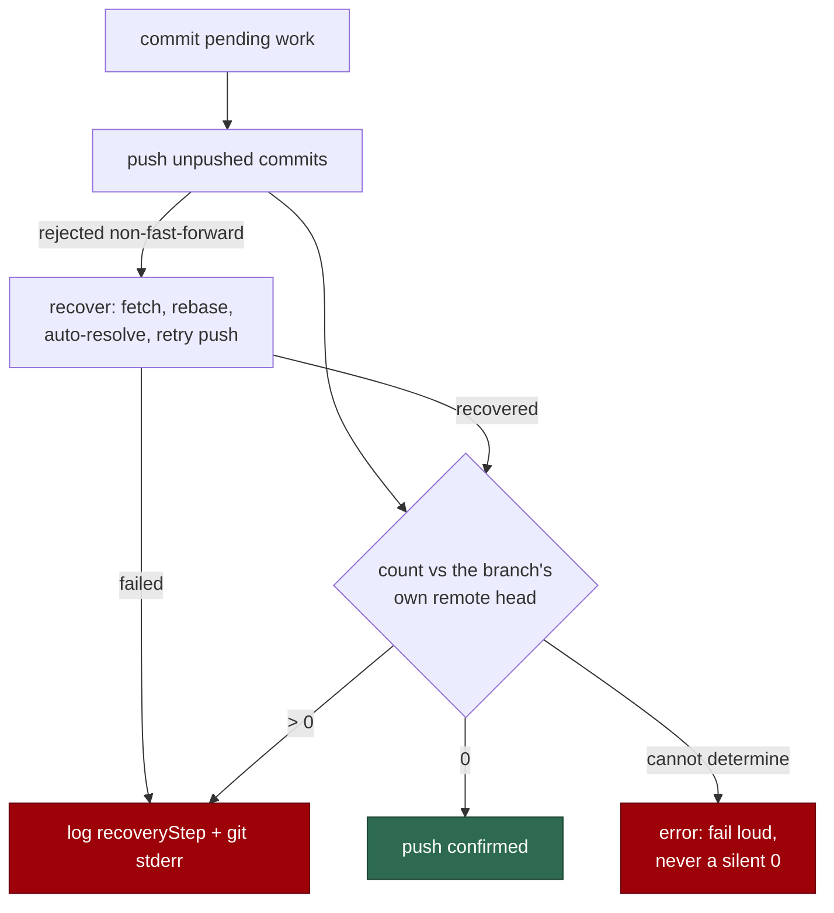

## Summary

A successful push was reported as a failure. `commitAndPushPending` re-counted
unpushed commits with `git rev-list --count HEAD --not --remotes=origin`, which
answers "commits ahead of the default branch" whenever the clone keeps no
remote-tracking ref for the branch — a single-branch clone never gains one, even
after `git push -u` succeeds. NEAT-AI-core PR #557 logged
`commitsPushed=4 finalUnpushedCount=4`, which triggered a pointless recovery, a
"please check the branch status" comment to a human, and a `merge-conflict`
label on a PR GitHub reported as mergeable. Closes #211.

Four changes, one per defect in the issue:

1. **Honest unpushed count.** New
   `worker/deno/lib/git_remote_head.ts` resolves the branch's *own* remote head
   (`refs/remotes/origin/<branch>`, else `git ls-remote --heads origin <branch>`)
   and counts against it. When the remote state cannot be determined at all it
   returns an error — never a silent `0`. `pushUnpushedCommits` and
   `commitAndPushPending` both use it, so `commitsPushed` and
   `finalUnpushedCount` can no longer contradict each other.
2. **A failed push says why.** The CI-fix, feedback and spelling processors log
   `recoveryStep` plus the recovery error (`detail`), which names whether the
   rebase conflicted, auto-resolution failed, or `--force-with-lease` was
   refused; `pushUnpushedCommits` folds the recovery error into its own error
   instead of discarding it; the merge-conflict pass asks git for the rejection
   reason with a dry-run push rather than reporting a bare
   `N commit(s) could not be pushed`.
3. **Stale feedback is not claimed.** New
   `worker/deno/lib/pr_feedback_supersede.ts` drops a PR comment when a fleet
   account pushed the PR head *after* the comment was written. Unknown state (no
   `created_at`, unreadable head commit, unparseable date) still claims, so
   genuine feedback is never silently dropped.
4. **The branch-update pass judges the remote head.** `updatePrBranch` fetches
   and resets the PR branch to its remote head before evaluating behind/conflict
   state, naming any discarded local-only commits in its message and failing
   loud if the remote head cannot be established. A genuine conflict on the
   remote head is still left untouched (Issue #4373 behaviour unchanged).

A head that moved during the run was already handled inside the push path
(reject → fetch → rebase → auto-resolve → retry); with the count fixed, that
recovery is no longer invoked spuriously, and the "please check the branch
status" comment now only fires when the rebase genuinely fails.

## Evidence

Backend/CLI change — no web interface to screenshot. Evidence is the test suite,
run against real git repositories (bare upstream + clones), not stubs.

The reproduction is exact: on a `--single-branch` clone, after a successful push
of four commits, `git rev-list --count HEAD --not --remotes=origin` prints `4`.
`tests/git_remote_head_test.ts` asserts that legacy count as a precondition and
then asserts the new count is `0`.

`./quality.sh` result: **14885 passed, 10 failed**. All 10 failures are
pre-existing and environment-dependent (`fleet_health_test.ts`,
`host_workdir_guard_test.ts`, `optional_feature_env_test.ts`,
`setup_workdir_reminder_test.ts`) — verified by running those four files from a
worktree at the base commit `9658a20`, where the same 10 fail. Every other gate
(lint, type check, fmt, mermaid, markdownlint, chokepoints) passed.

## Test Plan

New tests — all call real functions and assert on results or git state:

- `worker/deno/tests/git_remote_head_test.ts` (8 tests) — remote head from the
  tracking ref, from `ls-remote` when no tracking ref exists, branch absent from
  the remote, unpushed counts on a single-branch clone (0 after a good push, 2
  when two commits really are unpushed), a loud error when the remote is
  unreachable and no tracking ref exists, and a refused dash-leading branch name.
- `worker/deno/tests/git_push_single_branch_test.ts` (3 tests) — the regression:
  `commitAndPushPending` on a single-branch clone reports
  `commitsPushed=4, finalUnpushedCount=0`; `pushUnpushedCommits` counts 1, not 4,
  when only one commit is missing from the remote; a sibling that moves the head
  mid-run is rebased onto and the work lands with the sibling's commit intact.
- `worker/deno/tests/push_recovery_detail_test.ts` — a failed recovery logs git's
  own reason, not just "Push failed after recovery attempt".
- `worker/deno/tests/pr_feedback_supersede_test.ts` (8 tests) — the supersession
  decision (later fleet push, earlier push, non-fleet pusher, case-insensitive
  login, unknown data) and `findPrCommentsToFix` end to end: superseded comment
  not claimed, fresh comment still claimed, unreadable head commit still claimed.
- `worker/deno/tests/git_pull_remote_head_test.ts` (2 tests) — a stale local-only
  commit no longer produces a false conflict verdict and is reported as
  discarded; a genuine conflict on the remote head is still left untouched.

Existing suites re-run green: `commit_and_push_pending_test.ts`,
`git_push_test.ts`, `git_push_recovery*_test.ts`, `git_push_preflight_test.ts`,
`git_pull_conflict_test.ts`, `pr_ci_processor*_test.ts`,
`pr_feedback_processor*_test.ts`, `pr_spelling_processor_test.ts`,
`pr_merge_conflict_processor_test.ts`, `pr_maintenance_test.ts`,
`pr_uninvited_action_test.ts`, `pr_feedback_trusted_bot_e2e_test.ts`. No existing
test was modified or removed.

### Security self-check

- Branch names still pass `assertSafeGitRef` before any git or `ls-remote` call;
  `pushUnpushedCommits` validates its own slot so the refusal names it, and the
  new `reset --hard` uses `--end-of-options` with a SHA validated against the
  object-id pattern.
- The new `gh api repos/{repo}/commits/{sha}` read is a fetch of the PR's own
  head commit — no new write surface, no secrets, no user input concatenated
  into a command.
- Failure paths surface git's stderr to the worker log only; PR comments are
  unchanged.
