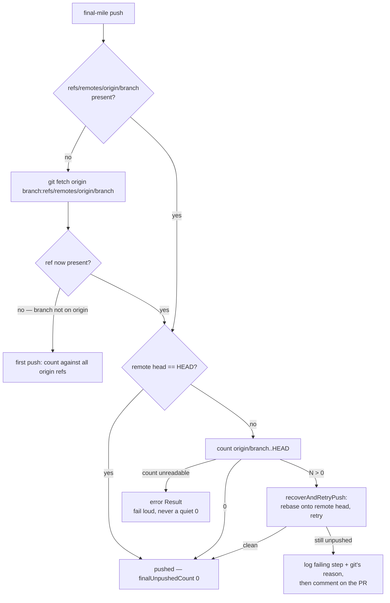

# False "push failed" on single-branch clones (Issue #211)

## Summary

A successful push was reported as failed on any clone whose fetch refspec
covers only the default branch. `finalUnpushedCount` was
`git rev-list --count HEAD --not --remotes=origin` — commits on no *locally
tracked* origin ref. A single-branch clone never gains
`refs/remotes/origin/<feature>`, not even from a good push, so the number
silently degraded to "commits ahead of Develop" (4 on NEAT-AI-core #557, 5 on
#563 — exactly the PR sizes). Everything downstream was a consequence: a
pointless rebase recovery, an "I fixed the issues … but failed to push" comment
aimed at a human, and a `merge-conflict` label on a PR that was mergeable.

Closes #211.

What changed:

1. **Count against the branch's own remote head.** `countUnpushedCommits()`
   (`worker/deno/lib/git_unpushed.ts`) resolves
   `refs/remotes/origin/<branch>` — fetching that tracking ref explicitly when
   the clone's refspec does not cover it — and counts
   `origin/<branch>..HEAD`. A count it could not take is an error `Result`,
   never a quiet `0`, and `commitAndPushPending` now reports
   `unpushedMeasuredAgainst` alongside the count so a logged `0` can be
   trusted. The same blind spot in the pre-push probe is gone with it.
2. **Repair the clone.** `ensureAllBranchesFetchRefspec()`
   (`git_fetch_refspec.ts`) adds — never substitutes —
   `+refs/heads/*:refs/remotes/origin/*` to a legacy single-branch clone from
   `setupRepo`, and forces one full fetch so the tracking refs materialise.
3. **Log why a push failed.** `recoverAndRetryPush()`
   (`push_recovery_retry.ts`) replaces the block the CI-fix, PR-feedback and
   spelling processors each carried, and returns the failing step
   (`rebase-recovery` / `retry-push`) with git's own message. The
   merge-conflict pass now names both heads and git's stderr instead of
   `5 commit(s) could not be pushed`.
4. **Judge the PR by its remote head.** `updatePrBranch()` checks the branch
   out at `origin/<branch>` via `checkoutPrBranchAtRemoteHead()`, and refuses
   loudly when the local branch holds commits origin has never seen — that
   refusal is a plain failure, not the conflict error that hands a PR to the
   `merge-conflict` labelling pass.
5. **Do not claim superseded feedback.** `isSupersededByFleetPush()`
   (`pr_comment_supersession.ts`) skips a PR comment when a fleet account
   pushed to the PR head after it was written. It fails closed: a human push,
   an unknown comment time or an unreadable head commit all leave the comment
   actionable.

## Evidence

Backend/CLI change — no web interface to screenshot. Verified by tests that
build real git repositories (single-branch clones, bare remotes, sibling
pushes) and run real git.



Regression test for the reported incident — it fails against the unfixed
measure, which reported 4:

```
countUnpushedCommits - single-branch clone reports 0 after a good push ... ok
commitAndPushPending - single-branch clone: a good push reports finalUnpushedCount 0 ... ok
```

`docs/INTERNALS.md` gains the "Is it pushed? is a question about origin" and
"Fleet-superseded PR feedback" sections, plus the new modules in the module
table.

## Test Plan

New:

- `worker/deno/tests/git_unpushed_test.ts` — a good push on a `--single-branch`
  clone reports 0; only commits ahead of the remote branch are counted; a
  branch absent from origin counts every local commit; an existing tracking ref
  is used as-is; a dash-leading branch name is refused; `commitAndPushPending`
  reports `finalUnpushedCount=0` after pushing 4 commits (the incident shape);
  an unreachable origin still reports the commits as unpushed rather than 0.
- `worker/deno/tests/git_fetch_refspec_test.ts` — repairs a single-branch
  clone, leaves a full clone untouched, is idempotent, and reports a git
  failure rather than claiming a repair.
- `worker/deno/tests/pr_branch_checkout_test.ts` — creates the branch from the
  remote head on a single-branch clone, resets a stale local branch onto a
  sibling's push, refuses when the local branch holds unpushed commits, refuses
  a branch that exists only locally, and refuses a refspec-breaking name.
- `worker/deno/tests/push_recovery_retry_test.ts` — a clean push reports
  nothing unpushed; the rebase failure reason, a failed retry commit-and-push,
  and commits surviving the retry are each surfaced with the failing step.
- `worker/deno/tests/pr_comment_supersession_test.ts` — supersession by a later
  fleet push, no supersession for an earlier push, a human push or missing
  data; `fetchPrHeadCommit` parsing and failure; and `findPrCommentsToFix`
  skipping a superseded comment while still claiming the other two shapes.
- `worker/deno/tests/git_pull_remote_head_test.ts` — `updatePrBranch` refuses
  loudly (not as a base conflict) when the local branch carries an unpushed
  commit that collides with the base, and evaluates a sibling's remote head
  rather than the behind local branch.

Modified: none of the pre-existing suites needed changing;
`git_pull_conflict_test.ts` and `pr_branch_arg_injection_test.ts` pass
unchanged against the new checkout path.

Full gate: `./quality.sh` passes.
