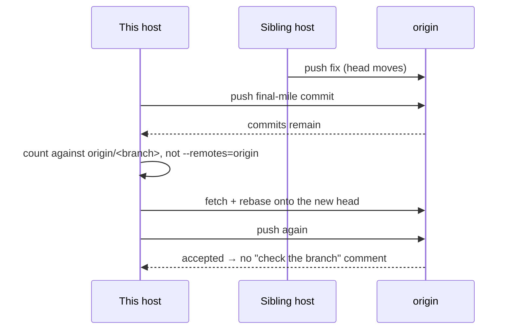

# False "push failed" on single-branch clones (Issue #211)

## Summary

A fully pushed branch was reported as having unpushed commits, so a good push
was declared a failure: bogus rejection recovery, a "please check the branch
status" comment addressed to a human, and a `merge-conflict` label on a PR that
was perfectly mergeable (NEAT-AI-core #557, #563). Closes #211.

Root cause, reproduced with real git: every fleet workdir is a **single-branch
clone**, whose fetch refspec maps only the default branch. `refs/remotes/origin/<feature>`
therefore never exists — not even after `git push -u`, because push only updates
a remote-tracking ref the refspec covers. Both the pre-push and post-push counts
fell back to `rev-list --count HEAD --not --remotes=origin`, which in that clone
means *commits ahead of Develop*. A four-commit branch reported
`commitsPushed=4 finalUnpushedCount=4` after a push that had, in fact, landed.

What changed, one defect at a time:

1. **Honest count** — new `worker/deno/lib/git_unpushed_count.ts` resolves the
   remote head of the branch itself (tracking ref when present; otherwise a
   fetch of that branch) and counts against it. A branch missing from origin
   still counts every local-only commit, so the Issue #1463 first-push path is
   unchanged. A count that cannot be established is a loud error, never a
   silent `0`.
2. **Recovery reason kept** — `recoverFromPushRejection` now names the step that
   failed (`pull-rebase`, `force-with-lease`, `retry-push`) and carries git's own
   stderr. The CI-fix, PR-feedback and spelling processors share one
   `recoverAndRetryPush` step that logs that reason and folds it into the reply,
   replacing three copies of a block that discarded it.
3. **Moved head is rebased onto** — that shared step fetches, rebases our commits
   onto the current remote head (which a sibling host may have moved) and pushes
   again. The "check the branch status" comment now fires only when that recovery
   genuinely fails, and carries the reason.
4. **Superseded feedback is not claimed** — `findPrCommentsToFix` skips a comment
   a fleet author pushed against after it was written, within a 30-minute
   de-duplication window. Bounded on purpose: an old fleet push must never starve
   genuine feedback.
5. **Conflicts judged on origin's head** — `updatePrBranch` fast-forwards the
   checked-out branch to origin's head before evaluating it, so a stale local copy
   in a long-lived workdir can no longer manufacture a conflict. A branch holding
   genuinely unpushed commits is reported as exactly that — never reset away, never
   relabelled a base-branch conflict.

## Evidence

Backend/CLI change with no web interface, so no screenshot applies. The root
cause was verified against real git before any code was written:

```text
$ git clone --single-branch --branch Develop remote.git work
$ git -C work fetch origin feat && git -C work checkout -b feat FETCH_HEAD
$ git -C work push -u origin feat        # succeeds
$ git -C work for-each-ref refs/remotes  # only refs/remotes/origin/Develop
$ git -C work rev-list --count HEAD --not --remotes=origin
2                                        # ← "unpushed" after a successful push
```

That exact shape is now a test fixture
(`tests/git_unpushed_count_test.ts::makeSingleBranchClone`), which asserts the
legacy probe still reports `4` while `countUnpushedCommits` reports `0`.



All affected suites pass — 285 tests across the push, recovery, branch-update,
PR-maintenance and processor files. `./quality.sh` passes every gate except
`deno tests`, which fails on ten pre-existing host-environment tests
(`setup_workdir_reminder`, `host_workdir_guard`, `optional_feature_env`,
`fleet_health` work-dir cases). Those same ten fail with this branch's changes
stashed, so they are not caused by this work.

## Test Plan

Added:

- `tests/git_unpushed_count_test.ts` — single-branch clone in sync reports `0`
  (with the legacy probe's `4` asserted alongside it); genuinely unpushed commits
  counted correctly; branch absent from origin counts local-only commits; full
  clone uses the tracking ref; an unreachable origin fails loud; a dash-leading
  ref is refused.
- `tests/commit_and_push_pending_test.ts` — two single-branch-clone cases:
  `finalUnpushedCount=0` after a good push, and `0 pushed / 0 unpushed` when
  there is nothing to do.
- `tests/git_push_recovery_diagnostics_test.ts` — a refused lease names the step
  and carries git's stderr; every recovery failure is labelled as one.
- `tests/push_recovery_retry_test.ts` — the shared step reports success, a failed
  recovery (with the step and stderr in the log context), a residual-commit
  retry, and a failed retry.
- `tests/pr_feedback_superseded_comment_test.ts` — a sibling fleet push
  suppresses the comment; a comment posted after the push is claimed; a human
  push does not suppress; an old fleet push stops suppressing; plus the
  `isSupersededByFleetPush` window boundaries.
- `tests/git_pull_remote_head_test.ts` — a sibling's merge on origin clears the
  conflict a stale local branch still shows; a branch holding unpushed commits
  is refused by name, not labelled conflicted, and its commits survive.
- `tests/pr_ci_processor_moved_head_test.ts` — the moved-head incident end to
  end: rebase, push, no "check the branch status" comment; and an unrecoverable
  push whose comment names the failing step.

No existing tests were removed or weakened.
