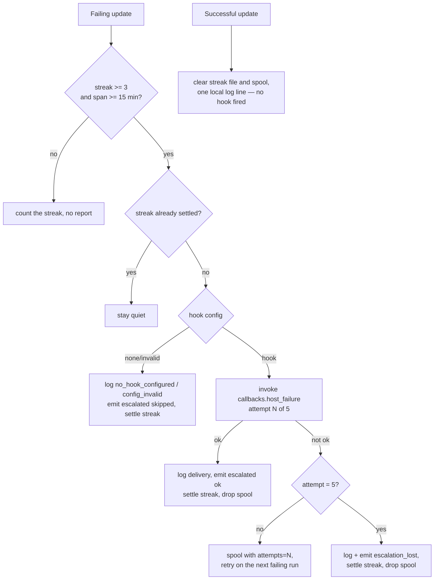

# Checkout update escalates through `callbacks.host_failure`, not GitHub

## Summary

The host-side checkout update reported a crash-loop by filing (or commenting
on) a `Worker checkout update failing on <host>` issue against the checkout's
own origin repository, and re-delivered the spooled report when the update
recovered. A host-level fault is the operator's business, not a public record
in the repository the fleet works on, so it now rides the
`callbacks.host_failure` hook added by #2107.

- **One report per streak, through the hook.** Three consecutive failures
  spanning at least fifteen minutes invoke the configured hook once with a
  `checkout_update` payload — host, streak count, streak start, the redacted
  diagnosis, the checkout's branch and dirty-file count, and
  `lastExitStatus` only when the failing git step's status was actually
  observed. A status of `ok` settles the streak; later failures in it invoke
  nothing.
- **Five attempts, then `escalation_lost`.** A non-`ok` invocation is spooled
  with its attempt count and retried on the next failing run. The fifth failed
  attempt records `escalation_lost` once, settles the streak and drops the
  spool, so a permanently broken hook is not paid for on every launch.
- **No hook, or a bad config, never blocks the update.** `none` records
  `no_hook_configured`, `invalid` records `config_invalid` with the reason;
  both settle the streak and the git update proceeds.
- **Recovery delivers nothing.** A clean update clears the streak file and the
  spool and writes one local line saying the streak ended and whether a report
  was still undelivered.
- **No `gh` anywhere on this path**, pinned by a test that makes
  `Deno.Command` throw and drives a whole streak, loss and recovery through it.

Closes #2110.

## Evidence

Backend/CLI only — there is no web surface to screenshot. The evidence is the
three test suites below plus the full quality gate (`./quality.sh`: PASSED,
every check green, `config integration` skipped as it is on this host).

## Reproduction

- **symptom** — a host whose checkout update crash-looped filed a public
  GitHub issue against the worker repository, and the run that recovered
  delivered the spooled report after the condition had already cleared
- **status** — `verified` — the "nothing is spawned" assertion was driven
  against the *unfixed* module this run (the base-branch `checkout_update.ts`
  copied in beside it, every git seam stubbed, `Deno.Command` replaced with a
  throwing class): it went red, `SPAWNED: ["git"]`, the first process of the
  old `resolveEscalationGhEnv` → `gh issue` escalation. The same probe against
  the module in this diff is green, `SPAWNED: []`. The five-attempt bound was
  verified the same way: reverting the spool drop in `deliverEscalation` turns
  `the fifth failed attempt loses the report and settles the streak` red, and
  restoring it turns it green
- **regression test** —
  `worker/deno/tests/checkout_update_escalation_spool_test.ts::updateCheckout - no escalation path spawns a process (Issues #2110, #2088)`

## Acceptance Criteria

<!-- vibe-spec-review inputs="diff+issue-body" -->

- **met** — Behaviours 1–5 hold and are covered by the tests in step 4 — evidence: `worker/deno/tests/checkout_update_escalation_spool_test.ts` (15 cases covering the single invocation, the five-attempt bound, `escalation_lost`, recovery, `none`/`invalid`), `worker/deno/tests/worker_checkout_update_test.ts` (a real shell hook end to end) — reviewer: met
- **met** — `grep -n "fileOrCommentIssue\|resolveOriginRepo\|resolveEscalationGhEnv\|recovered" worker/deno/lib/checkout_update.ts` prints nothing — evidence: the grep exits 1 with no output — reviewer: met
- **met** — `docs/CONFIGURATION.md`, `docs/TROUBLESHOOTING.md` and `run.sh` no longer say the checkout update files a GitHub issue — evidence: `docs/CONFIGURATION.md:1295`, `docs/TROUBLESHOOTING.md:337`, `run.sh:585` — reviewer: met
- **met** — `check-markdownlint` and `shellcheck` pass — evidence: `./quality.sh` markdownlint and validate-scripts stages, both PASSED — reviewer: met
- **met** — `cd worker/deno && deno test && deno lint && deno fmt --check && deno check` pass — evidence: full `./quality.sh` run after the final edit — deno tests, lint, type check and fmt all PASSED — reviewer: met — reason: the reviewer saw only the diff and ran the three affected suites rather than the whole gate; the gate was run here and passed
- **met** — `attempts` defaults to 0 when absent from an old spool file — evidence: `worker/deno/lib/checkout_update.ts:925`, `worker/deno/tests/checkout_update_escalation_spool_test.ts::a spool entry written before the attempt count reads as no attempts` — reviewer: partial — reason: the reviewer found the default was 1, which contradicted the issue; corrected to 0 in this diff and the test inverted with it
- **unrequested** — `docs/CALLBACKS.md` gains a "What the checkout update sends" section — reviewer: unrequested — reason: the hook's own page had no caller documented; the cadence rules the issue defines are only discoverable from there, and it is four bullets
- **unrequested** — `run.ps1` carries the same comment correction as `run.sh` — reviewer: unrequested — reason: the two launchers carry the identical comment; leaving the PowerShell one saying "raise a GitHub issue" would make the docs sweep half-done
- **unrequested** — `docs/DEPLOYMENT.md:252` rewritten off the GitHub-issue channel — reviewer: unrequested — reason: the Standards reviewer found it still described the retired channel; a code change owes the docs sweep
- **unrequested** — `CheckoutUpdateDeps.emitEvent` is an injected seam rather than a direct `emitSelfHealEventAuto` call — reviewer: unrequested — reason: the self-heal sink is process-global, so a direct call would make every escalation test mutate it; the seam keeps the suites parallel-safe and the production default is `emitSelfHealEventAuto`
- **unrequested** — `docs/archive/handover/issue-2110.md` — reviewer: unrequested — reason: the worker's own handover note for the interrupted attempt, committed by the worker, matching the nine already tracked in that directory

## Standards Review

<!-- vibe-standards-review inputs="diff+CODING-STANDARDS.md" -->

- **violation** — `docs/DEPLOYMENT.md` still described the retired GitHub-issue channel — evidence: `docs/DEPLOYMENT.md:252` — reason: fixed here; it now names the `callbacks.host_failure` hook and links the configuration section
- **violation** — a stale rationale in `defaultReadEscalationState` justified a re-read by "the deduplicated channel folds into the issue already open" — evidence: `worker/deno/lib/checkout_update.ts:941` — reason: fixed here; it now says the operator's hook may receive the report twice
- **violation** — the new exported `invokeCheckoutUpdateFailureHook` had no direct test and no error-path coverage — evidence: `worker/deno/lib/checkout_update.ts:1113` — reason: fixed here; `checkout_update_test.ts` now drives an unspawnable hook (non-`ok`, never thrown) and a real hook that takes delivery
- **violation** — `workerCheckoutUpdateCommand.execute` was modified but no test exercised it, so the self-heal wiring the docs rest on was unproven — evidence: `worker/deno/commands/worker_checkout_update.ts:262` — reason: fixed here; `worker_checkout_update_test.ts::the command's own execute wires the self-heal sink` drives `execute` with `--work-dir` and asserts the `checkout_update` record lands under it
- **violation** — the new `--work-dir` flag was documented only in module JSDoc — evidence: `worker/deno/commands/worker_checkout_update.ts:11` — reason: fixed here; `docs/CONFIGURATION.md` §Host-Side Checkout Update now names it and its `WORK_DIR`/`HOME` fallback
- **violation** — the "no escalation path spawns a process" case replaces the process-global `Deno.Command` — evidence: `worker/deno/tests/checkout_update_escalation_spool_test.ts:699` — reason: stands. The global *is* the assertion — the point is that the real production seam spawns nothing, which an injected seam cannot prove — it is restored in a `finally`, Deno runs each test file in its own process under `--parallel`, and the same shape is already on the base branch at `worker/deno/tests/callback_failure_streak_test.ts:345`
- **violation** — `fileOrCommentIssue` / `resolveOriginRepo` in `worker/deno/lib/host_escalation.ts` have no production caller left after this change — evidence: `worker/deno/lib/host_escalation.ts:117,187` — reason: stands, and is already tracked: issue #2112 "Retire the GitHub issue channel from host_escalation.ts" is the sibling in this milestone that owns the removal. Deleting it here would be out of scope
- **clean** — Australian English throughout the added lines; fail-loud handling (a non-`ok` hook is logged with its status and spooled, a seam that throws is a distinct `threw` status, `no_hook_configured` / `config_invalid` / `escalation_lost` are all said out loud, and no escalation problem masks the update failure); tests call real functions (`updateCheckout`, `updateWorkerCheckout`, `workerCheckoutUpdateCommand.execute`, `buildCheckoutHostFailurePayload`, `gitStepExitStatus`, `invokeCheckoutUpdateFailureHook`) with no source-grepping, sleeps or wall-clock budgets; `detail` is routed through `redactSecrets` before the operator's hook sees it, with its own test; no hidden paths staged; the new logic is factored into small named units and the shared fixtures live in `tests/support/checkout_escalation_hook.ts`

## Test Plan

Added or rewritten:

- `worker/deno/tests/checkout_update_escalation_spool_test.ts` — the single
  invocation per qualifying streak with the payload facts; a 4th failure
  invoking nothing; a non-`ok` result spooling `attempts: 1` and retrying;
  the fifth attempt recording `escalation_lost`, settling the streak and
  dropping the spool, with the 6th run silent; recovery invoking nothing and
  clearing both files; `none` and `invalid` recorded once with the update
  still running; a pre-#2110 spool entry reading as no attempts; a corrupt
  store re-escalating; a spool that cannot be written reported as unqueued;
  the self-heal records; and no process spawned anywhere on the path.
- `worker/deno/tests/checkout_update_test.ts` — `buildCheckoutHostFailurePayload`
  (condition, phase, delivery, streak start, redaction, omitted
  `lastExitStatus`), `gitStepExitStatus`, `createDefaultCheckoutUpdateDeps`
  defaulting to `none`, and `invokeCheckoutUpdateFailureHook` against both an
  unspawnable and a real hook.
- `worker/deno/tests/worker_checkout_update_test.ts` — the command reading
  `callbacks.host_failure` from `.config.json` and running a real shell hook;
  a host with no hook and one with an unparseable `callbacks` block both still
  updating; `resolveSelfHealEventsWorkDir`'s precedence; and `execute` wiring
  the self-heal sink from `--work-dir`.
- `worker/deno/tests/support/checkout_escalation_hook.ts` — shared hook config
  and canned invocations for the two unit suites.

Gate: `./quality.sh` — PASSED (all 21 checks green, `config integration`
skipped on this host).
