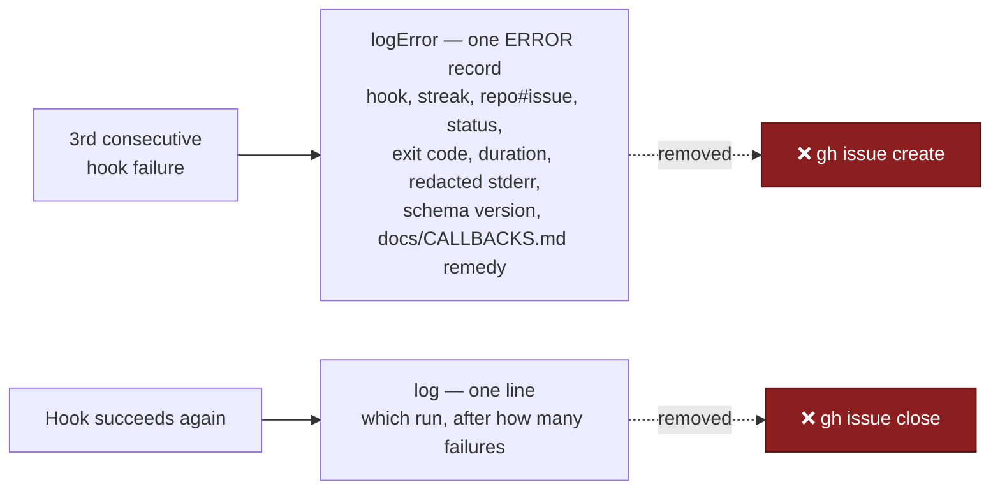

## Summary

The in-container callback-failure streak no longer writes to GitHub. The third
consecutive failing issue now writes **one** multi-line `ERROR` record to this
host's own worker log, and the success that ends a recorded streak writes one
line. `escalateCallbackFailure`, `resolveCallbackFailure`, the issue title and
body builders, `workerCheckoutDir`, the `escalate` / `resolve` seams and every
`host_escalation.ts` import are gone, so nothing in the module can reach `gh`.
The count in `$WORK_DIR/callback-failure-streaks.json` is unchanged and still
survives the run boundary. Closes #2111.

## Evidence

Backend/CLI change with no web surface to screenshot. The evidence is the test
suite: `cd worker/deno && deno task test tests/callback_failure_streak_test.ts`
→ **11 passed, 0 failed**. `deno lint` (2622 files), `deno fmt --check` (2634
files) and `deno task check` are clean, and `markdownlint-cli2` reports 0
issues in 138 files.

`./quality.sh` reports `deno tests FAILED` on **two pre-existing, environmental
failures** unrelated to this change — `agent_provider_test.ts` and
`config_test.ts`, both "per-run provider override" cases (Issue #2062), which
fail with `The running container image did not install the "deepseek"
coding-agent provider. Installed: claude.` Verified pre-existing: the same two
cases fail on a clean worktree of
`origin/milestone/2088-host-escalations-must-not-file-public-github`
(138 passed, 2 failed, identical names). Every other gate check passed:
markdownlint, semgrep, mermaid, the chokepoint checks, `deno lint`, `deno
check`, `deno fmt`.

## Reproduction

- **symptom** — a hook broken on one host filed a public
  `Post-run <event> callback failing on <host>` issue in the worker's own
  repository from inside the container, and closed it again on recovery: two
  GitHub writes for a fault that belongs to one host's hook deployment
- **status** — `verified` — `#2111 - a whole streak and its recovery spawn no
  process, so nothing can reach gh` was observed **failing** against the
  unfixed code (the stubbed `Deno.Command` threw when `escalateCallbackFailure`
  shelled out to `gh`) and passes after the change
- **regression test** —
  `worker/deno/tests/callback_failure_streak_test.ts::#2111 - a whole streak and its recovery spawn no process, so nothing can reach gh`

## Acceptance Criteria

<!-- vibe-spec-review inputs="diff+issue-body" -->

- **met** — `recordCallbackOutcomes` has no `escalate` / `resolve` seams and
  `callback_failure_streak.ts` imports nothing from `host_escalation.ts` —
  evidence: `worker/deno/lib/callback_failure_streak.ts:39-44` (imports) and
  `:98-111` (deps are read/write/log/logError only) — reviewer: met
- **met** — the third consecutive failure produces exactly one error-log record
  containing hook path, streak, status, exit code, redacted stderr and the
  schema version — evidence:
  `worker/deno/tests/callback_failure_streak_test.ts::#2111 - the threshold crossing writes one error record carrying every fact`
  and `::#2111 - the stderr in the record is redacted` — reviewer: met
- **met** — recovery produces one info-log line and resets the streak; nothing
  is spawned or sent — evidence:
  `worker/deno/tests/callback_failure_streak_test.ts::#2111 - recovery after a recorded streak logs exactly one line and resets the count`
  and `::#2111 - a whole streak and its recovery spawn no process, so nothing can reach gh`
  — reviewer: met
- **met** — `docs/CALLBACKS.md` no longer says the worker files or closes a
  `Post-run <event> callback failing on <host>` issue; `check-markdownlint`
  passes — evidence: `docs/CALLBACKS.md:148-176` and the updated cross-link at
  `:311-315`; `markdownlint-cli2` → 0 issues in 138 files — reviewer: met
- **partial** — `cd worker/deno && deno test && deno lint && deno fmt --check &&
  deno check` pass — evidence: lint, fmt, check and every callback/host-escalation
  suite are green; the two failures in the full suite are the pre-existing
  `deepseek` provider cases documented under Evidence — reviewer: partial —
  reason: the reviewer could not finish the full suite inside its own budget, so
  it did not verify end-to-end; the run here finished it and the only two
  failures reproduce unchanged on the base branch
- **unrequested** — the sub-threshold "clearing its failure streak" info line
  was dropped, so only a streak that reached the threshold logs on recovery —
  reviewer: unrequested — reason: it is what makes "recovery logs exactly one
  line" true, and the issue's bullet enumerates the recovery line as the only
  output after a threshold streak
- **unrequested** — the stale migration sentence in `docs/RELEASE-NOTES.md:46-50`
  now describes the local record rather than an issue the worker files and
  closes — reviewer: unrequested — reason: that paragraph is operator-facing
  instruction, not history, and this change made it false ("A Code Change Owes a
  Docs Change"); the 1.6.0 change table at `:29` is left as the historical record
  of what that release shipped

## Standards Review

<!-- vibe-standards-review inputs="diff+CODING-STANDARDS.md" -->

- **violation** — the "no seam" test asserted the module's shape rather than its
  behaviour, and half of it asserted the keys of an object literal it had just
  declared — evidence:
  `worker/deno/tests/callback_failure_streak_test.ts` (the original
  `#2111 - the module exposes no seam that could reach GitHub` case) — reason:
  fixed here — the self-referential half is gone, and the property is now proved
  behaviourally by stubbing `Deno.Command` to throw across a whole streak and
  its recovery; the remaining export enumeration is a one-assertion API-surface
  check the issue asked for explicitly
- **violation** — `docs/RELEASE-NOTES.md:47` still instructed operators that a
  host whose hooks refuse the schema version "carries one open `Post-run …`
  issue per hook; the worker closes each one" — evidence:
  `docs/RELEASE-NOTES.md:46-50` — reason: fixed here; the sentence now describes
  the local `ERROR` record and names Issue #2111 for the change
- **violation** — the JSDoc promised "Never throws" while the only remaining
  `try`/`catch` guards `readStreaks` — evidence:
  `worker/deno/lib/callback_failure_streak.ts:189` (before) — reason: fixed here
  by stating the boundary that is actually held: a fault in the count file never
  alters the run's own outcome
- **violation** — `closeResolvedIssue` in `host_escalation.ts` lost its only
  production caller and is now referenced solely by its own test — evidence:
  `worker/deno/lib/host_escalation.ts:295` — reason: stands; `host_escalation.ts`
  is the subject of sibling issues in milestone #2088 and removing it here would
  be scope creep into their diffs
- **violation** — `CALLBACK_FAILURE_ESCALATION_THRESHOLD` keeps "ESCALATION" in
  its name after the prose moved from "escalated" to "recorded" — evidence:
  `worker/deno/lib/callback_failure_streak.ts:54` — reason: stands; the issue
  does not ask for a rename and the constant is referenced across the tests, so
  renaming is scope the issue did not open
- **clean** — Australian English throughout; `redactSecrets` still wraps the
  stderr that reaches the record, with a dedicated test proving a `ghp_…` token
  is masked; the failure goes to `logError` (never a silent pass); the callback
  schema contract and every exported hook field are untouched, so no version
  bump is owed; the tests spawn nothing, sleep nowhere and assert no wall-clock
  thresholds; no hidden or credential-shaped path is staged

## Test Plan

`worker/deno/tests/callback_failure_streak_test.ts` — rewritten, 11 tests:

- the threshold crossing writes one error record carrying every fact
- the stderr in the record is redacted
- a single success clears the streak, so the next fault is recorded afresh
- recovery after a recorded streak logs exactly one line and resets the count
- a timed-out and an un-spawnable hook extend the same streak as a non-zero exit
- streaks are per event: a failing `always` does not record a healthy `success`
  hook
- each event's recovery retires its own record
- no callbacks configured means nothing is read, written or recorded
- the streak survives the run boundary the condition survives
- a whole streak and its recovery spawn no process, so nothing can reach `gh`
  (the regression test)
- the module's only callable export is the recorder itself

**Tests removed, and why.** The behaviour they covered no longer exists: the
four `#2039` cases (the closure of a filed report, its failure path, and the
issue title/body builders), `#1092 - an escalation that cannot be delivered is
reported loud` (there is no delivery left to fail), and
`workerCheckoutDir - honours VIBE_BASE_DIR` (the function is deleted). Every
property that survives the change — one record per streak, per-event streaks,
the run-boundary count, the reset on success — is still covered above.
