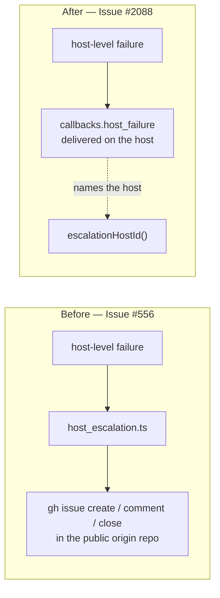

# Retire the GitHub issue channel from host_escalation.ts

## Summary

`host_escalation.ts` used to be the channel a HOST-level failure reached a human
through: a deduplicated issue in the worker's own repository, filed, commented
on while the condition persisted, and closed when it recovered. Issues #2108,
#2110 and #2111 moved all three host-level conditions onto
`callbacks.host_failure`, which is delivered **on the host**, so nothing called
the issue channel any more.

This change deletes that channel and rewrites the module as the host-identity
helper it has become. Removed: `fileOrCommentIssue`, `closeResolvedIssue`,
`listOpenIssuesTitled`, `resolveOriginRepo`, `resolveEscalationGhEnv`,
`HostEscalation`, `FileOrCommentDeps`, `EscalationDelivery`,
`EscalationClosure`, and the four imports they alone needed (`gh_spawn`,
`alert_dedup_authors`, `credential_preflight`, `git_timeout`). Kept:
`parseOriginRepo`, which `release_check.ts` uses, and `escalationHostId`, which
names the `host` field of every host-failure payload.

The docs that described the retired channel move with it — the
`host_escalation.ts` row in the `SECURITY.md` §5c marker-driven-actions table,
its mirror row in the verification suite's header table, and the
`outcome_record_gate.ts` header, which described the hostname as an issue title
and dedup key rather than as the payload field it now is.

Closes #2112.

## Evidence

Backend-only change — no web interface to screenshot. The evidence is the type
checker and the test suites: removing an export that something still imported
would fail `deno check`, and the full quality gate passed after the change.

What moved:



`host_escalation.ts` keeps only the two pure helpers on the dotted edge:
`escalationHostId` for the payload's `host` field, and `parseOriginRepo` for the
release check.

Gate output after the final edit:

```text
  markdownlint                   PASSED
  semgrep                        PASSED
  deno tests                     PASSED
  deno lint                      PASSED
  deno type check                PASSED
  deno fmt                       PASSED

Result: PASSED (with skipped checks)
```

(`config integration` is the only skip — it needs live credentials and skips on
every run in this environment.)

## Acceptance Criteria

<!-- vibe-spec-review inputs="diff+issue-body" -->

- **met** — `grep -rn "fileOrCommentIssue\|closeResolvedIssue\|resolveOriginRepo\|resolveEscalationGhEnv" worker/deno SECURITY.md` returns nothing — evidence: the grep exits 1 with no output; the reviewer widened it to the other five removed symbols (`listOpenIssuesTitled`, `HostEscalation`, `FileOrCommentDeps`, `EscalationDelivery`, `EscalationClosure`) and it is still empty — reviewer: met
- **met** — `release_check.ts` still compiles against `parseOriginRepo`; `outcome_record_gate.ts` tests still pass — evidence: `worker/deno/lib/release_check.ts:32` still imports it and `deno check` reports `Checked 2629 files` clean; `worker/deno/tests/outcome_record_gate_test.ts` runs 7/7 including `every launcher and supervisor records its outcome with a readable hostname (Issue #709)` — reviewer: met
- **met** — `deno test && deno lint && deno fmt --check && deno check` pass, and `check-markdownlint` passes for `SECURITY.md` — evidence: the full `./quality.sh` gate run above, in which `deno tests` (102 + parallel/serial suites), `deno lint`, `deno type check`, `deno fmt` and `markdownlint` all report PASSED — reviewer: met — reason: the reviewer was asked not to spend six minutes on the full suite and verified lint/fmt/check plus the three affected suites (35/35) and markdownlint on `SECURITY.md`; the full gate was run here and passed
- **unrequested** — `worker/deno/tests/untrusted_marker_action_verification_test.ts` — the `commentsGh` jq fake was rewritten: `select(.body | test(...))` changed from a dynamically built `RegExp` to a literal substring match, with new `isFieldBearing` / `readJqPath` helpers using `Object.hasOwn` — reviewer: unrequested — reason: the removal of §6b left the file's remaining `new RegExp(<caller string>)` as a semgrep ReDoS finding that failed the gate, so clearing it was the cost of landing this change; every caller's pattern is a literal marker prefix, so containment is what jq's `test` means here and all seven surviving sections still pass
- **unrequested** — `worker/deno/lib/idle_task_snapshot.ts:48` — doc cross-reference retargeted from `host_escalation.ts` to `escalate_as_work.ts` — reviewer: unrequested — reason: it pointed at `host_escalation.ts` as an example of the author-verification control, which this change removes from that module; leaving it would be a dangling reference
- **unrequested** — `worker/deno/lib/checkout_update.ts:113` — the re-export comment said "the channel itself now lives in host_escalation.ts" — reviewer: unrequested — reason: the channel no longer lives there, so the sentence became false with this change
- **unrequested** — `worker/deno/tests/outcome_record_gate_test.ts:6-7` and `worker/deno/lib/outcome_record_gate.ts:101-106` — the test header and the emitted `fault` string were reworded off "issue title / deduplication key" — reviewer: unrequested — reason: the issue scoped the library header; the same stale phrasing appears in the fault string that header documents and in the test's own header, and the gate's logic is untouched (7/7 still pass)

## Standards Review

<!-- vibe-standards-review inputs="diff+CODING-STANDARDS.md" -->

- **violation** — the rewritten module header opened "Core files nothing in the origin repository", using `Core` as a bare subject noun that appears nowhere else in the tree — evidence: `worker/deno/lib/host_escalation.ts:11` — reason: fixed here in commit `c0bfbf03`, which reworded it to "The core worker files nothing in the origin repository"
- **violation** — no `docs/archive/pr-summaries/pr-summary-2112.md`, which the standards require with Summary / Evidence / Test Plan — evidence: absent at review time — reason: fixed here — this file is that summary
- **violation** — ten deleted tests with no explicit documentation of the removal, which TDD rule 3 requires — evidence: `worker/deno/tests/host_escalation_test.ts` (eight cases) and `worker/deno/tests/untrusted_marker_action_verification_test.ts` (two cases) — reason: fixed here — each removal is named and justified in the Test Plan below
- **clean** — Australian English on every added line; no hidden or credential-shaped path staged; both commits carry the `(Issue #2112)` reference and a `Vibe-Coder-Run-Id` trailer; every surviving test imports the module and calls the real function rather than grepping source; no wall-clock sleeps or spawned scripts, so both touched suites stay parallel-safe; the removed exports survive nowhere outside historical `docs/archive/` records; `ALERT_DEDUP_TITLE_JSON_FIELDS`, `AlertDedupRow`, `AlertDedupAuthorOptions` and the three `credential_preflight` constants all retain other consumers, so no orphaned dependency or stale manifest is left behind; nothing left swallows an error

## Test Plan

No new tests: this change removes a capability rather than adding one, so the
covering work is deleting the tests that pinned the deleted code and proving
nothing else depended on it.

**Tests removed** — documented here per TDD rule 3. All ten exercised functions
that no longer exist, so each would fail to compile if kept:

- `worker/deno/tests/host_escalation_test.ts` — the four `resolveEscalationGhEnv`
  cases (established `GH_CONFIG_DIR` left alone, scratch copy found, legacy
  runtime copy fallback, no staged copy) and the four `closeResolvedIssue` cases
  from Issue #2039 (closes the fleet's report, leaves an outsider's title alone,
  no-op when nothing is open, throws on a refused close).
- `worker/deno/tests/untrusted_marker_action_verification_test.ts` — §6b's two
  `fileOrCommentIssue` author-verification cases (a planted title is created
  fresh; a fleet-authored title is still commented on). These pinned the
  `SECURITY.md` §5c row that this change also removes, so the assertion and the
  control it guarded retire together.

**Tests kept and passing**, which is what shows the remaining surface is intact:

- `worker/deno/tests/host_escalation_test.ts` — `parseOriginRepo` (SSH and
  HTTPS origins, non-GitHub rejection) and `escalationHostId` (explicit
  `VIBE_HOST_ID`, fallback to the machine name). 3/3.
- `worker/deno/tests/outcome_record_gate_test.ts` — all 7, including the real
  call-site sweep over `run.sh`, `run.ps1`, `loop.sh` and `loop.ps1`, confirming
  the header/fault rewording left the gate's logic alone.
- `worker/deno/tests/untrusted_marker_action_verification_test.ts` — the seven
  surviving sections, confirming the `commentsGh` fake still models jq's
  projection for every other caller.

Targeted run: `deno task test tests/host_escalation_test.ts
tests/untrusted_marker_action_verification_test.ts
tests/outcome_record_gate_test.ts` → `ok | 35 passed | 0 failed`.

Full gate: `./quality.sh` → `Result: PASSED (with skipped checks)`.
