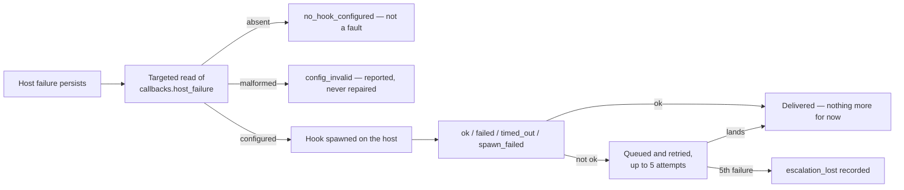

## Summary

Documents the `callbacks.host_failure` contract on every operator surface and
records the removed public-issue default as a contract change. Closes #2113.

- **`docs/CALLBACKS.md`** — the section is now
  `Host-level failures — callbacks.host_failure` and carries the payload
  document, the full `VIBECODER_*` table, the launcher's crossing / +1 h /
  daily cadence beside the checkout update's one-per-streak cadence, the
  ≤ 5-attempt retry and `escalation_lost`, `no_hook_configured` /
  `config_invalid`, and an extended Mermaid flow. Every anchor reference to
  the old heading follows the rename, and the conformance-fixture section says
  the hook is not exercised there.
- **`README.md`** — a host-level failure goes to the deployment's
  `callbacks.host_failure` hook, or to the host log and the self-heal events
  when none is configured; it is never filed as a public issue.
- **`docs/RELEASE-NOTES.md`** — a new `Unreleased` contract-change entry with
  the breaking default, the migration (configure the hook) and the rollback
  (pin the previous release).
- **Straggler sweep** — `docs/TROUBLESHOOTING.md`,
  `docs/workflows/resilience-and-concurrency.md` and `docs/DEPLOYMENT.md` no
  longer describe the old GitHub channel;
  `docs/PRIVATE-EXTENSIONS.md` loses an unrelated phrase that was the only
  remaining false positive of the acceptance grep.

`docs/CONFIGURATION.md` already carried the key, "All six entries" and the
host-path note (landed by #2107), so it needed no change.

## Evidence

Backend/docs-only — there is no web interface to screenshot. The gates are the
evidence:

```text
markdownlint: PASSED (139 file(s) checked)
mermaid: PASSED (739 file(s), 855 block(s) checked)
./quality.sh → Result: PASSED (with skipped checks)
```

The acceptance grep now matches only archive and history entries:

```console
$ grep -rn "own repository\|launcher failing on\|checkout update failing on\|Post-run .* callback failing" \
    docs README.md SECURITY.md | grep -v "^docs/archive/" | grep -v "^docs/RELEASE-NOTES.md"
$ echo $?
1
```

The documented flow, as it now reads in `docs/CALLBACKS.md`:



## Acceptance Criteria

<!-- vibe-spec-review inputs="diff+issue-body" -->

- **met** — `docs/CALLBACKS.md` states `host_failure` is a host path and the
  other keys are container paths, and documents every `VIBECODER_*` variable
  and document field #2107 exports — evidence: `docs/CALLBACKS.md:38-40`,
  `:78-117`, `:119-180` (13 variables and 16 document fields, checked row by
  row against `worker/deno/lib/host_failure_hook.ts`), `:256-263` —
  reviewer: met — reason: the reviewer also read the launcher's
  "five attempts, then `escalation_lost`" bullet as terminal where the source
  falls back to the re-notify schedule, and read the no-hook short-circuit as
  unconditional where it is gated on `reason === "no_channel"`; both bullets
  were corrected after the review (`docs/CALLBACKS.md:197-210`).
- **met** — `docs/CONFIGURATION.md` and `README.md` describe the hook and the
  no-hook default; `docs/RELEASE-NOTES.md` carries the contract-change entry —
  evidence: `README.md:309-315`, `docs/RELEASE-NOTES.md:17-66`,
  `docs/CONFIGURATION.md:2835-2845` (already present on the base) —
  reviewer: met
- **met** — the grep matches only archive / history entries — evidence: the
  console block above; the only non-archive match left is the 1.6.0 history
  row in `docs/RELEASE-NOTES.md` — reviewer: met
- **met** — `check-markdownlint` and `check-mermaid` pass — evidence: the gate
  output above, re-run after the post-review corrections — reviewer: met
- **unrequested** — `docs/PRIVATE-EXTENSIONS.md:423` "that deployment's own
  repository" → "a repository that deployment owns" — reviewer: unrequested —
  reason: unrelated to the hook, but it was the last false positive of the
  acceptance grep, and a review check with a permanent false positive stops
  being a check.
- **unrequested** — `docs/TROUBLESHOOTING.md:126-134` and
  `docs/workflows/resilience-and-concurrency.md:88` replace the past-tense
  description of the old GitHub channel with a pointer to the release notes —
  reviewer: unrequested — reason: the issue asked for stragglers describing
  the old channel to be fixed; rewriting the history rather than deleting it
  keeps the "why" without leaving the old channel described in a live doc.

## Standards Review

<!-- vibe-standards-review inputs="diff+CODING-STANDARDS.md" -->

- **violation** — `docs/DEPLOYMENT.md:861` still titled "Escalation through
  GitHub" and still said a pre-claim launcher failure is reported through the
  crash-notification channel — evidence: `docs/DEPLOYMENT.md:861` — reason:
  fixed here; the bullet now names the hook, the no-hook default and the crash
  channel's remaining scope (a crash *during* an issue).
- **violation** — hand-wrap broken by the anchor rename —
  evidence: `docs/CALLBACKS.md:39`, `:177` — reason: both paragraphs rewrapped
  in this diff.
- **violation** — the new `VIBECODER_*` table was not pipe-aligned like every
  other table in the file — evidence: `docs/CALLBACKS.md:159` — reason:
  regenerated with aligned cells.
- **violation** — the Mermaid flow sent every retry to `escalation_lost`, with
  no edge for a retry that lands — evidence: `docs/CALLBACKS.md:100-101` —
  reason: fixed; the flow now has an `ok` edge, a "lands" edge and a
  "5th failure" edge.
- **violation** — a contract-change release-notes entry with no release-floor
  move — evidence: `.release-floor` (unchanged, `1.6.0`) — reason: stands. The
  floor-move rule in `CODING-STANDARDS.md:596-603` governs a **callback schema
  version bump**, and `schemaVersion` is unchanged at 2 here. The entry is
  `Unreleased` by the same precedent as the existing one in this file ("Not yet
  tagged. Recorded here so the version that carries it can be named when it is
  cut"), and minting a release from a docs sub-issue inside an open milestone
  is not this change's call.
- **violation** — two `## Unreleased` sections now straddle the released 1.6.0
  entry — evidence: `docs/RELEASE-NOTES.md:17` and `:110` — reason: stands.
  The page states newest-first ordering, so a new entry belongs at the top; the
  second `Unreleased` below a released section is pre-existing, and rewriting
  1.6.0's trailing sentence is outside this issue.
- **clean** — Australian English throughout the added lines; every documented
  field, variable name, phase and cadence verified against
  `worker/deno/lib/host_failure_hook.ts`,
  `worker/deno/lib/container_restart_backoff.ts` and
  `worker/deno/lib/checkout_update.ts`; every anchor the diff writes resolves
  to a real heading and no live doc still points at `#the-host-failure-hook`;
  Mermaid used for the sequence of events; no hidden paths staged; commit
  carries the issue reference and the run-id trailer.

## Test Plan

Docs-only — no code changed, so no test was added (the issue's own Failure
Detection section says the same). What was run:

- `deno run -A worker/deno/mod.ts check-markdownlint` — PASSED (139 files)
- `deno run -A worker/deno/mod.ts check-mermaid` — PASSED (739 files, 855
  blocks)
- `deno test -A tests/callback_schema_compat_test.ts
  tests/callback_failure_streak_test.ts
  tests/config_precedence_release_docs_test.ts tests/host_failure_hook_test.ts`
  — 39 passed, 0 failed (the suites that read these docs and the hook contract)
- `./quality.sh` — `Result: PASSED (with skipped checks)`
