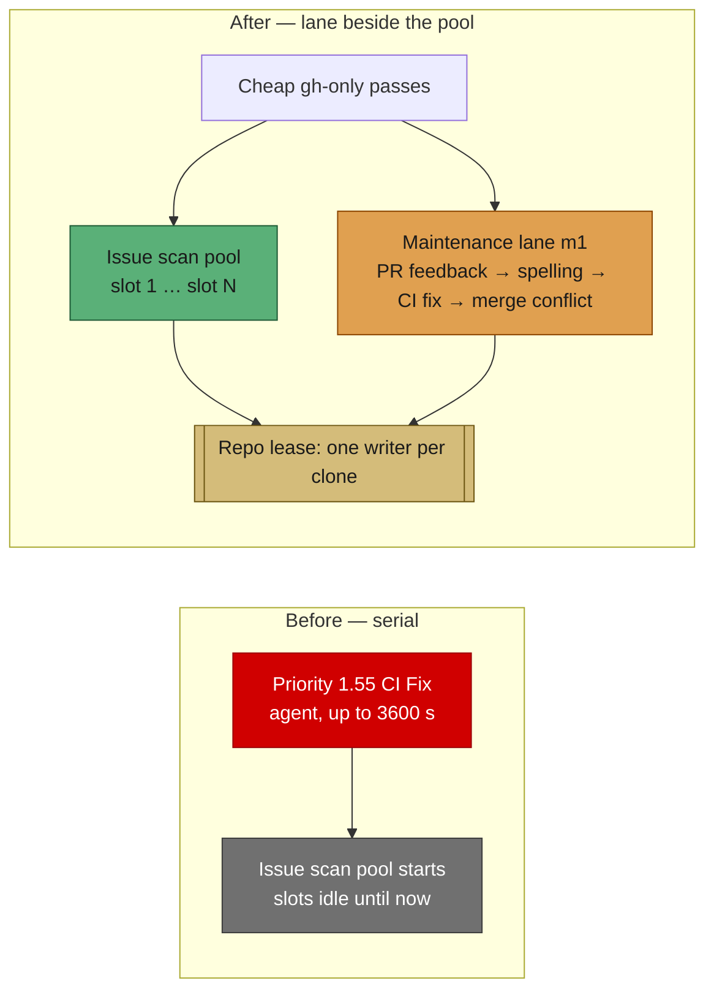

# Maintenance lane: agent-backed PR passes run beside the issue pool

## Summary

The Priority-1.x maintenance ladder ran **serially ahead of** the Priority-2
issue-scan pool, and several of its steps launch a full Claude agent. A CI fix
with a 30–60 minute budget therefore held both issue slots idle before the pool
had started — 16 minutes into the hour in the reported run, with nothing
claimed.

The four agent-backed passes that work an open PR in a repo clone — PR feedback
(1), spelling (1.5), CI fix (1.55) and merge-conflict resolution (1.61) — are
now deferred out of the serial ladder and run in a **maintenance lane**
alongside the pool. The cheap `gh`-only passes stay serial, so the pool's first
scan still sees freshly-updated branch and merge state. Closes #213.

What makes the concurrency safe is a **repository lease**. Every flow checks out
into the single per-repo clone `${WORK_DIR}/<repo>`, and `setupRepo` opens with
`reset --hard` + `clean -fd`, so two writers in one tree destroy each other's
work. Each maintenance pass leases its repository from the pool's own
`InFlightRepoRegistry` before touching the clone: a repository a slot holds is
refused (the pass defers to the next cycle), and a repository the lane holds is
in the pool's exclusion set. A lane hold is marked `maintenance` because its
number is a **PR**, not a claimed issue — the heartbeat sweep, the shutdown
drain's claim release and the idle-slot sibling count all skip it.

Two supporting fixes fell out of the same work:

- **`ci_fix_timeout` reconciled (docs 1800 vs logged 3600).** The run-loop
  dispatch path handed the reactive processors `config.claudeTimeout`, so a host
  with `claude_timeout: 3600` ran a CI fix on twice the documented budget; the
  single-shot CLI path always used the dedicated key. `reactivePhaseTimeout()`
  now resolves the budget for both, falling back to the phase's own operational
  default rather than to the issue-work one. The remaining half of the
  discrepancy is config-level and intentional (Issue #1824): an unset
  `ci_fix_timeout` inherits an **explicitly configured** `claude_timeout` for
  back-compat. That inheritance was undocumented — it now is, in
  `docs/CONFIGURATION.md` and `docs/workflows/ci-fix.md`.
- **`gh`-call attribution is async-scoped.** The process-wide
  `enterPriority`/`exitPriority` stack was exact only while priorities ran one
  after another; with the lane running beside the pool it would cross-credit.
  `withPriorityContext()` binds the priority to the async chain instead, with
  an explicit stack entry still winning so nested `enterPriority` keeps
  innermost-wins.

A shutdown bounds the lane exactly as it bounds the pool's drain: no new pass
starts once SIGTERM lands, and a pass still running after
`slot_drain_grace_seconds` is abandoned — logged loudly, its agent terminated —
instead of holding the process exit open for the rest of the hour.

## Evidence

Backend/CLI change with no web interface, so there is no screenshot to capture;
the evidence is the test suite below.



Test run (`deno test`, the three new files):

```
running 5 tests from ./tests/maintenance_lane_test.ts        ... ok
running 3 tests from ./tests/reactive_phase_timeout_test.ts  ... ok
running 7 tests from ./tests/run_core_maintenance_lane_test.ts ... ok
ok | 15 passed | 0 failed
```

The shutdown-bound test is a genuine regression test: against the lane without
the bound it fails with `still-waiting` — the cycle sat on the hung maintenance
agent after SIGTERM.

`./quality.sh` passes every gate except `deno tests`, which reports **10
pre-existing failures unrelated to this change**
(`setup_workdir_reminder_test.ts`, `fleet_health_test.ts`,
`host_workdir_guard_test.ts`, `optional_feature_env_test.ts`). Verified by
running those four files on a clean `origin/main` worktree: the same 10 fail
there. Everything else is green — 15267 passed.

## Test Plan

New — `worker/deno/tests/run_core_maintenance_lane_test.ts`:

- the dispatch table marks exactly the four repo-clone agent passes lane-eligible
  and leaves planning serial;
- a slow CI fix no longer delays the pool — issue work runs while the CI-fix
  agent is still going (the acceptance criterion);
- a lane pass and an issue slot never work one clone at once;
- a pass whose repository a slot already holds defers instead of colliding;
- at `max_concurrent_issues: 1` every pass stays serial (unchanged behaviour);
- with no in-flight registry wired the lane is disabled **and reported** rather
  than silently racing two writers;
- a shutdown grace elapsing mid-pass abandons the lane and terminates its agent
  rather than holding the exit.

New — `worker/deno/tests/maintenance_lane_test.ts`: lease granted outside the
lane, granted for a free repo, refused for a slot-held repo, idempotent release,
and a maintenance hold not counting as an issue claim.

New — `worker/deno/tests/reactive_phase_timeout_test.ts`: each phase uses its
own configured key, a CI fix never inherits the issue-work hour from the
dispatch path, and a missing budget degrades to the phase default rather than to
`claude_timeout`.

Existing suites re-run unchanged: `run_core_*`, `gh_call_metrics_test.ts`,
`in_flight_repos_test.ts` (224 passed), plus the docs-consistency gates
(`priority_ladder_docs_test.ts`, `timeout_docs_consistency_test.ts`,
`markdown_anchors_test.ts`, mermaid and markdownlint).
