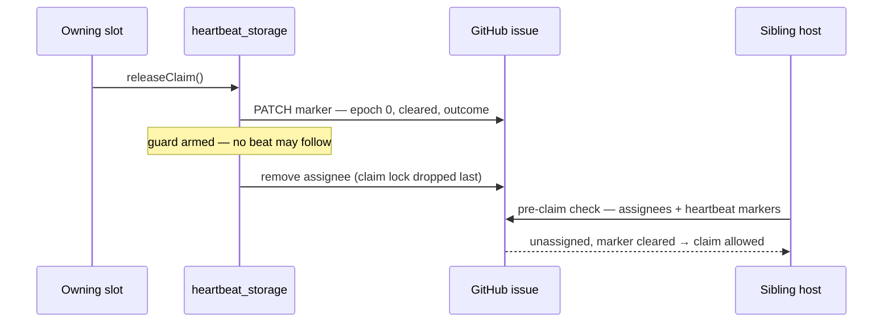

# Claim lock dropped mid-run — no issue may be unassigned with a live heartbeat

## Summary

The assignee is the claim lock every host checks, so VibeCoder#185 —
unassigned at 06:31Z with no release comment while its heartbeat kept beating
to 06:40Z — was claimable by any host for nine minutes, the same duplicate-work
pattern as #178/#184 and #187/#188 but *during* the sibling's run. Three
invariants now close it. Closes #214.

1. **Claim availability** — `claimIssue`
   (`worker/deno/lib/claim_issue.ts`) treats an unassigned issue whose
   fleet-authored heartbeat beat within `LIVE_HEARTBEAT_WINDOW_SECONDS` as
   unavailable, refusing with reason `heartbeat_active` and logging
   `heartbeat_active_without_assignee` at WARNING. The window is 2× the
   **marker refresh** interval (600 s), not 2× the in-process heartbeat timer:
   a beat only reaches GitHub every `DEFAULT_MARKER_REFRESH_SECONDS`, so that
   is the only beat rate another host can observe. It stays well inside the
   1800 s stale-assignment timeout, so a genuinely dead run is still recovered.
   A released marker (epoch 0 + `cleared:`) never blocks a claim, and neither
   does a marker forged by a non-fleet author.
2. **Live-slot holds** — new `worker/deno/lib/live_slot_holds.ts` exposes the
   pool's `InFlightRepoRegistry` holds to the recovery and cleanup passes,
   wired once in `run_core_production_deps.ts`. `recoverStuckIssue`,
   `detectAssignedWithoutHeartbeat`, `recoverStaleGithubAssignments` (both via
   `emitDecision`) and the Priority 1.68 closed-PR pass now leave an issue a
   live slot owns completely alone — the serial passes predate the pool and
   decided from GitHub state plus a local heartbeat file alone. The skip is
   logged and recorded as the new `skipped:live_slot` recovery decision.
3. **Release order + write-after-release guard** — `releaseClaim()` stops the
   heartbeat and posts the outcome **before** dropping the assignee (it used to
   unassign first), and `recordHeartbeat()` refuses a beat for an
   already-released claim, loudly: a WARNING line, a fault event, and an
   `{ ok: false }` result rather than a silent no-op. The guard is keyed by
   work directory + issue and lifted by the next claim (`startHeartbeat`, or
   the claim path's `seedMarkerState`), so a legitimate re-claim beats normally.

## Evidence

Backend/CLI change — no web interface to screenshot. Verified by the tests
below plus `./quality.sh`.

Before this change the last two steps were reversed, so the sibling's
pre-claim check saw "unassigned" while the marker was still beating.

`./quality.sh` result: every check passes except `deno tests`, which reports
**10 pre-existing failures unrelated to this change** —
`tests/setup_workdir_reminder_test.ts` (7), `tests/fleet_health_test.ts` (1),
`tests/host_workdir_guard_test.ts` (1), `tests/optional_feature_env_test.ts`
(1). All ten were confirmed failing on the unmodified tree
(`git stash` → same failures), and they concern host work-dir layout this
container does not have. The 14 838 other tests pass, including the 15 new
ones.

## Test Plan

New file `worker/deno/tests/claim_lock_integrity_214_test.ts` (15 tests), each
calling the real function:

- `findLiveHeartbeatMarker` — a beat inside the window is live; one older than
  the window is not; a cleared marker is not; the most recent beat wins.
- `claimIssue` — refuses an unassigned issue with a beating heartbeat
  (`heartbeat_active`, no `--add-assignee` attempted); claims when the only
  marker is a released one; claims when the live marker was forged by a
  non-fleet author.
- `recoverStuckIssue` — makes no GitHub call at all for an issue a live slot
  owns, and still recovers one no slot owns (regression guard both ways).
- `detectAssignedWithoutHeartbeat` — no mutation, recovered count 0, and the
  emitted decision is `skipped:live_slot`.
- `detectAssignedWithClosedPr` — no unassign, comment or close for a held
  issue.
- `releaseClaim` — the marker PATCH precedes the unassign and the unassign is
  last; the heartbeat file is gone.
- `recordHeartbeat` — refused after release with "already released", leaving no
  heartbeat file; and a new `startHeartbeat` lifts the guard so the next claim
  beats normally.

Existing suites re-run green: `claim_issue_test.ts`, `release_claim_test.ts`,
`claim_release_test.ts`, `heartbeat_test.ts`, `heartbeat_release_collapse_test.ts`,
`stuck_recovery_recover_issue_test.ts`, `stuck_recovery_telemetry_test.ts`.

Documentation: `docs/INTERNALS.md` gains a **Claim-lock integrity** entry with
the three invariants and the sequence diagram above, plus a module-table row
for `live_slot_holds.ts`.
