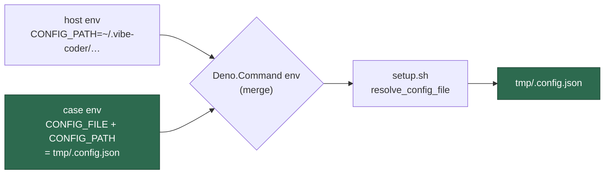

## Summary

Four `setup_*` suites handed `setup.sh` a temporary `.config.json` through
`CONFIG_FILE` alone. `Deno.Command`'s `env` **merges** into the parent
environment unless `clearEnv` is set, so each child also inherited whatever
`CONFIG_PATH` the host exported — and a worker host exports
`~/.vibe-coder/run-config/.config.json`. `resolve_config_file` then refused the
mismatched pair, correctly, and 40 cases failed for a reason they never stated.
The guard is right; the tests were reading ambient environment.

Each child environment now states the whole pair through one shared helper,
`worker/deno/tests/support/setup_config_env.ts`, which pins both spellings to
the case's own temporary file. No `Deno.env.set` — that is process-wide and
parallel-unsafe. `setup.sh` itself is untouched.

The new suite spawns the real `setup.sh`, so the integration-test classifier
claims it; it is registered in `INTEGRATION_TEST_FILES` beside the four suites
it guards.

Closes #2144.

## Evidence

Backend/CLI change with no web interface, so the evidence is test output. The
four suites, run on this worker host (which exports `CONFIG_PATH`):

```text
before: FAILED | 11 passed | 40 failed     (origin/main, CONFIG_PATH exported)
after:  ok     | 54 passed |  0 failed     (with CONFIG_PATH exported)
after:  ok     | 54 passed |  0 failed     (env -u CONFIG_PATH)
```

The 40 is the exact count the issue reported. The two `after` runs are the
point: the result no longer depends on what the host exports.

Full gate after the final edit: `./quality.sh` → every check PASSED except
`deno tests`, whose only failure is
`agent_provider_test.ts::agent provider - the per-run provider override beats
the configured file value (Issue #2062)` — the same host-dependence class in an
untouched file, already tracked as open issue #2141 and failing identically on
`origin/main`. It is a separate root cause and out of scope here.



## Reproduction

- **symptom** — on a host exporting `CONFIG_PATH`, 40 cases across
  `setup_credential_provisioning_test.ts` (25),
  `setup_provider_credential_flow_test.ts` (10), `setup_lockfile_test.ts` (3)
  and `setup_workdir_reminder_test.ts` (2) failed with
  `ERROR: CONFIG_FILE and CONFIG_PATH are both set and name different files`
- **status** — `verified` — the four suites were run at `origin/main` with
  `CONFIG_PATH` exported and observed red (`40 failed`), and green after the fix
  (`54 passed`); the new regression suite was likewise observed failing before
  the `set -euo pipefail` harness matched the real one and passing after
- **regression test** —
  `worker/deno/tests/setup_config_env_test.ts::setup.sh - a case that states the whole pair resolves its own config file`
  (paired with
  `::setup.sh - stating only CONFIG_FILE trips the guard on a host that exports CONFIG_PATH`,
  which pins the old half-stated shape as the failure it was)

## Test Plan

Added:

- `worker/deno/tests/setup_config_env_test.ts` — three cases. One drives
  `setup.sh` under an ambient `CONFIG_PATH` with only `CONFIG_FILE` stated and
  asserts the guard refuses it (exit 1, both paths named); one states the pair
  via the helper and asserts `setup.sh` resolves the case's own file (exit 0);
  one asserts the helper returns both spellings. The ambient value is modelled
  by `clearEnv` plus an explicit `env NAME=value …` layer, which is exactly the
  merge `Deno.Command` performs — so the case is deterministic on any host.
- `worker/deno/tests/support/setup_config_env.ts` — the shared helper.

Modified (child environment only, no assertions changed, none removed):

- `worker/deno/tests/setup_credential_provisioning_test.ts` (2 sites)
- `worker/deno/tests/setup_provider_credential_flow_test.ts` (1 site)
- `worker/deno/tests/setup_lockfile_test.ts` (1 site)
- `worker/deno/tests/setup_workdir_reminder_test.ts` (3 sites)
- `worker/deno/lib/integration_test_manifest.ts` — registers the new suite

The other `setup_*` suites were checked and already state the pair or use
`clearEnv: true`, which is why they were not in the failing set.
