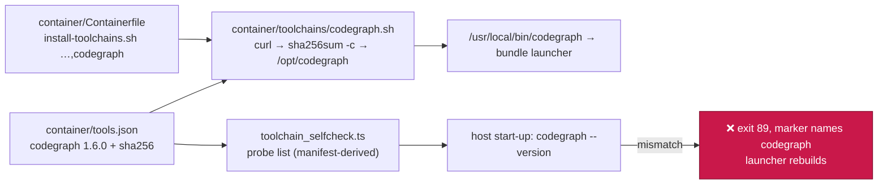

# Pin and install CodeGraph 1.6.0 as a container toolchain fragment

## Summary

CodeGraph 1.6.0 is now installed into the container image from the pinned,
SHA-256-verified GitHub-release tarball as a `toolchains` fragment, so the
image's manifest-derived start-up self-check probes `codegraph --version` with
no further code. Closes #2153.

The release is **not** a bare binary, so the issue's documented fallback
applies: each tarball extracts a `codegraph-linux-<asset arch>/` bundle
carrying `bin/codegraph` (a POSIX shell launcher), its own `node` runtime and
`lib/`. The fragment installs that whole bundle under `/opt/codegraph` and
symlinks `/usr/local/bin/codegraph` at the launcher, which resolves symlinks
itself to find its bundle directory. The layout is recorded in the fragment
header, the manifest `notes` and `docs/CONTAINER.md`.



## Evidence

Backend/container change — no web interface to screenshot. What was run
instead:

- **The real artefacts.** Both pins are the release's own `SHA256SUMS` entries
  for `codegraph-linux-x64.tar.gz` and `codegraph-linux-arm64.tar.gz`, copied,
  never computed from a download.
- **The fragment end to end**, in a private mount namespace with `/opt` and
  `/usr/local/bin` bound to scratch directories (so nothing touched the host):

  ```text
  [codegraph] Installing 1.6.0 for arm64
  /tmp/tmp.XXXX/codegraph.tar.gz: OK
  [codegraph] Installed codegraph 1.6.0
  lrwxrwxrwx root root /usr/local/bin/codegraph -> /opt/codegraph/bin/codegraph
  bin  lib  node
  --- probe as the self-check runs it ---
  1.6.0
  ```

- **The failure paths**, standalone with `TOOLCHAIN_MANIFEST=container/tools.json`:
  a deliberately wrong checksum exits 1 with
  `sha256sum: WARNING: 1 computed checksum did NOT match` and installs nothing;
  a manifest missing the pin exits 4 at the `jq -er` lookup; a missing manifest
  exits 1 naming the path.
- **`shellcheck container/toolchains/codegraph.sh`** — clean.
- **`./quality.sh`** — PASSED (config integration SKIPPED, as it is on this
  host); `deno task check`, `deno lint` and `deno task test` all pass.
- The image build itself could not be run here: neither `podman` nor `docker`
  is available in this container, which is why the fragment was exercised
  directly against the pinned artefact instead. `container-build.yml` runs the
  build and the in-image probe on the pull request.

## Acceptance Criteria

<!-- vibe-spec-review inputs="diff+issue-body" -->

- **met** — `worker/deno/tests/container_manifest_test.ts` passes with the new entry (manifest/Containerfile agreement, fragment shape, image-hash inputs) — evidence: `container/tools.json` codegraph entry, `container/Containerfile:200`, `worker/deno/lib/container_image_hash.ts:97`; suite green — reviewer: met
- **met** — the fragment passes `shellcheck`; run standalone against a deliberately wrong checksum it exits non-zero; where the run can build the image, the build installs the binary and `codegraph --version` prints a string containing `1.6.0` — evidence: `shellcheck` clean, tampered-checksum run exits 1, and `worker/deno/tests/install_toolchains_test.ts::container/toolchains/codegraph.sh - a tampered download aborts before extracting` — reviewer: met — reason: the reviewer could not build the image either and verified upstream instead (digests byte-identical to `SHA256SUMS`, the arm64 bundle run through a symlink printing `1.6.0`)
- **met** — the existing toolchain self-check tests still pass; the manifest-derived probe list now includes `codegraph` — evidence: `worker/deno/tests/toolchain_selfcheck_test.ts::every probe of the committed manifest passes against what the image really prints` and `worker/deno/tests/launcher_toolchain_selfcheck_test.ts`; `worker/deno/lib/toolchain_selfcheck.ts` untouched — reviewer: met
- **met** — `docs/CONTAINER.md` row present; `deno task check`, `deno lint`, `deno task test` pass — evidence: `docs/CONTAINER.md:91`, and the reviewer's own run of the full suite (22387 passed, 0 failed) — reviewer: met
- **unrequested** — `docs/audits/dependency-inventory.md` gains a codegraph row — reviewer: unrequested — reason: generated by `supply-chain-gate --write-inventory`; the gate fails `inventory-stale` without it
- **unrequested** — `worker/deno/tests/toolchain_selfcheck_test.ts` gains the `REAL_IMAGE_OUTPUT.codegraph` fixture — reviewer: unrequested — reason: the self-check test throws for any pinned toolchain with no fixture, so criterion 3 cannot pass without it
- **unrequested** — `worker/deno/tests/install_toolchains_test.ts` gains three codegraph guard tests — reviewer: unrequested — reason: the standards reviewer found every fragment since #1595 carries fail-loud tests and this one had none; they cover the missing pin, the unsupported architecture and the tampered download
- **unrequested** — `docs/CONTAINER-IMAGE.md:51` and a `docs/CONTAINER.md` consequence bullet — reviewer: unrequested — reason: both quote the exact `install-toolchains.sh` id list or the toolchain rationale, so leaving them would ship documentation that contradicts the Containerfile
- **unrequested** — `worker/deno/lib/container_manifest.ts` doc comments on `repos` and `REQUIRED_REPO_TOOLCHAIN_COMMANDS` — reviewer: unrequested — reason: both state that a toolchain exists for a monitored gate, which this entry deliberately does not; the code's own docs owed the exception

## Standards Review

<!-- vibe-standards-review inputs="diff+CODING-STANDARDS.md" -->

- **violation** — the new fragment's guards had no tests, unlike every fragment added since #1595 — evidence: `container/toolchains/codegraph.sh:1` — reason: fixed here; `worker/deno/tests/install_toolchains_test.ts` now covers the missing pin, the unsupported architecture and the tampered download
- **violation** — the `repos` and `REQUIRED_REPO_TOOLCHAIN_COMMANDS` doc comments still read as if every toolchain backs a monitored gate — evidence: `worker/deno/lib/container_manifest.ts:142` — reason: fixed here; both now record the codegraph exception
- **violation** — the Containerfile's codegraph comment was separated from the toolchain rationale block and joined to the PowerShell `ENV` paragraph — evidence: `container/Containerfile:186` — reason: fixed here; the paragraph is now contiguous with the list it explains
- **violation** — `REAL_IMAGE_OUTPUT` documents itself as output captured inside the fleet image, and the codegraph fixture is not — evidence: `worker/deno/tests/toolchain_selfcheck_test.ts:297` — reason: it stands, and says so: no built image carries this toolchain yet, so the fixture was captured by running the very tarball the manifest checksums, on the architecture the image builds for. `container-build.yml` runs the probe in the real image on this PR
- **clean** — Australian English throughout; `set -euo pipefail`, `jq -er` pins, explicit layout assertion, `sha256sum -c` and a post-install `--version` assertion (fail-loud); pins stated only in `container/tools.json`; manifest conforms to `parseToolchain`; every registration surface updated (`CONTAINER_IMAGE_INPUTS`, Containerfile, both container docs, the generated inventory); no hidden paths staged; commits carry the issue number and the run-id trailer

## Test Plan

- `worker/deno/tests/install_toolchains_test.ts` — three new tests added:
  `container/toolchains/codegraph.sh - a missing pin aborts before downloading`,
  `… - an unsupported architecture aborts, naming it`,
  `… - a tampered download aborts before extracting`.
- `worker/deno/tests/toolchain_selfcheck_test.ts` — the `codegraph` fixture
  makes the manifest-derived probe list assert against what the binary really
  prints.
- Existing suites re-run unchanged: `container_manifest_test.ts`,
  `container_image_hash_test.ts`, `launcher_toolchain_selfcheck_test.ts`,
  and the full `deno task test` (22387 passed, 0 failed).
