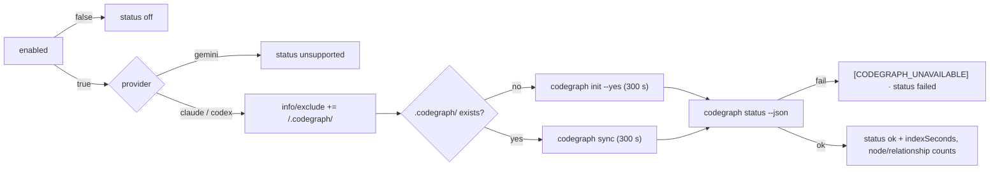

# CodeGraph runner module — index step, MCP entry, prompt line and `.codegraph/` persistence

## Summary

Adds `worker/deno/lib/codegraph_context.ts`, a separate sibling of the Graft
runner (#2099) rather than a shared abstraction over both tools. It keeps the
clone's `.codegraph/` index across runs, builds or refreshes it, reports its
figures, exposes the MCP server entry and the single prompt line, and counts
`codegraph_explore` queries from a tool tally. Nothing here wires it into a run.
`/.codegraph/` also joins `REQUIRED_GITIGNORE_PATTERNS`. Closes #2155.

## Evidence

Backend module with no web interface, so there is nothing to screenshot. What
was run instead:

- `./quality.sh` — **PASSED** (all 21 checks; `config integration` skipped as it
  is on every run here). That covers `deno task test`, `deno task check`,
  `deno lint`, `deno fmt`, semgrep, and both spawn-chokepoint scans — the last
  confirming `codegraph` and `git` are reached only through the injected
  `runWithTimeout` / `runGitCommand`.
- `deno test tests/codegraph_context_test.ts tests/gitignore_enforcer_test.ts` —
  26 + 26 cases, all green, none spawning `codegraph`.

**Verified against the pinned v1.6.0 source, not assumed.** The binary is not
installed on this host (`codegraph: command not found`), so every upstream claim
was read from `colbymchenry/codegraph` at tag `v1.6.0` — the version
`container/tools.json` pins (#2153) — and recorded in the module docstring:

- **The counts come from `codegraph status --json`** (`nodeCount`, `edgeCount`),
  not from `init`/`sync` output as the issue's assumption guessed: both render
  progress through `@clack/prompts` and report only what _changed_, and
  `.codegraph/` holds a SQLite database rather than a stats file. This is the
  issue's "verify and record the source" path, so the counts are reported rather
  than left absent.
- **`init` is invoked with `--yes`.** Without it `init` prompts (the
  watch-fallback offer, and the ignored-child-repo offer on an empty graph), and
  an unattended run has nobody to answer.
- The `.codegraph/` layout in the docstring is read from `src/directory.ts`,
  `src/mcp/daemon-paths.ts` and the CLI at that tag — deliberately **not** from
  the project's `main`-branch README, which describes a later release (an
  earlier draft of this PR took `writer.pid` and `ui/trails/` from it; the Spec
  reviewer caught it and it is corrected).
- `serve --mcp`, the `codegraph_explore` tool name and `CODEGRAPH_NO_DAEMON=1`
  were each confirmed in the same tree.

**Two residuals named rather than fixed**, both consequences of the issue's own
rules:

- `init` vs `sync` is chosen by the _presence of the directory_, as specified. A
  `.codegraph/` that exists without `codegraph.db` — an `init` killed by the 300
  s limit before the database is created — therefore makes `sync` exit 1 on
  every later run, so that checkout stays `failed` until the directory is
  removed. Failing loud every run, never silently stale.
- CodeGraph honours the cross-tool `DO_NOT_TRACK=1` (the variable #2099 sets for
  Graft). This module does not set it, because #2155 pins the child environment
  to `CODEGRAPH_NO_DAEMON=1` for the index step and the MCP entry alike; its
  telemetry payload carries counts and a machine id, not repository content.
  Recorded in `docs/audits/security-sweep-2155-codegraph-context.md`.

## Acceptance Criteria

<!-- vibe-spec-review inputs="diff+issue-body" -->

- **met** — `off` and `unsupported` return without spawning — evidence:
  `worker/deno/tests/codegraph_context_test.ts::prepareCodegraphContext - the switch off returns off without spawning`
  and `::- a Gemini run is unsupported and spawns nothing`, both passing seams
  that throw if touched — reviewer: met
- **met** — `init` vs `sync` chosen by the presence of `.codegraph/`; both with
  `CODEGRAPH_NO_DAEMON=1` and the 300 s limit — evidence:
  `worker/deno/tests/codegraph_context_test.ts::- an absent index is built with init`,
  `::- a present index is refreshed with sync`,
  `::- the index step carries CODEGRAPH_NO_DAEMON and the 300 s limit` —
  reviewer: met — reason: the reviewer noted `init --yes` as an added argument;
  it is listed as `unrequested` below and justified there
- **met** — every failure mode → `failed`, exactly one `[CODEGRAPH_UNAVAILABLE]`
  warn line, no throw — evidence: six tests in
  `worker/deno/tests/codegraph_context_test.ts` (non-zero exit, timeout,
  rejecting seam, missing binary, unreadable counts, unparseable status), each
  asserting `markerLines(...).length === 1` — reviewer: met
- **met** — `/.codegraph/` is in `REQUIRED_GITIGNORE_PATTERNS` and appended once
  to `info/exclude` across repeated calls — evidence:
  `worker/deno/lib/gitignore_enforcer.ts:86` plus
  `worker/deno/tests/gitignore_enforcer_test.ts::ensureGitignorePatterns - the CodeGraph pattern is written once across runs (Issue #2155)`
  and
  `worker/deno/tests/codegraph_context_test.ts::- appends the exclude pattern once across runs`
  — reviewer: met
- **met** — `countCodegraphQueries` returns the count, `0` when only other tools
  ran, `undefined` with no tally — evidence: six `countCodegraphQueries` tests
  in `worker/deno/tests/codegraph_context_test.ts` — reviewer: met
- **met** — `deno task check`, `deno lint`, `deno task test` and the
  spawn-chokepoint scan pass — evidence: `./quality.sh` PASSED after the final
  edit (the reviewer saw the full suite still running when it finished, and
  observed no failures) — reviewer: met
- **unrequested** — `codegraph status --json` is a third subprocess, with its
  own 30 s limit — reviewer: unrequested — reason: the issue's assumption was
  that the counts come from `init`/`sync` output or a stats file; neither exists
  at v1.6.0, and the issue asked for the source to be verified and recorded, so
  this is that verification rather than inventing figures
- **unrequested** — `codegraph init --yes` instead of a bare `init` — reviewer:
  unrequested — reason: `init` prompts without it, and no run here has anyone to
  answer a prompt
- **unrequested** — an unresolvable `info/exclude` is a sixth failure mode that
  skips the index — reviewer: unrequested — reason: the issue orders the exclude
  line _before_ the index step, so an index the next `git clean` would delete is
  300 s spent for nothing
- **unrequested** — `CODEGRAPH_LAYOUT_DIRS` and its clean test, the link-free
  exclude read/write, and the exported constants and seam types — reviewer:
  unrequested — reason: the issue asks the docstring to _state_ the
  `EXECUTABLE_IGNORED_DIRS` invariant; pinning it in a test that runs the real
  cleans is what makes the statement checkable, and the link-free helpers are
  the house rule for an agent-writable clone (#1234)
- **unrequested** — `docs/audits/security-sweep-2155-codegraph-context.md` and
  its ledger slice — reviewer: unrequested — reason: not in the issue, but
  `check:manifests` fails on any new `lib/` module claimed by no sweep slice, so
  the change cannot land without it

## Standards Review

<!-- vibe-standards-review inputs="diff+CODING-STANDARDS.md" -->

- **violation** — the new module was claimed by no sweep slice, so
  `check:manifests` and `./quality.sh` were red — evidence:
  `docs/audits/lib-sweep-coverage.json` — reason: fixed here; the module is read
  in `docs/audits/security-sweep-2155-codegraph-context.md` under a
  `top-up-2155` slice, and both gates are green
- **violation** — the `.codegraph/` layout in the docstring was taken from the
  project's `main` README and named files that do not exist at the pinned v1.6.0
  — evidence: `worker/deno/lib/codegraph_context.ts:46` — reason: fixed here;
  the layout is now read from the v1.6.0 source and the docstring says which
  files it came from
- **violation** — `indexDirectoryPresent` caught every `lstat` error as "no
  index" — evidence: `worker/deno/lib/codegraph_context.ts:441` — reason: fixed
  here; only `NotFound` answers `false`, and any other error is a reported
  failure, because an unreadable path silently re-running `init` would leave a
  stale index reported as `ok`
- **violation** — the layout invariant was asserted by comparing two constants,
  exercising no code — evidence:
  `worker/deno/tests/codegraph_context_test.ts:544` — reason: fixed here; the
  test now runs the real `git clean -fd` and `ignoredExecutableCleanArgs()` over
  a temp checkout, with `node_modules/` as the control that is erased
- **violation** — the same `info/exclude` failure message was rebuilt four times
  — evidence: `worker/deno/lib/codegraph_context.ts:472` — reason: fixed here,
  collapsed into one `unresolved()` helper
- **violation** — the shared `CODEGRAPH_ENV` object was handed straight to the
  subprocess seam — evidence: `worker/deno/lib/codegraph_context.ts:398` —
  reason: fixed here; the child gets a copy, as `codegraphMcpServer()` already
  did
- **violation** — the docstring described a `.config.json` key
  (`codegraph_context.enabled`) that exists nowhere yet — evidence:
  `worker/deno/lib/codegraph_context.ts:5` — reason: fixed here; it now names
  the `enabled` argument and points at the wiring in #2145
- **violation** — the test file defines its own `withTempDir` rather than the
  hardened shared one — evidence:
  `worker/deno/tests/codegraph_context_test.ts:148` — reason: fixed here; it
  delegates to `tests/support/temp_tree.ts`, so a teardown error cannot replace
  the assertion failure (#1135)
- **violation** — `performance.now()` is read directly rather than through the
  repo's clock seam — evidence: `worker/deno/lib/codegraph_context.ts:296` —
  reason: stands; `indexSeconds` is a measurement of a real subprocess, the
  sibling Graft runner times its build the same way, and this module is
  deliberately its shape
- **violation** — 660 lines, above the `lib/` median, carrying four separable
  concerns — evidence: `worker/deno/lib/codegraph_context.ts:1` — reason:
  stands; the issue specifies one module mirroring `graft_context.ts` (654
  lines), and splitting it would depart from the shape #2145 asked for
- **clean** — Australian English throughout (the only American spellings are the
  upstream CLI's own JSON field names); fail-loud on every path, with unreadable
  counts a failure rather than a zero; no wall-clock sleep, polling, absolute
  timing threshold or spawned process in the tests; `Result<T>` and
  `@std/assert` per Deno conventions; commit safety — four non-hidden paths,
  run-id trailer present; the `.gitignore` change is a forbidden pattern, not a
  re-allow, so the five-entry hidden-path allowlist is untouched and
  `pre_commit_safety`, `gitignore_sync` and `hidden_allowlist_drift` stay green

## Test Plan

- Added `worker/deno/tests/codegraph_context_test.ts` (26 cases): the two
  no-spawn short circuits; `init` vs `sync` by directory presence; the child
  environment and both the default and an overridden limit; the happy-path
  figures; six failure modes each asserting exactly one marker line and no
  throw; the exclude line written once across two calls and appended without
  joining existing content; the index surviving the real `git clean -fd` and the
  scoped ignored clean while `node_modules/` is erased; the MCP entry's exact
  shape and its isolation from a mutated copy; the prompt line's single line;
  and `countCodegraphQueries` over both key forms, a look-alike name, zero and
  no tally.
- Extended `worker/deno/tests/gitignore_enforcer_test.ts`: `/.codegraph/` in the
  canonical pattern set, the index ignored by real `git check-ignore` without
  over-matching `worker/deno/lib/codegraph_context.ts`, and the pattern written
  once across repeated runs.
