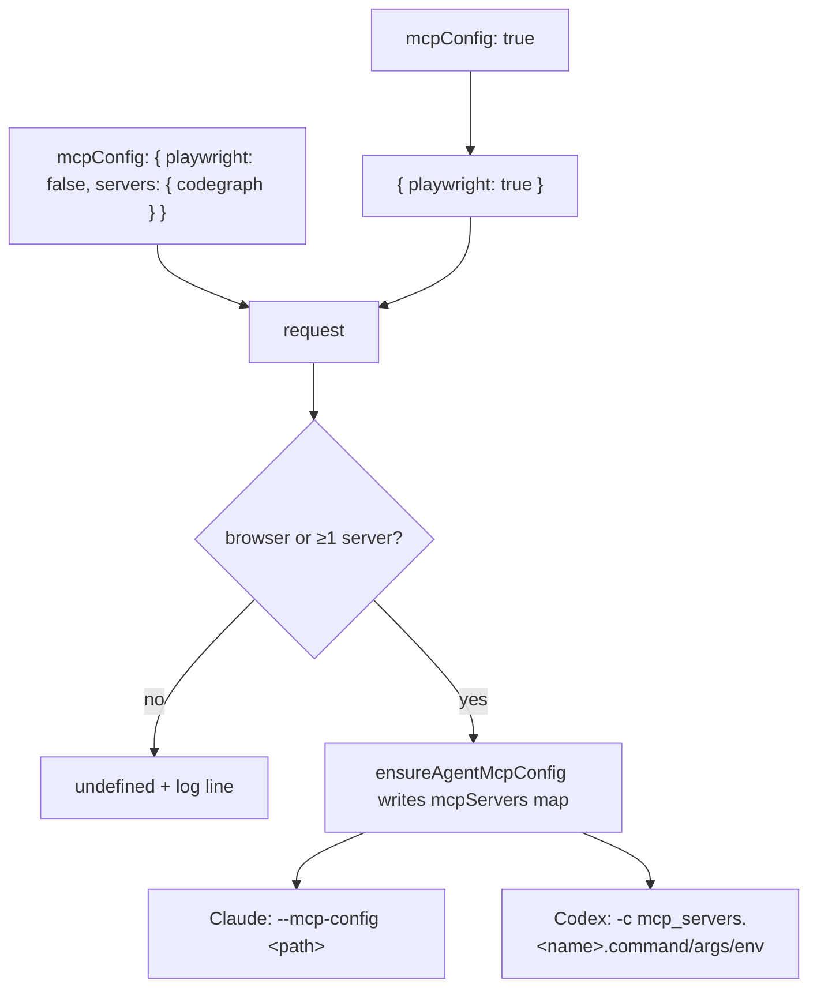

# Let the per-run MCP config carry additional servers, independent of the Playwright grant

## Summary

`ensureAgentMcpConfig` now takes `playwright?: boolean` (default `true`) and
`servers?: Record<string, { command; args?; env? }>`, and writes the Playwright
`generateMcpConfig` output with those servers merged into its `mcpServers` map.
`RunClaudeOptions.mcpConfig` accepts the same request as an object beside the
existing `true`. A run can therefore be handed CodeGraph with `playwright:
false` and get a config carrying only that entry — the browser grant of Issue
#192 is not widened by an extra server. Requesting no server at all returns
`undefined` with a log line, exactly as a write failure already did.
`mcpConfigPath` continues into `invocationRequest` unchanged, so Claude still
gets `--mcp-config` and Codex still gets `-c mcp_servers.*` overrides from the
same file with no provider change.

Closes #2156.

## Evidence

Backend/CLI change — no web interface to screenshot. Verified by the test suites
below (133 passed, 0 failed across the four affected files) and by the full
`./quality.sh` gate.

How a request becomes provider arguments:

## Acceptance Criteria

<!-- vibe-spec-review inputs="diff+issue-body" -->

- **met** — `mcpConfig: true` produces the same file content and provider arguments as before — evidence: `worker/deno/tests/agent_mcp_config_test.ts::agent mcp config - the Playwright-only request is byte-for-byte what the unflagged call writes (Issue #2156)`; `agent_mcp_config.ts` writes `generate(...)` verbatim when no extras are requested and `agent_provider.ts` is untouched — reviewer: met
- **met** — A codegraph-only config is written and passed when no screenshot is required, and the Playwright entry is absent from it — evidence: `worker/deno/tests/agent_mcp_config_test.ts::agent mcp config - a server requested without Playwright is written alone, with no browser entry (Issue #2156)` and `worker/deno/tests/claude_runner_test.ts::runClaudeWithTimeout - the object form of mcpConfig writes a browserless config and passes it as --mcp-config; false and absent pass nothing (Issue #2156)` — reviewer: partial — reason: the reviewer noted no production caller requests it yet (`execute_claude_phase.ts:1245` and `phases/execute_phase.ts:697` still pass `mcpConfig: screenshotRequired`); that wiring is the separate #2145 sub-issue and this issue's scope names only the two libs and the tests
- **met** — Codex receives `mcp_servers.codegraph.command/args/env` overrides from the same file — evidence: `worker/deno/tests/agent_provider_codex_test.ts::buildCodexMcpConfigArgs - a non-Playwright server yields command, args and env overrides (Issue #2156)`; the file→override leg is the pre-existing `agent_provider.ts` path covered at `agent_provider_codex_test.ts:246` — reviewer: met
- **met** — `deno task check`, `deno lint`, `deno task test` pass — evidence: full `./quality.sh` run after the final edit, all stages PASSED — reviewer: partial — reason: the reviewer confirmed check and lint clean but stopped waiting on the full suite before it finished; the gate was run here to completion and passed
- **unrequested** — the merge refuses an additional server whose name collides with a generated one, and refuses a generated shape carrying no `mcpServers` entry — evidence: `worker/deno/lib/agent_mcp_config.ts::mergeServers`, tests `…an additional server may not replace the generated browser entry` and `…a browser-only request is checked for the browser entry too` — reviewer: unrequested — reason: both reviewers independently flagged the plain additive merge as a silent capability loss (a caller-supplied `playwright` entry would replace the hardened browser entry — its secrets denylist, pinned specifier and scratch output dir — while still returning a config path); fail-loud is required by `CODING-STANDARDS.md`
- **unrequested** — the failure log names what was actually requested (`MCP` rather than `Playwright MCP` for a browserless run) — evidence: `worker/deno/lib/agent_mcp_config.ts` catch block — reviewer: unrequested — reason: the old wording ("the agent runs without a browser this run") misreports a codegraph-only run; the `… config not written` prefix is preserved so the existing assertion still holds
- **unrequested** — `docs/CONTAINER.md` gains a bullet on the object form — evidence: `docs/CONTAINER.md:319` — reviewer: unrequested — reason: the issue asked only for a docstring note, but the browser-grant contract is documented there and `CODING-STANDARDS.md` ("A Code Change Owes a Docs Change") requires the surface be updated with the code

## Standards Review

<!-- vibe-standards-review inputs="diff+CODING-STANDARDS.md" -->

- **violation** — the additive merge let a caller-supplied `servers.playwright` silently replace the hardened browser entry (Never Fail Silently — Fail Loud) — evidence: `worker/deno/lib/agent_mcp_config.ts:239` — reason: fixed here — `mergeServers` refuses the collision, and the run logs it instead of returning a degraded config as success
- **violation** — the docs bullet claimed extra servers ride "without widening that grant" while `playwright` defaults to `true` (A Code Change Owes a Docs Change) — evidence: `docs/CONTAINER.md:319` — reason: fixed here — the bullet now states that an object leaving `playwright` unset asks for the browser as plainly as `mcpConfig: true` does
- **violation** — the empty-generated-map guard fired only when extras were present, leaving the invariant asymmetric (Never Fail Silently — Fail Loud) — evidence: `worker/deno/lib/agent_mcp_config.ts:238` — reason: fixed here — both branches are checked, with `…a browser-only request is checked for the browser entry too` covering the second
- **violation** — `...mcpRequest` was spread after `cwd`, so an untyped request could shadow the clone path or the injected logger (defence in depth) — evidence: `worker/deno/lib/claude_runner.ts:1049` — reason: fixed here — the request is spread first and this call's own fields win
- **violation** — the `mcpConfig` docstring said `true` is "exactly `{ playwright: true }`" while the code mapped `true` to `{}` (docs match code) — evidence: `worker/deno/lib/claude_runner.ts:1044` — reason: fixed here — `true` now maps literally to `{ playwright: true }`
- **clean** — the throw inside the best-effort `catch` is a deliberate carry-over, not a new swallow: the "logged, never thrown" contract predates this change (`agent_mcp_config.ts:21-23`) and every caller treats `undefined` as "no MCP this run"; the reason a fault must not be masked is served by the log line naming it
- **clean** — Australian English throughout the added prose and docstrings; tests call real functions and assert on real artefacts (written JSON, recorded stub argv, returned arg list) with no source-grepping; no wall-clock sleeps or absolute timing thresholds; only `docs/` and `worker/deno/{lib,tests}` staged, no hidden or key-shaped path; both commits carry `(Issue #2156)` and a `Vibe-Coder-Run-Id` trailer; `deno fmt`, `deno lint` and `deno check` clean on every changed file
- **clean** — `codegraphMcpServer()` was left declaring its own `{ command; args; env }` shape rather than being retyped to the new `AgentMcpServerSpec`: `env` is optional on the spec and required on the helper, so retyping would weaken the return type its callers rely on — out of scope for this issue

## Test Plan

Added to `worker/deno/tests/agent_mcp_config_test.ts`:

- the Playwright-only request is byte-for-byte what the unflagged call writes
- a server requested without Playwright is written alone, with no browser entry
- Playwright and an additional server are both written
- requesting no server at all writes nothing and says so
- a browser request the generator cannot satisfy fails loud rather than writing a browserless config
- an additional server may not replace the generated browser entry
- a browser-only request is checked for the browser entry too

Added to `worker/deno/tests/claude_runner_test.ts`:

- the object form of `mcpConfig` writes a browserless config and passes it as `--mcp-config`; `false` and absent pass nothing

Added to `worker/deno/tests/agent_provider_codex_test.ts`:

- `buildCodexMcpConfigArgs` yields `command`, `args` and `env` overrides for a non-Playwright server, one `-c` each

Modified `worker/deno/tests/execute_claude_phase_test.ts`: the Issue #192 case
widens its captured type from `boolean | undefined` to
`RunClaudeOptions["mcpConfig"]`; its assertions are unchanged.

Modified `worker/deno/tests/shared_tmp_state_dir_test.ts`: the world-writable
directory case stubbed `generate: () => "{}"`, a shape the new browser-entry
check now refuses before the directory is reached — which would mask the
refusal that test exists to prove. Its stub now returns a realistic
`{ mcpServers: { playwright: … } }`; no assertion was changed or removed.

Run: `deno test -A tests/agent_mcp_config_test.ts tests/claude_runner_test.ts
tests/agent_provider_codex_test.ts tests/execute_claude_phase_test.ts` — 133
passed, 0 failed. Full `./quality.sh` — PASSED.
