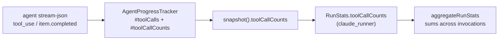

# Tally per-tool calls from the agent stream and carry them on RunStats

## Summary

`AgentProgressTracker` already parsed every Claude `tool_use` block and every
Codex tool item in the stream, but kept only a running total and the last tool
seen. This change keeps a per-name tally beside that total, exposes it as
`toolCallCounts` on `AgentActivitySnapshot`, and carries it onto `RunStats` from
the runner — so a caller asking "how many `codegraph_explore` calls did the
agent make?" reads data the worker already holds rather than re-parsing the
stream.

`aggregateRunStats` sums the tally across invocations. The field is **omitted**
when a run made no tool call at all, on both the runner and the aggregate path,
so absence never reads as a zeroed tally. The existing `toolCalls` total,
`lastToolCallAtMs` and the `[agent-progress]` line are unchanged.

Closes #2157.

## Evidence

Backend/telemetry change with no web interface to screenshot. Evidence is the
test suite and the full quality gate:

- `deno test tests/agent_progress_test.ts` — 21 passed, 0 failed
- `deno test tests/run_stats_test.ts` — 18 passed, 0 failed
- `./quality.sh` — **PASSED** (deno tests 12 847 passed / 0 failed, lint, type
  check, fmt, semgrep and every chokepoint check green; `config integration`
  skipped as usual on this host)

## Acceptance Criteria

<!-- vibe-spec-review inputs="diff+issue-body" -->

- **met** — Snapshot and `RunStats` carry per-tool counts for Claude and Codex
  streams; `toolCalls` and `lastToolCallAtMs` are unchanged — evidence:
  `worker/deno/lib/agent_progress.ts:68,123,130` and
  `worker/deno/tests/agent_progress_test.ts::agent_progress - tallies Claude tool_use blocks by name (Issue #2157)`,
  `::agent_progress - tallies Codex mcp_tool_call items by name (Issue #2157)` —
  reviewer: met
- **met** — `aggregateRunStats` sums counts across invocations — evidence:
  `worker/deno/tests/run_stats_test.ts::run_stats - aggregateRunStats sums per-tool call counts`
  — reviewer: met
- **met** — `deno task check`, `deno lint`, `deno task test` pass — evidence:
  full `./quality.sh` gate run after the final edit, and the reviewer's own
  `deno task test` run (12 847 passed, 0 failed) — reviewer: met
- **unrequested** — `AggregatedRunStats.toolCallCounts` on the aggregate type —
  reviewer: unrequested — reason: the issue names only `RunStats`, but the
  summed figure has to land somewhere for "aggregateRunStats sums it" to be
  observable; the reviewer judged it traceable rather than creep, so it stands
- **unrequested** — the extra
  `run_stats_test.ts::buildRunStats leaves toolCallCounts absent`
  characterisation test — reviewer: unrequested — reason: pins the seam that the
  tally is layered on by the runner, not parsed from the stream; one cheap
  assertion, kept

Deliberate deviation, recorded rather than silent: the issue's task list says
"spread `toolCallCounts` from `progress.snapshot()`", which would always set the
key (as `{}` for a toolless run), while its own required test says a stream with
no tool events leaves the field absent. The code follows the test — the spread
is conditional on a non-empty tally (`worker/deno/lib/claude_runner.ts:2061`).

## Standards Review

<!-- vibe-standards-review inputs="diff+CODING-STANDARDS.md" -->

- **violation** — the PR summary file required by "PR Summary and Evidence" was
  absent from the diff — evidence:
  `docs/archive/pr-summaries/pr-summary-2157.md` — reason: fixed here; this file
  is the missing artefact, added in the same PR
- **clean** — scope matches the issue's stated file list exactly (no rendering,
  no `countCodegraphQueries` leakage); DRY — both increment sites funnel through
  `#countToolCall` (`worker/deno/lib/agent_progress.ts:130`); fail-loud — the
  field is omitted, never zeroed, on both paths
  (`worker/deno/lib/claude_runner.ts:2061`, `worker/deno/lib/run_stats.ts:366`);
  additive-only contract, no field removed or repurposed; no docs owed (no
  `docs/` surface documents `RunStats` fields); Australian English throughout;
  tests call real code with no source-grep assertions, no sleeps and no absolute
  timing budgets; commit references the issue and carries the
  `Vibe-Coder-Run-Id` trailer; no hidden paths staged

Prototype-pollution check (reviewer): tool names are model-controlled, but both
tallies accumulate in a `Map` and only materialise via `Object.fromEntries`, so
a `__proto__` tool name cannot reach a prototype.

## Test Plan

Added to `worker/deno/tests/agent_progress_test.ts`:

- `agent_progress - tallies Claude tool_use blocks by name (Issue #2157)` —
  per-name tally including an `mcp__codegraph__codegraph_explore` block; asserts
  the total is unchanged and equals the sum of the tally
- `agent_progress - tallies Codex mcp_tool_call items by name (Issue #2157)` —
  `mcp_tool_call` keyed on `item.name`, `mcp_tool` falling back to
  `item.server`, `command_execution` still keyed as `Bash`
- `agent_progress - a Codex item seen started then completed is tallied once (Issue #2157)`
  — dedupe by item id applies to the tally, not just the total
- `agent_progress - non-tool lines leave the tally empty (Issue #2157)` — init
  lines, text blocks, reasoning items and unparseable lines count nothing
- `agent_progress - runClaudeWithTimeout carries the per-tool tally on runStats (Issue #2157)`
  — end-to-end through the runner against a stubbed agent
- `agent_progress - runClaudeWithTimeout leaves toolCallCounts absent for a stream with no tool events (Issue #2157)`

Added to `worker/deno/tests/run_stats_test.ts`:

- `run_stats - aggregateRunStats sums per-tool call counts`
- `run_stats - aggregateRunStats leaves toolCallCounts absent when no call reported any`
- `run_stats - buildRunStats leaves toolCallCounts absent (the tally is layered on by the runner)`

No existing test was removed or modified.
