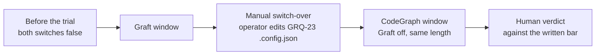

## Summary

Added `docs/REPO-CONTEXT-TRIAL.md`, the repo-context trial write-up page that
milestone #2060 commits to and #2145 extends: it records the protocol the Graft
and CodeGraph trials follow, written **before** either window runs. The page
covers the two candidates and their switches, why Graphify was dropped (Python
runtime, LLM cost to index docs/PDFs, weakest video result), the bar both
candidates are judged by, the sequential windows on GRQ-23 with the manual
switch-over, the exclusion rules, where every figure is read from, and a results
table per candidate left as a template to fill in when each window closes. The
video figures are recorded as motivation only, not evidence. Closes #2158.

The README documentation table links the page, and the `codegraph_context`
switch row in `docs/CONFIGURATION.md` carries a one-line pointer to it (there is
no `graft_context` row on this build to point from).

## Evidence

Docs-only change, so there is no web interface to screenshot. The evidence is
the gate and the drift test:

- `./quality.sh` — **PASSED** (`markdownlint PASSED`, `mermaid PASSED`,
  `deno tests PASSED`; the only `SKIPPED` entry is the pre-existing
  environmental `config integration` check).
- `worker/deno/tests/repo_context_trial_docs_test.ts` — 10 tests, all passing.
  The assertions are not keyword greps over prose: the statuses come from real
  `prepareCodegraphContext` calls, the index cap and failure marker from
  `CODEGRAPH_INDEX_TIMEOUT_MS` / `CODEGRAPH_UNAVAILABLE_MARKER`, and the switch
  key from `CODEGRAPH_CONTEXT_KEYS` via the live parser. Every prose assertion
  is scoped to the section that must carry the rule.
- **Mutation-checked.** Each of four mutations was applied to the page and the
  suite re-run: raising the judging threshold from 20 to 35 runs, deleting the
  "build/index time counts against it" bullet, deleting the "Both switches were
  on" exclusion, and deleting "No code schedules it" each turned the suite
  **red**; the restored page is green.

## Acceptance Criteria

<!-- vibe-spec-review inputs="diff+issue-body" -->

- **met** — The page exists, passes the `check-markdownlint` stage of
  `./quality.sh`, and covers candidates, bar, windows, switch-over, exclusions,
  figure sources and the Graphify reasons — evidence:
  `docs/REPO-CONTEXT-TRIAL.md` §1–§8; `markdownlint PASSED` in the gate run —
  reviewer: met
- **met** — The README documentation table links it — evidence: `README.md:471`,
  pinned by
  `worker/deno/tests/repo_context_trial_docs_test.ts::the trial page is linked from the README Documentation table`
  — reviewer: met
- **met** — `./quality.sh` passes — evidence: full gate run after the final
  edit, `Result: PASSED (with skipped checks)` — reviewer: met
- **unrequested** — a drift test suite for the page
  (`worker/deno/tests/repo_context_trial_docs_test.ts`) — reviewer: unrequested
  — reason: the issue asked only for the page, but a protocol page whose
  statuses, index cap and switch key are copied from code goes stale silently;
  the suite pins them to the live modules, matching the repo's existing
  `*_docs_test.ts` precedent.
- **unrequested** — a Mermaid flowchart of the window sequence
  (`docs/REPO-CONTEXT-TRIAL.md` §4) — reviewer: unrequested — reason: the
  coding standards ask for a diagram where it aids understanding, and the
  sequential-window/manual-switch-over rule is the page's most easily misread
  paragraph.
- **unrequested** — the rule that `failed` runs stay in a candidate's figures
  (`docs/REPO-CONTEXT-TRIAL.md` §5) — reviewer: unrequested — reason: the issue
  names two exclusions and says nothing about the third status; leaving it
  unstated is exactly the ambiguity this page exists to remove, so it is
  written down rather than left to the judge's discretion.

## Standards Review

<!-- vibe-standards-review inputs="diff+CODING-STANDARDS.md" -->

- **violation** — three assertions were satisfiable by text elsewhere on the
  page (the `20` threshold matched `#2060`; the index-time clause matched a
  results-table row; the both-on exclusion matched "both candidates") —
  evidence: `worker/deno/tests/repo_context_trial_docs_test.ts:84,99,143` in the
  reviewed commit — reason: fixed here; every prose assertion is now scoped to
  its own section and the four mutations above were verified to fail the suite.
- **violation** — §6 described the run-stats and callback surfaces in the
  present tense although neither has landed — evidence:
  `docs/REPO-CONTEXT-TRIAL.md:139` in the reviewed commit — reason: fixed here;
  §6 now says both surfaces are still being built, names the sub-issue that
  lands each, and states a window cannot open before its own two have landed.
- **violation** — the page contradicted itself on what the 10% is measured
  against (§3 "the other hosts" versus §5 "baseline runs") — evidence:
  `docs/REPO-CONTEXT-TRIAL.md:134-135` in the reviewed commit — reason: fixed
  here; §5 now states the comparison set is the other hosts' runs over the same
  window length, and an `off` GRQ-23 run falls outside the window.
- **violation** — a cross-reference pointed at §5 (Exclusions) for the recorded
  figures, which live in §7/§8 — evidence: `docs/REPO-CONTEXT-TRIAL.md:74` in
  the reviewed commit — reason: fixed here.
- **violation** — DRY: the 17-line markdown link resolver was copied verbatim
  from `readme_docs_reachability_test.ts` — evidence:
  `worker/deno/tests/repo_context_trial_docs_test.ts:29-54` in the reviewed
  commit — reason: fixed here; the README check is a one-line substring test and
  the resolver is gone.
- **violation** — the index cap (300 s) and `[CODEGRAPH_UNAVAILABLE]` were
  hand-copied prose with exported sources of truth — evidence:
  `docs/REPO-CONTEXT-TRIAL.md:34,37` — reason: fixed here; both are now pinned
  to `CODEGRAPH_INDEX_TIMEOUT_MS` and `CODEGRAPH_UNAVAILABLE_MARKER`.
- **violation** — the motivating figures had no citation — evidence:
  `docs/REPO-CONTEXT-TRIAL.md:62-74` in the reviewed commit — reason: fixed
  here with an inline link to the source comparison; no `docs/REFERENCES.md`
  row was added, because that page credits sources whose *ideas* are embedded
  in the prompts and docs, not one-off figures a trial was launched on.
- **violation** — the Australian-English attestation named words the file did
  not contain — evidence:
  `worker/deno/tests/repo_context_trial_docs_test.ts:16` in the reviewed commit
  — reason: fixed here.
- **violation** — the Graft column carried figures that cannot be checked in
  this tree (no `graft_context` module on this build) — evidence:
  `docs/REPO-CONTEXT-TRIAL.md:32-37` — reason: the figures are what milestone
  #2060 specifies, and the page now says so explicitly beneath the table rather
  than presenting them as this repo's own measurements.
- **clean** — Australian English throughout both new files; no hidden paths
  staged; commit carries `(Issue #2158)` and the `Vibe-Coder-Run-Id` trailer;
  `deno fmt --check`, `deno lint`, `deno check` and `deno task check:manifests`
  clean; `markdownlint-cli2` 0 issues across 142 files; the page's 300 s cap,
  `.codegraph/` persistence, `init`/`sync`, failure marker, four status names
  and `codegraph_context.enabled` all match
  `worker/deno/lib/codegraph_context.ts`; docs-only, so no production behaviour
  changed.

## Test Plan

- Added `worker/deno/tests/repo_context_trial_docs_test.ts` (10 tests):
  - the README Documentation table links the page;
  - the candidates section names Graft, CodeGraph and both host switches;
  - all three Graphify rejection reasons are recorded;
  - the bar section carries every clause (≥ 10%, no worse success rate,
    build/index time counts, 2 days or 20 runs whichever is later);
  - the windows section carries the host, the equal window length, the
    `.config.json` switch-over and "no code schedules it";
  - the exclusions section covers the statuses `prepareCodegraphContext` really
    returns (`off`, `unsupported`) plus the both-switches-on rule;
  - the index cap and failure marker match the live constants;
  - the switch key matches `CODEGRAPH_CONTEXT_KEYS` and the live parser;
  - the figure-sources section names both surfaces for both candidates;
  - each candidate has a results table and a verdict line to fill in.
- Re-ran `worker/deno/tests/readme_docs_reachability_test.ts` and
  `idle_task_count_docs_test.ts` — the new page does not orphan or double-count
  anything.
- `./quality.sh` — PASSED.
