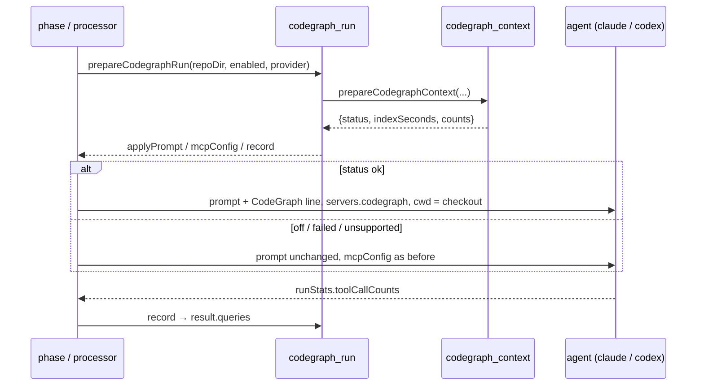

## Summary

On an enabled host the issue, planning and question runs now prepare the
CodeGraph index before invoking the agent, and hand it the `codegraph` MCP entry
and the single prompt line **together or not at all**. The result — status,
index seconds, node and relationship counts, and the `codegraph_explore` queries
the agent made — is carried on the phase state and on each processor's result
for the recording sub-issues (#2161, #2162). Closes #2159.

`worker/deno/lib/codegraph_run.ts` is the one place that turns a preparation
into those decisions, so the four call sites share an implementation and the
both-or-neither invariant is structural rather than repeated four times.

With the switch off (the default) nothing is spawned and every prompt and MCP
configuration is exactly what it was.

## Evidence

Backend/CLI change with no web interface, so no screenshot applies. The evidence
is the test suite and the full quality gate.

Full gate run after the final edit: `./quality.sh` → **PASSED** (21 checks;
`config integration` skipped for want of a `.config.json` on this host).

### Defect this PR found and fixed

The standalone issue phase (`lib/execute_claude_phase.ts`) passed **no `cwd`**
to `runClaudeWithRetry`. The runner writes MCP configuration only when
`mcpRequest && cwd`, so the request was silently dropped — the run would have
appended the CodeGraph prompt line and given the agent no server to call, the
exact "one of the pair without the other" failure this issue names. The same
gate had already made Issue #192's browser grant inert on that path. The phase
now names the checkout as `cwd` (which every git call it makes already assumed)
and the work volume as `workDir`, so the rate-limit signal stays where Issue
#4315 put it.
`execute_claude_phase_codegraph_2159_test.ts::the run names the
checkout, so the MCP request is honoured`
pins it.

### Known gap, filed

On the planning and question paths the agent's `cwd` is `config.workDir` — the
parent of every clone — while the index is built in `${config.workDir}/<repo>`.
`codegraphMcpServer()` carries no root of its own, so the server starts one
directory above the index it should read. Fixing it needs either a
`codegraph serve --mcp` root option confirmed against the real v1.6.0 CLI, or a
change to those processors' `cwd` — both beyond this issue. Filed as
**stSoftwareAU/VibeCoder#2200**, cross-referenced from the trial page's figure
section.

## Acceptance Criteria

<!-- vibe-spec-review inputs="diff+issue-body" -->

- **met** — Switch off: no `codegraph` subprocess in any of the paths; prompts
  and MCP config byte-identical to today — evidence:
  `worker/deno/tests/codegraph_run_test.ts::prepareCodegraphRun - a switched-off host changes nothing`,
  plus the "switch off" test in each of the four path suites — reviewer: met
- **met** — Switch on, status `ok`: MCP entry and prompt line both present; any
  other status: both absent — evidence:
  `worker/deno/tests/execute_claude_phase_codegraph_2159_test.ts::the run names the checkout, so the MCP request is honoured`
  and the "line and the server together" / "neither half" tests in all four
  suites — reviewer: partial — reason: the reviewer saw the diff before the
  `cwd` fix and correctly found the entry was dropped on the standalone path;
  that defect is fixed in this diff and pinned by the named test. Its second
  half — the server rooted above the index on planning/question — stands, and is
  #2200.
- **met** — Gemini-routed run: status `unsupported`, no index step, no entry, no
  line — evidence:
  `worker/deno/tests/codegraph_run_test.ts::a Gemini-routed run reports unsupported`;
  the `unsupported` short-circuit itself is `lib/codegraph_context.ts` (#2155) —
  reviewer: met — reason: the reviewer noted there is no path-level Gemini test;
  the resolved provider id reaching the preparer is what each path controls, and
  that is asserted.
- **partial** — The result with `queries` is present on the phase state /
  processor results in all paths — evidence:
  `ExecuteClaudePhaseResult.codegraphContext`, `PhaseState.codegraphContext`,
  `PlanningResult.codegraphContext`, `QuestionResult.codegraphContext`, asserted
  in all four suites — reviewer: partial — reason: planning's two sub-issue
  **recovery** pre-checks return before the index step, so those results carry
  no field at all. They close from sub-issues an earlier run created and
  normally invoke no agent; indexing every such run to record `off` would spend
  up to 300 s on a run that does nothing.
- **met** — `deno task check`, `deno lint`, `deno task test` pass — evidence:
  full `./quality.sh` run after the final edit — reviewer: met — reason: the
  reviewer ran the targeted files rather than the full task; the full gate was
  run here and passed.
- **unrequested** — a shared `lib/codegraph_run.ts` module rather than the
  wiring inlined at four call sites — reviewer: unrequested — reason: four
  copies of a both-or-neither invariant is four places to break it; one module
  makes the pair structural, and it is what lets the four suites inject one fake
  preparer.
- **unrequested** — `docs/REPO-CONTEXT-TRIAL.md` §1.2 and the
  `docs/CONFIGURATION.md` row rewording — reviewer: unrequested — reason: the
  config row said "turning it on changes nothing", which this PR makes false;
  the standards require a docs change with the code change.
- **unrequested** — `docs/audits/security-sweep-2159-codegraph-run.md` and the
  `lib-sweep-coverage.json` slice — reviewer: unrequested — reason: not
  optional. The repository's own completeness gate fails a new
  `worker/deno/lib/` module that no sweep slice claims.
- **unrequested** — the provider-drift warning in `CodegraphRun.record` —
  reviewer: unrequested — reason: the issue states the assumption that the
  resolved id matches the served one and says a difference "is reported in the
  log line, not corrected"; this is that report.
- **unrequested** — `PrepareCodegraphRunOptions.env` — reviewer: unrequested —
  reason: a test seam, added so the Gemini and provider cases do not depend on
  the host image's `VIBE_IMAGE_AGENT_PROVIDERS` stamp; production passes
  nothing.
- **unrequested** — splitting `runExecuteClaudePhase` into a thin wrapper plus
  `executeClaudePhaseBody` — reviewer: unrequested — reason: the body returns
  from two dozen places; attaching the outcome once is how "on the phase's
  return value" holds for all of them, including returns added later.
- **unrequested** — `cwd` / `workDir` on the standalone path's runner call —
  reviewer: unrequested — reason: without it the MCP entry never reaches the
  agent, so the criterion above cannot hold. See "Defect this PR found and
  fixed".

## Standards Review

<!-- vibe-standards-review inputs="diff+CODING-STANDARDS.md" -->

- **violation** — a `failed` run emitted no `CodeGraph context: status=…` line,
  contradicting this function's own docstring and the new trial-page claim —
  evidence: `worker/deno/lib/codegraph_run.ts:152` — reason: fixed here; the
  provider-resolution failure now falls through to the same single status line,
  pinned by
  `codegraph_run_test.ts::an unresolvable provider fails the index, not the run`
- **violation** — two unit tests read the host's `VIBE_IMAGE_AGENT_PROVIDERS`
  stamp instead of naming the environment, so they are green only on a
  Claude-stamped image — evidence:
  `worker/deno/tests/codegraph_run_test.ts:172`, `:194` — reason: fixed here;
  both now pass `env: () => undefined`, matching the Gemini case in the same
  file
- **violation** — DRY: the "undefined → omit the `mcpConfig` key" idiom was
  hand-written at three sites — evidence:
  `worker/deno/lib/planning_processor.ts:1500`, `:2060`,
  `worker/deno/lib/question_processor.ts:390` — reason: fixed here; moved onto
  `CodegraphRun.mcpConfigOption()`
- **violation** — `carrier` already means "carrier sub-issue" in
  `planning_processor.ts`; the new local reused the word for something unrelated
  — evidence: `worker/deno/lib/planning_processor.ts:1250` — reason: fixed here;
  renamed to `codegraphCarrier`
- **violation** — no `docs/archive/pr-summaries/pr-summary-2159.md` on the
  branch — evidence: `docs/archive/pr-summaries/` — reason: fixed here; this
  file
- **observation, fixed** — the `#1550` infrastructure retry re-enters the
  execute body, replacing `state.codegraphContext` and discarding the first
  attempt's query tally — evidence: `worker/deno/lib/phases/execute_phase.ts` —
  reason: fixed here; the earlier attempt's queries are carried forward
- **observation, accepted** — an enabled host can pay for an index on a run that
  later early-exits (the context-budget ceiling) — reason: `.codegraph/`
  persists between runs, so that work is not lost — the next run's step is an
  incremental `sync`
- **observation, accepted** — `ExecuteClaudePhaseDeps.prepareCodegraphContext`
  is optional while `ClaudeDeps.prepareCodegraphContext` is required — reason:
  optional matches `buildCiFailureContext` in the same interface and keeps every
  existing test double compiling; the real preparer never throws and reports
  `failed` when the binary is absent
- **clean** — Australian English throughout code, comments, tests and docs; all
  five new suites drive real entry points through injected seams with no
  source-grepping; no wall-clock or ratio assertions and no `Deno.env.set`;
  every new exported symbol carries a doc comment; every new field is optional
  and additive; no hidden or credential path staged; both commits carry
  `(Issue #2159)` and a `Vibe-Coder-Run-Id` trailer; `codegraph_run.ts` is one
  file with one job

## Test Plan

Added, all with an injected fake preparer so no suite spawns `codegraph`:

- `worker/deno/tests/codegraph_run_test.ts` — the shared module: off / `ok` /
  `failed` / `unsupported` decisions, the browser grant preserved but never
  widened, queries summed across invocations, "no tally" distinguished from
  "zero queries", provider drift reported, an unresolvable provider recorded as
  `failed` with both log lines.
- `worker/deno/tests/execute_claude_phase_codegraph_2159_test.ts` — the
  standalone issue path, including the `cwd` regression test above.
- `worker/deno/tests/execute_phase_codegraph_2159_test.ts` — the main-loop issue
  path, and the outcome landing on `PhaseState`.
- `worker/deno/tests/planning_processor_codegraph_2159_test.ts` — one index
  serving a two-turn round, with queries summed across both invocations.
- `worker/deno/tests/question_processor_codegraph_2159_test.ts` — the question
  path, asserting the `mcpConfig` key is **absent** (not `undefined`) when the
  index did not build.

Each path suite asserts: off → prompt and MCP configuration unchanged and no
spawn; `ok` → the line exactly once, outside the untrusted fence, with the
server entry present; `failed`/`unsupported` → neither half, the run proceeds,
the status is carried.

Existing suites re-run unchanged: `execute_claude_phase*`, `execute_phase*`,
`planning_processor`, `question_processor`, `issue_worker_wiring`.
