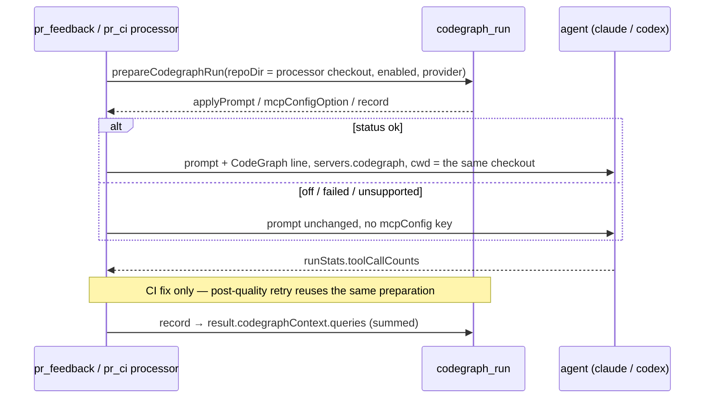

## Summary

On an enabled host the **PR-feedback** and **CI-fix** runs now prepare the
CodeGraph index before invoking the agent, and hand it the `codegraph` MCP entry
and the single prompt line **together or not at all**. That completes the five
wired run kinds the trial asked for — the issue, planning and question paths
landed in #2159; these are the two reactive PR paths. Closes #2160.

Both processors go through the shared `worker/deno/lib/codegraph_run.ts` module
rather than inlining the wiring, so the both-or-neither invariant stays
structural across six call sites instead of being restated at each one. The
outcome — status, index seconds, node and relationship counts, and the
`codegraph_explore` queries the agent made — is carried on each processor's
return value as `codegraphContext`, for the recording sub-issues.

The CI fix **prepares once**: the post-quality retry reuses the first
preparation rather than indexing the same checkout a second time, and both
invocations' `codegraph_explore` tallies are summed into the run's one figure.

With the switch off (the default) nothing is spawned, and every prompt and MCP
configuration is exactly what it was — the `mcpConfig` key is *absent*, not
`undefined`.

### Defect this PR found and fixed

`prepareCodegraphRun` took a required `repoDir`, but the CI processor's
`workDir` is optional. The runner writes MCP configuration only when
`mcpRequest && cwd` (`claude_runner.ts`), so a run that could not name its clone
would have appended the CodeGraph prompt line and given the agent no server to
call — the exact "one of the pair without the other" failure this trial exists
to avoid. `repoDir` is now optional and an unnamed checkout is recorded
`failed`.

The first fix guarded `repoDir === undefined` only, while the runner's gate
reads *falsiness*; an **empty** `workDir` was therefore still reported `ok` with
the line appended and no server behind it. Empty is now refused the same way as
absent, pinned by a regression test that fails against the old guard
(`codegraph_run_test.ts::prepareCodegraphRun - an empty checkout path fails the
index, not the run (Issue #2160)`).

## Evidence

Backend/CLI change with no web interface, so no screenshot applies. The evidence
is the test suite.



The three CodeGraph suites, run on the branch tip:

```
ok | 17 passed | 0 failed (219ms)
```

`deno task check` and `deno lint` are both green. `deno task test` is **red at
the branch tip** — see the fourth acceptance criterion below for what fails and
why it is not this branch's change.

## Acceptance Criteria

<!-- vibe-spec-review inputs="diff+issue-body" -->

- **met** — Switch off: neither processor attempts `codegraph`; prompts and MCP
  config byte-identical to today — evidence:
  `worker/deno/tests/pr_feedback_processor_codegraph_2160_test.ts::pr_feedback_processor - the switch off leaves the invocation untouched`
  and
  `worker/deno/tests/pr_ci_processor_codegraph_2160_test.ts::pr_ci_processor - the switch off leaves the invocation untouched`,
  which assert `Object.hasOwn(runOptions[0], "mcpConfig") === false` and no
  `CodeGraph index` text in the prompt — reviewer: met
- **met** — Switch on, `ok`: MCP entry and prompt line both present; other
  statuses: both absent — evidence:
  `worker/deno/tests/pr_ci_processor_codegraph_2160_test.ts::pr_ci_processor - an indexed run gets the line and the server together`
  (asserts `mcp.servers.codegraph.command === "codegraph"`, the prompt line
  exactly once, and `cwd === prepared.repoDir`), plus
  `::pr_ci_processor - a failed index adds neither half` and the mirrored
  `pr_feedback_processor - ...` tests for `failed`/`unsupported` — reviewer: met
- **met** — The result with `queries` is present on both processors' return
  values — evidence:
  `worker/deno/tests/pr_ci_processor_codegraph_2160_test.ts::pr_ci_processor - the post-quality retry reuses the index, it does not build a second`
  (one preparation, two invocations, `queries === 4` summed) and
  `worker/deno/tests/pr_feedback_processor_codegraph_2160_test.ts::pr_feedback_processor - an indexed run gets the line and the server together`
  (`queries === 3`), both read off `result.value.codegraphContext` — reviewer:
  met
- **partial** — `deno task check`, `deno lint`, `deno task test` pass —
  evidence: `worker/deno/tests/lib_sweep_coverage_test.ts:472` — reviewer:
  partial — reason: `check` and `lint` exit 0 and all 17 CodeGraph cases pass,
  but `deno task test` exits 1 (22643 passed, 1 failed) because
  `worker/deno/lib/markdown_table.ts` and `worker/deno/lib/plan_milestone_groups.ts`
  are claimed by no sweep slice — both added by merged main commit `04e42712`
  (#2163), not by this branch's three commits, yet the tip is red as it stands.
- **unrequested** — `worker/deno/lib/codegraph_run.ts` gains an optional
  `repoDir` plus the empty-string refusal and three new `codegraph_run_test.ts`
  cases — reviewer: unrequested — reason: the shared #2159 module is changed
  rather than only the two processors, but the CI-fix `workDir` is optional and
  the runner's `mcpRequest && cwd` gate reads falsiness, so it is in scope.
- **unrequested** — edits to `docs/REPO-CONTEXT-TRIAL.md`,
  `docs/CONFIGURATION.md` and `docs/audits/security-sweep-2159-codegraph-run.md`
  — reviewer: unrequested — reason: not named in the criteria, but each only
  restates the wired path count for #2160, and the standards require a docs
  change with the code change.

## Standards Review

<!-- vibe-standards-review inputs="diff+CODING-STANDARDS.md" -->

- **violation** — no `docs/archive/pr-summaries/pr-summary-2160.md` on the
  branch, so the regression-test linkage for the empty-`workDir` fix and the
  test classification were unrecorded — evidence:
  `docs/archive/pr-summaries/` — reason: fixed here; this file
- **violation** — a docs claim that is not true of the code it describes:
  `cf6d35af` widened the sweep note to "every wired suite asserts that the two
  match", but only four of the six wired suites assert `cwd === repoDir` —
  evidence: `docs/audits/security-sweep-2159-codegraph-run.md:62` — reason:
  stands — `planning_processor_codegraph_2159_test.ts:190` and
  `question_processor_codegraph_2159_test.ts:142` assert `repoDir` only and
  never look at `cwd`; those are #2159's suites and #2200 already owns the
  planning/question rooting defect, so the wording is corrected there, not by
  reopening a gate-passed branch
- **violation** — over-engineering: the new `codegraphContext` result fields and
  the mutable carrier threaded into `_processCiWithHeartbeat` /
  `_processFeedbackWithHeartbeat` have no production reader — evidence:
  `worker/deno/lib/pr_ci_processor.ts:202`,
  `worker/deno/lib/pr_feedback_processor.ts:104` — reason: stands as written but
  accepted — the issue's third acceptance criterion requires the result on both
  return values, and this mirrors the already-shipped #2159 shape in
  `planning_processor.ts`; the reader is the recording sub-issue
- **clean** — formatting and lint: `deno fmt --check` and `deno lint` both pass
  over the `worker/deno` tree (the gate's actual fmt scope), `markdownlint-cli2`
  reports 0 issues on the three changed docs, and `deno check` on all nine
  changed `.ts` files exits 0
- **clean** — tests: the three suites are real behavioural tests driving the
  exported processors through injected seams — no source-grepping, no
  `Deno.env.set`/`chdir`, no sleeps or wall-clock thresholds, no real process
  spawn; `@std/assert` only; coverage includes the happy path, both error
  statuses, absent and empty `repoDir`, switch-off, and the retry-reuse case
- **clean** — Australian English throughout the added prose, comments and
  docstrings; no `any` and no non-null assertions; explicit return type and
  JSDoc on the modified exported `prepareCodegraphRun` and on every new optional
  interface member; `Result<T, E>` preserved on both processors rather than
  throwing; fail-loud behaviour (an unnamed or empty checkout is logged with
  `[CODEGRAPH_UNAVAILABLE]` and recorded `failed`, never downgraded to `off`,
  with exactly one status line on every path); no secrets on any new sink;
  additive optional fields only, no callback schema touched; import conventions
  (`import type`, relative `.ts` specifiers); all three commits reference
  Issue #2160 and carry a `Vibe-Coder-Run-Id` trailer
- **clean** — the two earlier review rounds are visible in the history:
  `847b467b` remedied the stale three-path list in `CONFIGURATION.md`, the
  untested unnamed-checkout branch and an unnecessary conditional spread;
  `cf6d35af` corrected both processors' JSDoc overclaim that `codegraphContext`
  is present on "every outcome" to "every successful outcome"

## Test Plan

Added, all with an injected fake preparer so no suite spawns `codegraph`
(unit tests; no integration or benchmark tests apply to this change):

- `worker/deno/tests/pr_feedback_processor_codegraph_2160_test.ts` — 3 cases:
  switch off leaves the invocation untouched; an indexed run gets the line and
  the server together, in the checkout that was indexed; a failed index adds
  neither half and the run proceeds.
- `worker/deno/tests/pr_ci_processor_codegraph_2160_test.ts` — 4 cases: the
  same three, plus the post-quality retry reusing the one preparation with both
  invocations' tallies summed.
- `worker/deno/tests/codegraph_run_test.ts` — 3 new cases for the optional
  checkout: a run that names no checkout fails the index not the run; an empty
  checkout path does the same (fails against the old `undefined`-only guard); a
  switched-off host with no checkout stays `off` rather than `failed`.

Both new suites also assert that the checkout indexed is the checkout the agent
is run in — the half of the pair invariant that lives at the call site.

Existing suites re-run unchanged: `pr_ci_processor_test.ts`,
`pr_feedback_processor_test.ts`, the no-changes suites, and the three #2159
CodeGraph suites.
