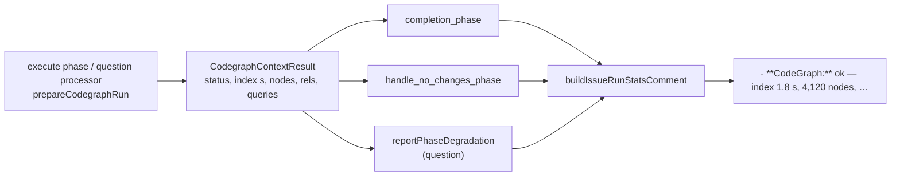

# Show the CodeGraph figures in the per-issue run-stats comment

## Summary

The per-issue run-stats comment now carries one `CodeGraph:` line on every run —
the status always, plus whichever of index seconds, node and relationship counts
and `codegraph_explore` queries the step actually gathered. Without it the
CodeGraph trial (#2145) had no per-run surface to read its figures from, so an
index that never ran and one that failed looked identical after the fact.

`buildIssueRunStatsComment` and `postIssueRunStatsComment` take an optional
`codegraph: CodegraphContextResult` and append the line to the stats section —
below `Degraded:`, above the cumulative issue total. It is a status line, never
a cost line: `tallyIssueCost` parses only the `Estimated cost` shape, so the
figures cannot move the published total. The three wrap-up sites pass the result
the run already recorded: `completion_phase.ts` and `handle_no_changes_phase.ts`
from `PhaseState.codegraphContext`, and `reportPhaseDegradation` (the
planning-shaped path) from the question processor's carrier — on both its
healthy and its degraded branch, so a degraded round is not a hole in the
trial's data.

Closes #2161.



## Evidence

Backend-only change with no web interface to screenshot, so the evidence is the
rendered line and the tests that pin it. The four shapes the line takes:

```text
- **CodeGraph:** ok — index 1.8 s, 4,120 nodes, 9,870 relationships, 14 queries
- **CodeGraph:** failed — index 300 s
- **CodeGraph:** unsupported (gemini)
- **CodeGraph:** off
```

`./quality.sh` passed in full after the final edit (deno tests, lint, type
check, fmt, semgrep, markdownlint, mermaid and the chokepoint checks).

## Acceptance Criteria

<!-- vibe-spec-review inputs="diff+issue-body" -->

- **met** — the comment carries the CodeGraph line for all four statuses with
  the figures available — evidence:
  `worker/deno/tests/issue_run_stats_comment_test.ts::codegraph line - an
  indexed run reports every figure it gathered`
  and its `failed` / `unsupported` / `off` siblings — reviewer: partial —
  reason: the reviewer marked it partial on two counts. (a) The issue's
  `failed — index 300 s
  (timed out)` example is not rendered:
  `CodegraphContextResult` (#2159) carries no timeout marker, so a timed-out
  index is not distinguishable from any other failure without changing that
  type, which this issue does not ask for; the seconds it spent are still
  reported. (b) The planning processor posts its own
  `## Planning run model stats` section through `buildPlanningStatsSection`, not
  through the two functions this issue names, so planning rounds still carry no
  CodeGraph line — a surface outside the three call sites the issue listed,
  recorded here rather than widened into.
- **met** — `tallyIssueCost` and the total-cost line are unchanged by the new
  line — evidence:
  `worker/deno/tests/issue_run_stats_comment_test.ts::codegraph
  line - the cost tally and total line ignore it`
  — reviewer: met
- **met** — a comment built without the argument is byte-identical to today's —
  evidence:
  `worker/deno/tests/issue_run_stats_comment_test.ts::codegraph line -
  a comment built without the argument is unchanged`,
  which now compares the whole body against
  `marker + shared section + disclaimer` rebuilt from `buildDegradationReport` —
  reviewer: met — reason: the reviewer called the first version of this test
  tautological (it compared the same falsy branch twice); it was rewritten to
  the independent reconstruction above.
- **met** — `deno task check`, `deno lint`, `deno task test` pass — evidence:
  full `./quality.sh` run after the final edit — reviewer: missing — reason: the
  reviewer saw only the diff and could not run the gate; it was run here and
  passed.
- **unrequested** — `docs/REPO-CONTEXT-TRIAL.md` gains 14 lines documenting the
  line's four shapes and its non-cost status — reviewer: unrequested — reason:
  that page already names this line as the trial's reading surface, and a code
  change owes a docs change; kept.
- **unrequested** — `formatCount` widened from private to exported in
  `worker/deno/lib/planning_run_stats.ts` — reviewer: unrequested — reason: DRY
  — the thousands separator is reused rather than re-implemented.
- **unrequested** — `reportPhaseDegradation` threads the figures onto the
  _degraded_ comment as well as the healthy one — reviewer: unrequested —
  reason: the degraded branch posts its own comment outside the one-per-run
  guard, so without it a degraded round would silently report no figures.

## Standards Review

<!-- vibe-standards-review inputs="diff+CODING-STANDARDS.md" -->

- **violation** — `reportPhaseDegradation`'s new `codegraph` parameter had no
  test on either branch — evidence: `worker/deno/lib/phase_run_stats.ts:183` —
  reason: fixed here; `worker/deno/tests/phase_run_stats_test.ts` now covers the
  healthy round, the degraded round and a round with no CodeGraph step.
- **violation** — the `handle_no_changes_phase.ts` and `question_processor.ts`
  wirings were untested, so either could be dropped without a red test —
  evidence: `worker/deno/lib/phases/handle_no_changes_phase.ts:241`,
  `worker/deno/lib/question_processor.ts:492` — reason: fixed here; both now
  have an end-to-end test asserting the line on the posted comment.
- **violation** — the `codegraph` spread in the "is there anything to report?"
  probe was dead (the empty-section early return precedes the append) —
  evidence: `worker/deno/lib/issue_run_stats_comment.ts:433` — reason: fixed
  here; removed, with a comment saying why the probe deliberately omits it.
- **violation** — `buildCodegraphStatsLine` was exported with no consumer
  outside its own module — evidence:
  `worker/deno/lib/issue_run_stats_comment.ts:137` — reason: fixed here; it is
  now module-private, tested through `buildIssueRunStatsComment`.
- **violation** — `unsupported (gemini)` hardcodes at the comment layer a fact
  owned by `codegraph_context.ts` — evidence:
  `worker/deno/lib/issue_run_stats_comment.ts:140` — reason: stands. The issue
  specifies that exact wording, and carrying a provider on
  `CodegraphContextResult` would change #2159's type. The coupling is no longer
  silent: the `unsupported` test drives the real `prepareCodegraphContext` with
  `GEMINI_PROVIDER_ID` and fails if a second provider ever produces the status.
- **clean** — Australian English throughout; tests call real functions
  (`buildIssueRunStatsComment`, `postIssueRunStatsComment`,
  `workOnIssueCompletion`, `workOnIssueHandleNoChanges`, `processIssueQuestion`,
  `prepareCodegraphContext`) and assert on rendered output, with no source
  greps, sleeps or wall-clock budgets; fail-loud preserved (`failed` is a
  visible status, not a dropped line); no hidden paths staged; the commits carry
  the issue reference and the `Vibe-Coder-Run-Id` trailer; the additive
  parameter leaves the previous render byte-identical.

## Test Plan

- `worker/deno/tests/issue_run_stats_comment_test.ts` — the line for `ok` (with
  and without `queries`), `failed` (with and without partial figures),
  `unsupported` (driven from the real `prepareCodegraphContext`) and `off`; the
  cost tally and the cumulative total unaffected; the no-argument comment
  byte-identical to the marker + section + disclaimer shape; the line's position
  inside the block; `postIssueRunStatsComment` posts it, and CodeGraph figures
  alone never manufacture a stats comment.
- `worker/deno/tests/completion_phase_run_stats_test.ts` — the PR-raise wrap-up
  reports the run's figures, reports a failed step rather than hiding it, and
  mentions nothing when the run had no CodeGraph step.
- `worker/deno/tests/phase_run_stats_test.ts` — the planning-shaped path reports
  the figures on the healthy round and on the degraded round, and stays silent
  without them.
- `worker/deno/tests/handle_no_changes_phase_test.ts` — the already-resolved
  close carries the line.
- `worker/deno/tests/question_processor_codegraph_2159_test.ts` — a question run
  that indexed posts a stats comment carrying the line, including the
  `codegraph_explore` query count.
