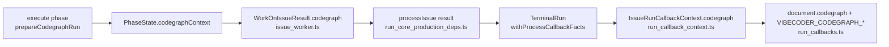

# Record CodeGraph figures as an additive `codegraph` block in the callback context

## Summary

Every post-run callback document now carries an additive `codegraph` block —
`enabled`, `status`, and `indexSeconds` / `nodeCount` / `relationshipCount` /
`queries` when the step produced them — so GRQ-23's CodeGraph runs are
comparable with the hosts that never had the switch. `CALLBACK_SCHEMA_VERSION`
stays at **2**: the block is additive and every field schema 1 promised is
untouched. Closes #2162.

The figures travel the same path `telemetry` already travels:



Two rules the block holds:

- **Never absent.** A run that reported no CodeGraph step still publishes the
  block, because a trial figure a reader has to infer from a missing key is
  worse than one stated outright.
- **`off` means the switch was off.** A run on a _switched-on_ host that ended
  before the index step reports `{ enabled: true, status: "failed" }` via
  `codegraphNotRun()`, so it is never counted on the switch-off side of the
  trial — the same reading `prepareCodegraphRun` already gives a switched-on run
  whose index never arrived. Each figure is omitted when the step never produced
  it, while a genuine `0` is published as `0`.

## Evidence

Backend/CLI only — no web interface to screenshot. The evidence is the test
suite and the full quality gate:

- `./quality.sh` — **PASSED** (deno tests, lint, type check, fmt, semgrep,
  markdownlint, mermaid and the chokepoint checks; `config integration` skipped
  as it is on this host).
- Targeted suites: `callback_schema_compat_test.ts`,
  `run_callback_context_test.ts`, `run_core_callbacks_test.ts`,
  `run_callbacks_test.ts`, `run_callbacks_integration_test.ts`,
  `callback_conformance_test.ts`, `issue_worker_test.ts` — all green.

Example document fragment a hook now receives:

```json
"codegraph": {
  "enabled": true,
  "status": "ok",
  "indexSeconds": 42.5,
  "nodeCount": 18412,
  "relationshipCount": 51903,
  "queries": 7
}
```

## Acceptance Criteria

<!-- vibe-spec-review inputs="diff+issue-body" -->

- **partial** — Every callback document carries `codegraph.enabled` and
  `codegraph.status`, plus the figures when CodeGraph ran (`ok`, or `failed`
  with partial figures) — evidence:
  `worker/deno/tests/callback_schema_compat_test.ts::#2162 - the codegraph block carries the run's figures for every status, omitting what was never gathered`
  and `worker/deno/lib/run_callbacks.ts:404-428` — reviewer: partial — reason:
  the run_core throw / shutdown-abandon paths construct a `TerminalRun` with no
  process result at all, so they lose the figures exactly as `telemetry` does
  there (`telemetryAbsentReason: "agent_not_invoked"`); the issue asked for the
  path telemetry travels, and preserving facts across a thrown run would need a
  new carrier for every fact, not just this one. Those runs no longer assert a
  false `off` — see the next criterion.
- **met** — A run on a host without the switch emits
  `codegraph: { enabled: false, status: "off" }` — evidence:
  `worker/deno/tests/run_callback_context_test.ts::run_callback_context - a host without the switch is explicitly off, so it stays comparable`
  and `…- a switched-off host whose run never indexed reports off` — reviewer:
  met — reason: the reviewer also found that a _switched-on_ host whose run
  ended before the index step wrongly borrowed the same block; fixed in commit
  `db9b2a4e` by `codegraphNotRun()`
  (`worker/deno/lib/run_callbacks.ts:164-180`), covered by
  `…- a switched-on host whose run never indexed reports failed, not off`.
- **met** — Existing callback fields and `schemaVersion` are unchanged; the
  compat test passes — evidence:
  `worker/deno/tests/callback_schema_compat_test.ts::#2162 - the block is additive: the schema version and every schema 1 field are untouched`,
  plus the pre-existing `#2039` tests still green — reviewer: met.
- **met** — `docs/CALLBACKS.md` documents the block; `deno task check`,
  `deno lint`, `deno task test` pass — evidence: `docs/CALLBACKS.md` example
  document, env table (six `VIBECODER_CODEGRAPH_*` rows), the additive prose and
  the Reference row; `./quality.sh` PASSED — reviewer: met.
- **unrequested** — `docs/CONFIGURATION.md` gains the six new env names —
  reviewer: unrequested — reason: it is the only other file enumerating the
  callback scalars, so leaving it out would make it wrong the moment this lands
  ("a code change owes a docs change").
- **unrequested** — a `Reference` row naming `codegraph_context.ts` — reviewer:
  unrequested — reason: the reviewer also noted it named the wrong file for "the
  block"; relabelled to "CodeGraph figures the block carries", which is what
  that module actually owns.
- **unrequested** — `CODEGRAPH_OFF` and `codegraphNotRun()` are exported from
  `run_callbacks.ts` — reviewer: unrequested — reason: both are consumed by
  `run_callback_context.ts` and `run_core_production_deps.ts`, so they cannot be
  module-private; exporting them is also what makes the off-versus-failed rule
  unit-testable.
- **unrequested** — a `workOnIssue` test in
  `worker/deno/tests/issue_worker_test.ts` — reviewer: unrequested — reason: the
  issue listed only the compat test, but the first leg of the threading
  (`PhaseState.codegraphContext` → `WorkOnIssueResult`) is otherwise uncovered.
- **unrequested** — the `!isExpectedSkip` guard on `codegraph` in
  `run_core_production_deps.ts` — reviewer: unrequested — reason: a skip
  dispatches no callbacks today, so the guard is defensive; kept because every
  sibling fact (`outcome`, `telemetry`, `phase`) carries the same guard and a
  lone exception would read as an oversight.

## Standards Review

<!-- vibe-standards-review inputs="diff+CODING-STANDARDS.md" -->

- **violation** — a run that never reached the index step on a switched-on host
  reported `off`, a positive false fact rather than a loud one — evidence:
  `worker/deno/lib/run_callback_context.ts:215` — reason: fixed in `db9b2a4e`
  via `codegraphNotRun()`, wired at the one dispatch point that knows the config
  (`worker/deno/lib/run_core_production_deps.ts:4305`).
- **violation** — `buildCallbackContextDocument`'s docstring still claimed every
  optional fact is omitted, contradicting the unconditional `codegraph` emit —
  evidence: `worker/deno/lib/run_callbacks.ts:359` — reason: fixed; the
  docstring now names the block as the deliberate exception and says why.
- **violation** — the new Reference row named `codegraph_context.ts` as the home
  of the block, which `run_callbacks.ts` builds — evidence:
  `docs/CALLBACKS.md:711` — reason: fixed; the row now describes the figures
  that module produces.
- **violation** — no test pinned a genuine `0` figure, so a refactor to
  truthiness could silently drop a zero-node index — evidence:
  `worker/deno/tests/callback_schema_compat_test.ts:167` — reason: fixed; an "ok
  with zero figures" case and a zero-scalar env assertion were added.
- **violation** — the new env-table row broke the table's column alignment —
  evidence: `docs/CALLBACKS.md:440` — reason: fixed; the scalar table and the
  Reference table were re-padded (`deno fmt` does not cover `docs/`).
- **violation** — three `?? CODEGRAPH_OFF` fallbacks for one field — evidence:
  `worker/deno/lib/run_callbacks.ts:413`, `:523`,
  `worker/deno/lib/run_callback_context.ts:215` — reason: stands. Each guards a
  different public entry point whose input type makes `codegraph` optional, so
  removing any one of them would let a hand-built context publish no block at
  all — the failure this block exists to prevent.
- **clean** — Australian English throughout; every new test calls real functions
  (`buildCallbackContextDocument`, `buildCallbackEnv`,
  `buildIssueRunCallbackContext`, `codegraphNotRun`, `workOnIssue`,
  `runCoreLoop`) with no source-greps, sleeps or wall-clock budgets; the
  additive contract holds (`CALLBACK_SCHEMA_VERSION` unchanged, nothing
  renamed); Deno-native tooling only; one commit per logical change with the
  issue number and the run-id trailer, no hidden paths staged.

## Test Plan

Added:

- `worker/deno/tests/callback_schema_compat_test.ts` — the block's shape for
  `ok`, `failed`, `unsupported`, `off` and an all-zero `ok`; the off default
  when a context carries no block; the six env scalars (present, omitted and
  zero); and a re-assertion that every schema 1 document field and env name
  still holds alongside the new block.
- `worker/deno/tests/run_callback_context_test.ts` — the figures travel into the
  context; a run with none is explicitly `off`; a failed step keeps its partial
  figures; `codegraphNotRun()` reports `failed` on a switched-on host and `off`
  on a switched-off one.
- `worker/deno/tests/run_core_callbacks_test.ts` — `runCoreLoop` carries a
  `processIssue` result's `codegraph` onto the terminal run, and carries none
  when the run reported none.
- `worker/deno/tests/issue_worker_test.ts` — `workOnIssue` returns the execute
  phase's CodeGraph figures on its result.

No existing test was modified or removed.
