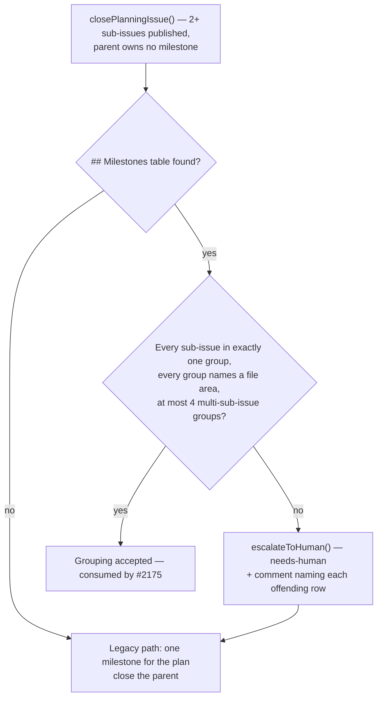

## Summary

Adds a deterministic parser and structural gate for the `## Milestones` table a
planning run publishes on its parent issue, so the multi-milestone grouping
(#2163) has an artefact the worker can check rather than a prose expectation
nobody enforces. Closes #2172.

- **New `worker/deno/lib/plan_milestone_groups.ts`** —
  `extractMilestoneGroups()` parses a `| Milestone | File area | Sub-issues |`
  table (sub-issues as `#N` refs or issue URLs; `—` / `none` / an empty
  milestone cell marks a group of one that merges straight to the default
  branch), `validateMilestoneGroups()` reports the structural offenders, and
  `runMilestoneGroupsGate()` reads `body,comments` of the parent through the
  same fleet-author check the coverage gate uses (Issue #1244).
  `MILESTONES_TABLE_REQUIREMENT` sits beside the rule it describes, exactly as
  `COVERAGE_TABLE_REQUIREMENT` does.
- **Structure only.** A published sub-issue in no group or in two, a group
  naming no file area, and a fifth multi-sub-issue group are offences. **File
  overlap between groups is never checked** — that is planner judgement, and a
  structural gate cannot tell an accepted housekeeping overlap from a real one.
- **Wired at `closePlanningIssue()`** after the coverage gate, when the run
  published 2+ sub-issues and the parent owns no milestone. No table → info log
  and the legacy single milestone, so the gate can land before the prompts teach
  the table (#2174) without stranding planning runs. A broken table →
  `escalateToHuman()` (`needs-human` + a paired comment naming every offending
  row) **and** the legacy single milestone, so overnight delivery continues
  while a human regroups.
- **`markdown_table.ts`** holds the table primitives the two gates now share, so
  the ReDoS-hardened separator pattern (Issue #1245) has one copy rather than a
  second, unguarded one.

The groups themselves are recorded, not yet acted on: creating one milestone per
group is #2175, which consumes this parser.

Note on the trigger set: the gate rules on the run's **published** sub-issues
(`textSubIssueNumbers`), the same set the coverage and Failure-Detection gates
use, because the published table can only describe what this run published.

## Evidence

Backend/CLI change with no web interface to screenshot. The evidence is the test
suites below plus the worker's own quality gate.

Command output:

- `deno test worker/deno/tests/plan_milestone_groups_test.ts` — 34 passed.
- `deno test worker/deno/tests/planning_processor_test.ts` — 127 passed.
- `deno test worker/deno/tests/markdown_table_test.ts` — 13 passed.
- `deno test worker/deno/tests/plan_coverage_gate_test.ts
  worker/deno/tests/plan_coverage_gate_bounds_1245_test.ts`
  — 37 passed, so the extracted primitives keep the coverage gate and its Issue
  #1245 bounds guards green.
- `deno lint`, `deno fmt --check`, `deno task check:manifests` — pass.

## Acceptance Criteria

<!-- vibe-spec-review inputs="diff+issue-body" -->

- **met** — `extractMilestoneGroups` returns the groups for the documented table
  shape and `null` when no `## Milestones` table exists; a `## Plan Coverage`
  table in the same comment is not mistaken for it — evidence:
  `worker/deno/tests/plan_milestone_groups_test.ts::extractMilestoneGroups - ignores an adjacent \`##
  Plan Coverage\` table` — reviewer: met
- **met** — `validateMilestoneGroups` reports a sub-issue in no group, a
  sub-issue in two groups, a group with an empty file area, and a fifth
  multi-sub-issue group; four multi-sub-issue groups plus any number of `—` rows
  pass — evidence:
  `worker/deno/tests/plan_milestone_groups_test.ts::validateMilestoneGroups - a fifth multi-sub-issue group is an offender`
  and `…- four multi groups plus any number of \`—\` rows pass` — reviewer: met
- **met** — a planning run with no `## Milestones` table closes exactly as today
  (single milestone, no escalation) — evidence:
  `worker/deno/tests/planning_processor_test.ts::processIssuePlanning - no \`##
  Milestones\` table closes the parent with one milestone (Issue #2172)` —
  reviewer: met
- **met** — a structurally invalid table applies `needs-human` with a paired
  comment naming the offending rows and still creates the legacy single
  milestone — evidence:
  `worker/deno/tests/planning_processor_test.ts::processIssuePlanning - a broken \`##
  Milestones\` table escalates and still creates the legacy milestone (Issue
  #2172)` — reviewer: met
- **met** — `deno test`, `deno lint`, `deno fmt --check` pass — evidence: full
  `./quality.sh` run after the final edit, `Result: PASSED` with every stage
  green (deno tests, lint, type check, fmt, completeness checks, semgrep,
  mermaid, markdownlint) — reviewer: partial — reason: the reviewer verified
  `deno lint` and `deno fmt --check` but declined to run `deno test`; the full
  gate was run here and passed, so the third leg is evidenced rather than
  assumed
- **partial** — the gate's trigger condition (2+ published sub-issues, parent
  owns no milestone) — evidence: `worker/deno/lib/planning_processor.ts:2256` —
  reviewer: partial — reason: the two skip branches (a single published
  sub-issue; a parent that already owns a milestone) are implemented but not
  directly covered by a test, so only the gate-runs path is pinned
- **unrequested** — `worker/deno/lib/markdown_table.ts` and the refactor of
  `plan_coverage_gate.ts` onto it — reviewer: unrequested — reason: the
  alternative was a second copy of the ReDoS-hardened `SEPARATOR_RE` (Issue
  #1245) in an attacker-facing parser; `plan_coverage_gate_test.ts` +
  `plan_coverage_gate_bounds_1245_test.ts` (37 tests) pass unchanged against the
  extracted copy
- **unrequested** — `worker/deno/tests/markdown_table_test.ts` — reviewer:
  unrequested — reason: the repo convention is one test file per `lib/` module,
  and `findMarkdownTable`'s "skip a non-matching table and keep scanning"
  contract is exactly what stops one gate parsing the other's table
- **unrequested** — `docs/audits/security-sweep-2172-milestone-groups-gate.md`
  and the `top-up-2172` slice in `docs/audits/lib-sweep-coverage.json` —
  reviewer: unrequested — reason: mandatory, not optional —
  `deno task check:manifests` fails any new `lib/` module claimed by no sweep
  slice
- **unrequested** — the new "Milestones table and structural gate" section in
  `docs/workflows/planning-and-questions.md`, and "Four reads" → "Five reads" in
  the author-verification table — reviewer: unrequested — reason: a code change
  owes a docs change; this gate is a fifth author-verified read at the close-out
  chokepoint the section enumerates
- **unrequested** — `NO_MILESTONE_RE` also accepts `–`, `-`, `--`, `n/a`,
  `no milestone` and an empty cell — reviewer: unrequested — reason: the em dash
  is one keystroke from the shapes a model actually writes, and reading a
  near-miss as a _milestone title_ would create a milestone named `-`
- **unrequested** — a bracketed placeholder (`[file area]`) counts as no file
  area — reviewer: unrequested — reason: an unfilled template placeholder is the
  shape the coverage gate already rejects for the same reason; without it the
  gate passes a row the planner never filled in
- **unrequested** — the exported escalation surface (`MAX_MILESTONE_GROUPS`,
  `MILESTONE_GROUPS_GATE_NEXT_STEP`, `buildMilestoneGroupsGateReason`,
  `escalateMilestoneGroupOffenders`, `MilestoneGroupsVerdict.readFailed`) —
  reviewer: unrequested — reason: the escalation criterion cannot be met without
  them, and each mirrors a symbol the coverage gate already exports

## Standards Review

<!-- vibe-standards-review inputs="diff+CODING-STANDARDS.md" -->

- **violation** — the two new `lib/` modules were claimed by no sweep slice, so
  `deno task check:manifests` was red — evidence:
  `docs/audits/lib-sweep-coverage.json` — reason: fixed here — `top-up-2172`
  added with its written security record,
  `docs/audits/security-sweep-2172-milestone-groups-gate.md`
- **violation** — `markdown_table.ts`'s public symbols had no test file of their
  own — evidence: `worker/deno/lib/markdown_table.ts:37` — reason: fixed here —
  `worker/deno/tests/markdown_table_test.ts` (13 tests) pins the cap, the
  splitter and the skip-and-keep-scanning contract
- **violation** — the gate's oversized-candidate skip had no test, unlike the
  coverage gate's parallel case — evidence:
  `worker/deno/lib/plan_milestone_groups.ts:371` — reason: fixed here —
  `runMilestoneGroupsGate - an oversized comment is skipped loudly and a real table still decides`
- **violation** — `escalateMilestoneGroupOffenders`'s failure branch had no test
  — evidence: `worker/deno/lib/plan_milestone_groups.ts:441` — reason: fixed
  here —
  `escalateMilestoneGroupOffenders - a failed escalation is reported, not swallowed`
- **violation** — the comment "coverage is deliberately the only plan gate here"
  was left false by the second gate this change inserts above it — evidence:
  `worker/deno/lib/planning_processor.ts:2324` — reason: fixed here — reworded
  to the claim that is actually true (no MVP-slice gate)
- **violation** — the module docstring claimed the versioned
  `prompts/planning_critique/` templates already state the rule; they do not —
  evidence: `worker/deno/lib/plan_milestone_groups.ts:88` — reason: fixed here —
  corrected to name #2174 as the prompt work, which is why the gate must
  tolerate a missing table
- **violation** — `docs/archive/pr-summaries/pr-summary-2172.md` was missing —
  evidence: this file — reason: fixed here
- **clean** — Australian English across all added lines; fail-loud handling (the
  `gh` read failure surfaces `readFailed` rather than collapsing into "no
  table", the oversized skip is logged, a failed escalation logs `error` and
  returns `false`); tests call real exported functions with real markdown, no
  source-greps, no sleeps, no wall-clock thresholds; bounded scan of
  attacker-writable input with the hardened separator carried across intact;
  reuse of the existing `escalateToHuman()` and `closePlanningIssue()`
  chokepoints rather than new ones; no hidden path staged; commit messages carry
  the run-id trailer

## Test Plan

- **Added** `worker/deno/tests/plan_milestone_groups_test.ts` (34 tests): parse
  happy path, escaped pipes, issue-URL refs, `—` / `none` / empty milestone
  cells, no table → `null`, `## Plan Coverage` and unrelated tables ignored,
  header-only table → `[]`; every validation offender (no group, two groups,
  empty file area, placeholder file area, fifth multi-sub-issue group) and the
  accept shapes (four multi groups plus `—` rows, overlapping file areas,
  unpublished refs); the gate's fleet-author checks (outsider discarded,
  unresolved fleet discards all, newest table wins), read failure,
  oversized-candidate skip, and the escalation happy and failure paths.
- **Added** `worker/deno/tests/markdown_table_test.ts` (13 tests): cell
  splitting with escaped pipes, the scan cap boundary, header/row extraction,
  skipping a non-matching table and continuing, every alignment form, and cap
  rejection.
- **Extended** `worker/deno/tests/planning_processor_test.ts` with the three
  wiring branches (no table → legacy milestone and no escalation; sound table →
  closes without escalating; broken table → `needs-human` + paired comment
  naming the rows **and** the legacy milestone) plus the fallback-prompt
  requirement assertion.
- **Unchanged and still green**: `plan_coverage_gate_test.ts` and
  `plan_coverage_gate_bounds_1245_test.ts` (37 tests) over the extracted
  primitives.
- **Full gate**: `./quality.sh` — `Result: PASSED` (config integration skipped,
  as it is without a live config).
