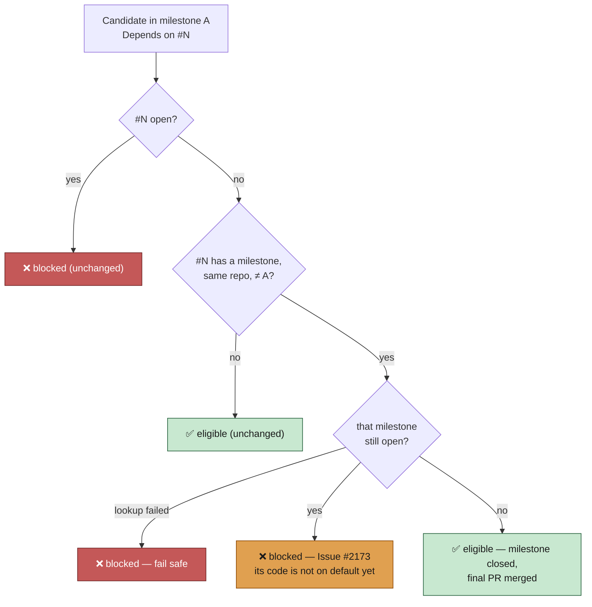

# Hold a cross-milestone `Depends on #N` until the dependency's milestone closes

## Summary

A sub-issue in milestone A may declare `Depends on #N` where #N belongs to
milestone B. Closing #N was enough to release the dependant — but #N's code
only reaches the default branch, and so A's milestone branch, once B's **final
PR merges and B closes**. The dependant was therefore being built against work
that was not there yet.

`isDependencyBlocked` now takes an optional fifth argument, `milestoneScope`. A
**CLOSED same-repo** dependency whose milestone is non-null, differs from the
candidate's milestone, and is **still open** keeps blocking. A dependency with
no milestone, or one in the candidate's own milestone, is satisfied on close
exactly as before, and omitting `milestoneScope` preserves the pre-change
behaviour.

Cost is unchanged per candidate: `milestone` rides the existing per-dependency
`gh issue view` (`number,state,title,milestone`), and the open-milestone set
comes from the already-cached `fetchOpenMilestoneClosedCounts` listing —
resolved lazily, once per repo, and never fetched when no dependency needs it.
A failed lookup fails safe (blocked).

Closes #2173.

## Evidence

Backend/CLI change — no web interface to screenshot. The evidence is the test
suite and the full quality gate.

- `deno test worker/deno/tests/cross_milestone_dependency_gate_test.ts` — 18
  tests, all passing, covering the gate, the fetcher mapping, the lazy lookup
  and an end-to-end collector wiring case.
- `./quality.sh` — full gate run (see Standards Review note on the re-run).
- **Call-site disposition (as the issue asked):** all six `isDependencyBlocked`
  callers are wired, because the candidate's `milestoneTitle` is in scope at
  every one — `collect_work_on_candidates.ts`, `collect_label_candidates.ts`,
  `collect_low_priority_candidates.ts`, `collect_idle_task_candidates.ts`,
  `collect_self_diagnostic_candidates.ts`, and `new_work_eligibility.ts` (the
  sixth, not enumerated in the issue). None was left on the default path.
- **`milestone_health.ts` (the issue's assumption):** confirmed by reading
  `classifyOpenIssue` (`worker/deno/lib/milestone_health.ts:131-163`). It
  classifies as `blocked` only when a dependency is still **open**, and has no
  "stuck milestone" state at all. An issue held by this new gate — its
  dependency is closed — is reported as `pending`/`assigned`, i.e. waiting, not
  stuck. No change was needed there.
- **Known, recorded divergence:** `idle_decision_census.ts` cannot model this
  hold — it needs the *closed* dependency's milestone, which its open-issue set
  does not carry. That is an under-count in the same bounded-harm direction as
  the parent/child gate the census already declines to model, and it is now
  documented at both surfaces (`idle_decision_census.ts`,
  `docs/IDLE-TASK-FRAMEWORK.md`) rather than left as a silent parity claim.

## Acceptance Criteria

<!-- vibe-spec-review inputs="diff+issue-body" -->

- **met** — With `milestoneScope`, a closed dependency in a different open
  milestone blocks; once that milestone is no longer open the dependant is
  eligible — evidence:
  `worker/deno/tests/cross_milestone_dependency_gate_test.ts::a closed dependency in another open milestone still blocks`
  and `::the dependant is eligible once the dependency's milestone closes` —
  reviewer: met
- **met** — A closed dependency with no milestone, or in the candidate's own
  milestone, does not block — evidence:
  `worker/deno/tests/cross_milestone_dependency_gate_test.ts::a closed dependency with no milestone does not block`
  and `::a closed dependency in the candidate's own milestone does not block`
  (both assert the listing is never consulted) — reviewer: met
- **met** — All existing dependency-gate tests pass unchanged; a mocked `gh`
  shows no additional call per candidate beyond the existing per-dependency
  `issue view` and the cached open-milestone listing — evidence: no existing
  test file was modified; the reviewer ran the `collect_*`, `issue_finder*`,
  `new_work_eligibility*` and `*dependency*` suites (408 passed, 0 failed), and
  `::a collector holds a candidate whose dependency's milestone is open`
  asserts exactly one `milestones?state=open` call for the whole repo —
  reviewer: met — reason: the reviewer noted a caveat, that a *failed* listing
  is deliberately not cached and so can repeat on the error path; that is the
  intended retry, covered by `::createOpenMilestoneLookup retries after a failed listing`
- **met** — `docs/workflows/projects-and-dependencies.md` states the rule;
  `deno test`, `deno lint`, `deno fmt --check` pass — evidence:
  `docs/workflows/projects-and-dependencies.md:106-107`, plus the full
  `./quality.sh` gate run here — reviewer: met — reason: the reviewer verified
  lint and fmt across the tree and the relevant test subsets, but could not run
  the full suite because the worktree was being edited underneath it; the full
  gate was run here instead
- **unrequested** — `new_work_eligibility.ts` wired as a sixth call site —
  reviewer: unrequested — reason: the issue asked for "the remaining
  `isDependencyBlocked` callers … where the candidate milestone is in scope";
  this one qualifies and leaving it out would make one selection path disagree
  with the other five
- **unrequested** — the hold is narrowed to **same-repo** dependencies —
  reviewer: unrequested — reason: milestone titles are per-repository, so
  measuring another repo's milestone title against this repo's open-milestone
  listing would be meaningless; tested by
  `::a cross-repo dependency is not measured against this repo's milestones`
- **unrequested** — `createOpenMilestoneLookup` does not cache a rejection —
  reviewer: unrequested — reason: caching a transient `gh` failure would hold
  every candidate in the repo for the rest of the iteration; the retry is
  bounded to the failure path and tested
- **unrequested** — `ISSUE_STATE_CACHE_PREFIX` bumped to `v2`, with the three
  per-issue prefixes moved beside the cache in `issue_cache.ts` — reviewer:
  unrequested — reason: a `v1` entry carries no `milestone` and would silently
  *release* a dependant this gate must hold; the prefix was spelled out a
  second time in `issue_close_notifier.ts`, so bumping one spelling alone would
  have left a close invalidating a key nothing writes
- **unrequested** — documentation of the rule at three further surfaces
  (`docs/INTERNALS.md`, `docs/workflows/README.md`, the forward-dependency
  definition in `projects-and-dependencies.md`) and of the census divergence —
  reviewer: unrequested — reason: "A Code Change Owes a Docs Change"; the
  forward-dependency definition sat in the same file it now contradicted

## Standards Review

<!-- vibe-standards-review inputs="diff+CODING-STANDARDS.md" -->

- **violation** — silent fail-open: the cached `IssueState` payload gained
  `milestone` without a cache-key bump, so a pre-change entry reads as "no
  milestone" and releases a dependant — evidence:
  `worker/deno/lib/issue_finder_common.ts:326` — reason: fixed here — prefix
  bumped to `issue_state_v2_` and the three prefixes moved to `issue_cache.ts`
  so `issue_close_notifier.ts` invalidates the same key
- **violation** — docs owed by the rule change left four surfaces stating the
  superseded rule — evidence: `docs/workflows/projects-and-dependencies.md:61`,
  `docs/INTERNALS.md:1598`, `docs/workflows/README.md:39`,
  `docs/GH-API-OPTIMISATION.md:170` — reason: all four updated in this diff
- **violation** — DRY: `idle_decision_census.ts` documents itself as matching
  `isDependencyBlocked`, a claim this change broke — evidence:
  `worker/deno/lib/idle_decision_census.ts:764` — reason: the divergence is now
  stated explicitly there and in `docs/IDLE-TASK-FRAMEWORK.md`; modelling it
  needs the closed dependency's milestone, which the census's open-issue set
  does not carry, and the residual error is an under-count in the same
  bounded-harm direction as the parent/child gate the census already declines
  to model
- **violation** — test coverage: the "rejection is not cached" branch and the
  collector wiring were untested — evidence:
  `worker/deno/lib/issue_finder_common.ts:481` — reason: fixed here — added
  `::createOpenMilestoneLookup retries after a failed listing` and two
  end-to-end collector tests that hold then release a real candidate
- **violation** — a docstring claimed the listing's keys are *exactly* the open
  milestone titles, which a single unpaginated page cannot guarantee —
  evidence: `worker/deno/lib/issue_finder_common.ts:457` — reason: wording
  corrected to name the page size; paginating `fetchOpenMilestoneClosedCounts`
  is pre-existing behaviour and out of scope here
- **violation** — the new `catch` reports a transient `gh` failure as an
  ordinary `dependency-blocked`, indistinguishable from a real block — evidence:
  `worker/deno/lib/issue_finder_common.ts:560` — reason: stands — it mirrors the
  pre-existing fail-safe catch three lines above, and returning "blocked" is
  meaningful handling rather than a swallowed error
- **violation** — `createOpenMilestoneLookup` signals failure by rejecting
  rather than returning `Result<T, E>` — evidence:
  `worker/deno/lib/issue_finder_common.ts:471` — reason: stands — it wraps
  `fetchOpenMilestoneClosedCounts`, which already throws, and converting at this
  one call site would leave the module half-converted
- **clean** — Australian English throughout; no hidden or credential paths
  staged; commit messages carry the issue reference and the
  `Vibe-Coder-Run-Id` trailer; no test removed or commented out; every test
  calls real exported functions and asserts on decisions (no source-grepping);
  the new tests are fast, hermetic and free of sleeps or polling; `IssueState`
  and `isDependencyBlocked` changed additively so every existing caller still
  compiles; `deno lint` and `deno fmt --check` clean.

## Test Plan

`worker/deno/tests/cross_milestone_dependency_gate_test.ts` (new, 18 tests):

- a closed dependency in another open milestone still blocks
- the dependant is eligible once the dependency's milestone closes
- a closed dependency in the candidate's own milestone does not block
- a closed dependency with no milestone does not block
- a dependency whose milestone the fetcher does not report does not block
- without a milestone scope the gate keeps today's behaviour
- an OPEN dependency blocks without consulting the milestone listing
- a candidate with no dependencies never consults the milestone listing
- a failed open-milestone lookup fails safe — blocked
- a cross-repo dependency is not measured against this repo's milestones
- `createIssueFetcher` maps the dependency's milestone title / maps a
  milestone-less dependency to null / maps a merged PR to CLOSED with no
  milestone
- `createOpenMilestoneLookup` lists open milestones at most once / propagates a
  failed listing / retries after a failed listing
- a collector holds a candidate whose dependency's milestone is open, and
  releases it once that milestone closes (end-to-end through
  `collectLowPriorityCandidates`, asserting one listing call per repo)

Existing suites re-run unchanged: `collect_*`, `cross_repo_dependency_gate`,
`issue_finder*`, `new_work_eligibility`, `idle_decision_census*`,
`find_oldest_issue*`, `issue_close_notifier*`.
